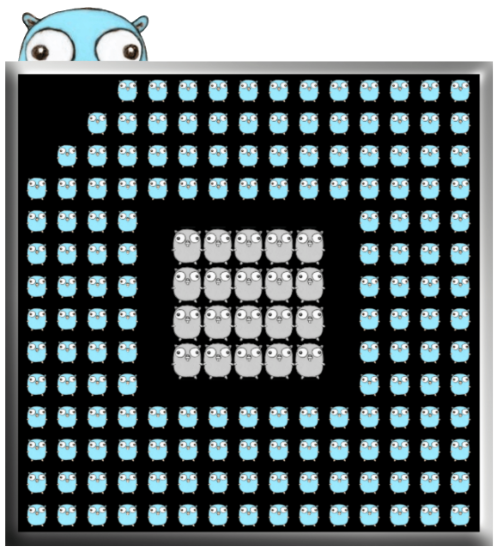
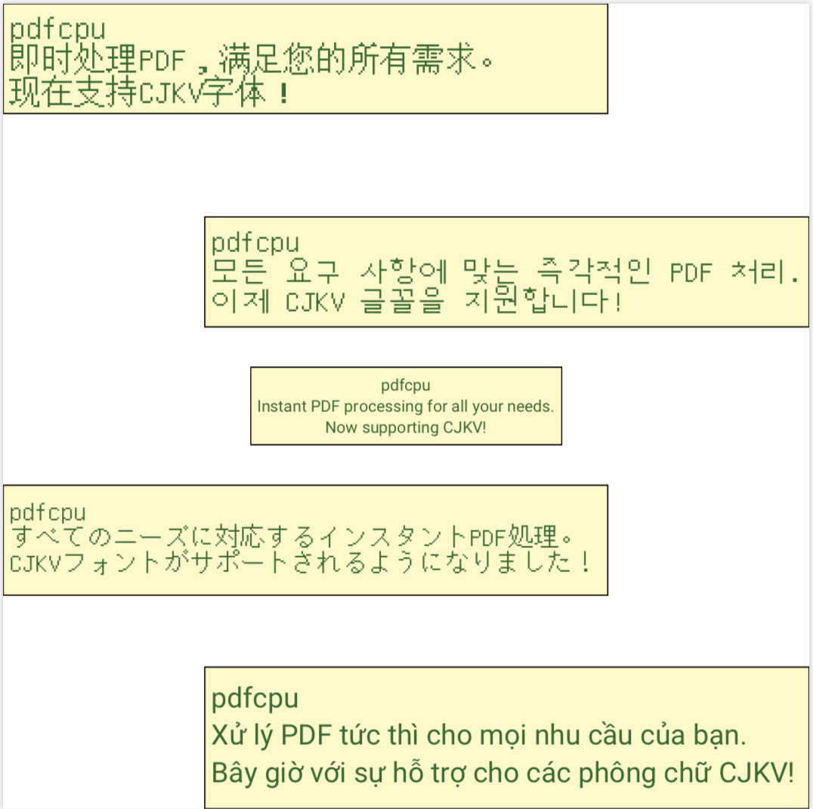
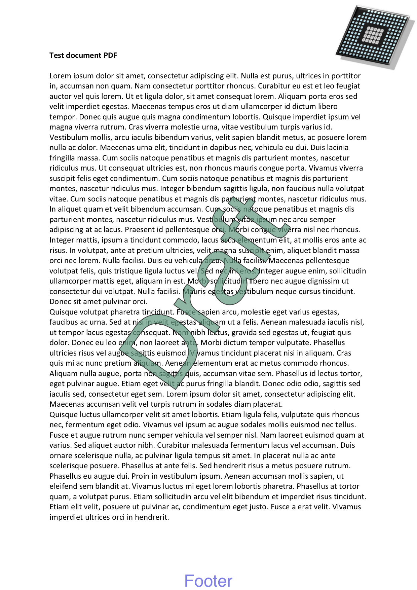
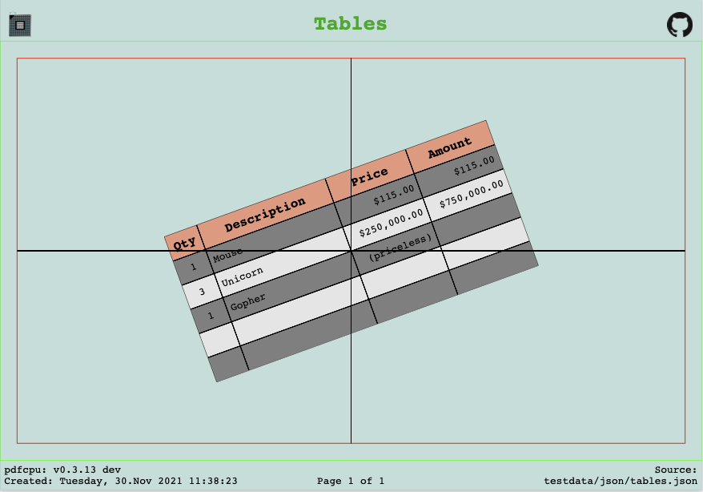
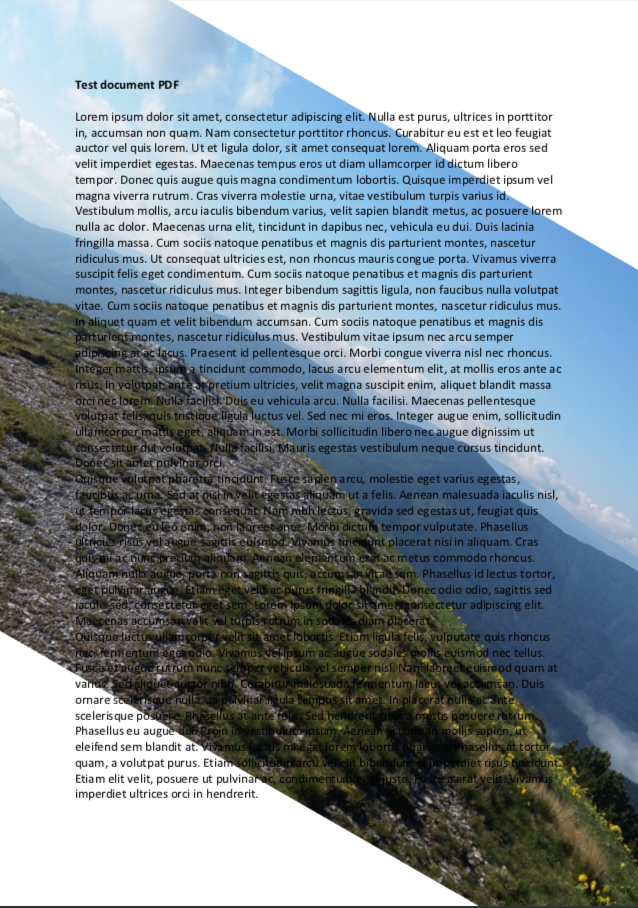
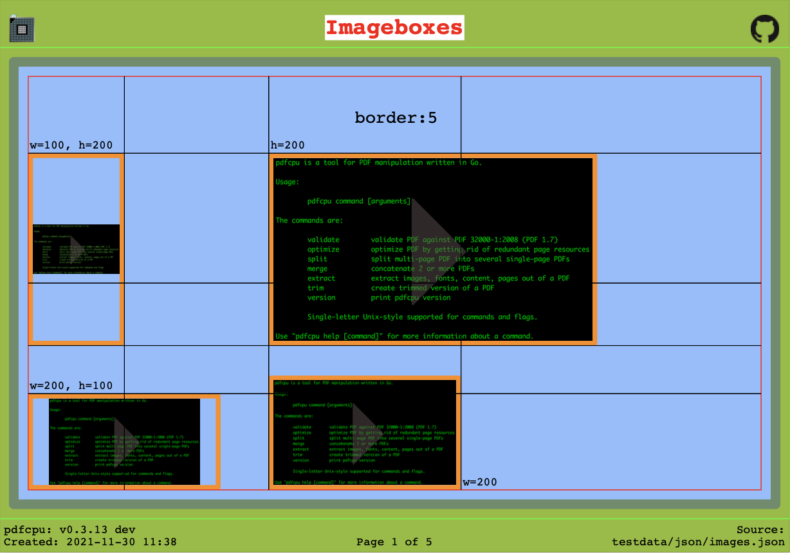
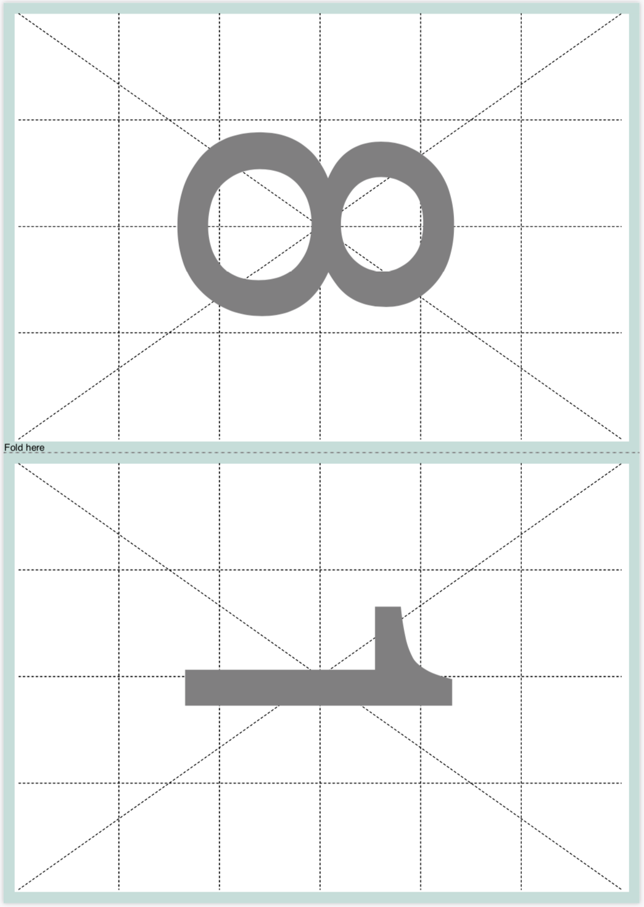
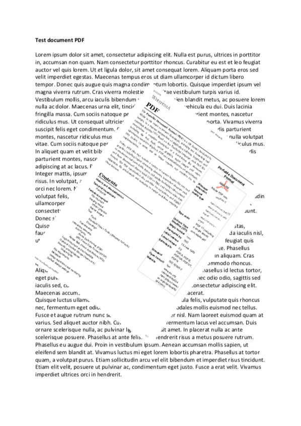
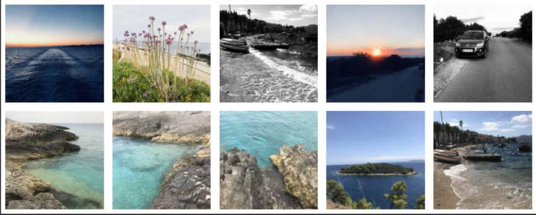
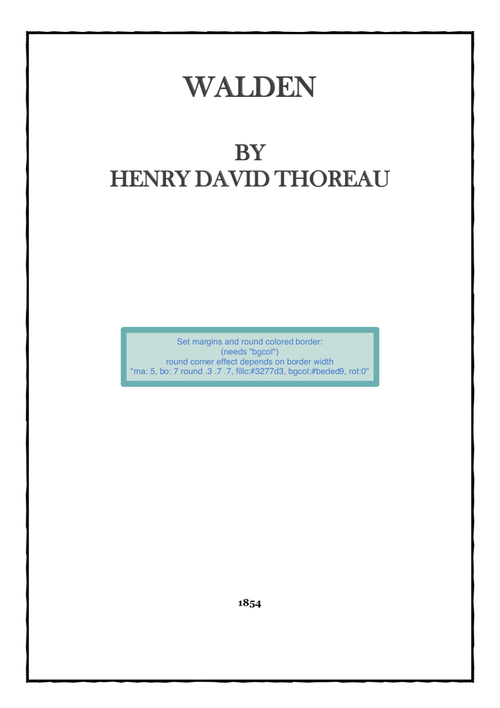

# pdfcpu: a Go PDF processor

[](https://open.vscode.dev/pdfcpu/pdfcpu)
[](https://github.com/pdfcpu/pdfcpu/actions)
[](https://coveralls.io/github/pdfcpu/pdfcpu?branch=master)
[](https://pkg.go.dev/github.com/pdfcpu/pdfcpu)
[](https://goreportcard.com/report/github.com/pdfcpu/pdfcpu)
[](https://opensource.org/licenses/Apache-2.0)
[](https://github.com/pdfcpu/pdfcpu/releases)

<a href="https://pdfcpu.io"></a>
<a href="https://pdfa.org"></a>

pdfcpu is a PDF processing library written in [Go](http://golang.org) supporting encryption.
It provides both an API and a CLI. Supported are all versions up to PDF 1.7 (ISO-32000).

Support for PDF 2.0 is basic and ongoing work.

## Motivation

This is an effort to build a comprehensive PDF processing library from the ground up written in Go. Over time pdfcpu aims to support the standard range of PDF processing features and also any interesting use cases that may present themselves along the way.

<p align="center">
  <kbd><a href="https://pdfcpu.io/generate/grid"></a></kbd>&nbsp;
  <kbd><a href="https://pdfcpu.io/core/watermark"></a></kbd>&nbsp;
  <kbd><a href="https://pdfcpu.io/generate/nup"></a></kbd>&nbsp;
  <kbd><a href="https://pdfcpu.io/fonts/fonts"></a></kbd>&nbsp;
  <kbd><a href="https://pdfcpu.io/core/stamp"></a></kbd>&nbsp;
  <kbd><a href="https://pdfcpu.io/form/form"></a></kbd><br><br>
  <kbd><a href="https://pdfcpu.io/generate/create"></a></kbd>&nbsp;
  <kbd><a href="https://pdfcpu.io/core/stamp"></a></kbd>&nbsp;
  <kbd></kbd>&nbsp;
  <kbd><a href="https://pdfcpu.io/core/watermark"></a></kbd>&nbsp;
  <kbd><a href="https://pdfcpu.io/generate/create"></a></kbd>&nbsp;<br><br>
  <kbd><a href="https://pdfcpu.io/generate/booklet"></a></kbd>
  <kbd><a href="https://pdfcpu.io/core/stamp"></a></kbd>&nbsp;
  <kbd><a href="https://pdfcpu.io/generate/grid"></a></kbd>
  <kbd><a href="https://pdfcpu.io/core/stamp"></a></kbd>
  <kbd><a href="https://pdfcpu.io/generate/booklet"></a></kbd>
</p>

## Focus

The main focus lies on strong support for batch processing and scripting via a rich command line. At the same time pdfcpu wants to make it easy to integrate PDF processing into your Go based backend system by providing a robust command set.

## Command Set

* [annotations](https://pdfcpu.io/annot/annot)
* [attachments](https://pdfcpu.io/attach/attach)
* [booklet](https://pdfcpu.io/generate/booklet)
* [bookmarks](https://pdfcpu.io/bookmarks/bookmarks)
* [boxes](https://pdfcpu.io/boxes/boxes)
* [change owner password](https://pdfcpu.io/encrypt/change_opw)
* [change user password](https://pdfcpu.io/encrypt/change_upw)
* [collect](https://pdfcpu.io/core/collect)
* [create](https://pdfcpu.io/generate/create)
* [crop](https://pdfcpu.io/core/crop)
* [cut](https://pdfcpu.io/generate/cut)
* [decrypt](https://pdfcpu.io/encrypt/decryptPDF)
* [encrypt](https://pdfcpu.io/encrypt/encryptPDF)
* [extract](https://pdfcpu.io/extract/extract)
* [fonts](https://pdfcpu.io/fonts/fonts)
* [form](https://pdfcpu.io/form/form)
* [grid](https://pdfcpu.io/generate/grid)
* [images](https://pdfcpu.io/images/images)
* [import](https://pdfcpu.io/generate/import)
* [info](https://pdfcpu.io/info)
* [keywords](https://pdfcpu.io/keywords/keywords)
* [merge](https://pdfcpu.io/core/merge)
* [ndown](https://pdfcpu.io/generate/ndown)
* [nup](https://pdfcpu.io/generate/nup)
* [optimize](https://pdfcpu.io/core/optimize)
* [pagelayout](https://pdfcpu.io/pagelayout/pagelayout)
* [pagemode](https://pdfcpu.io/pagemode/pagemode)
* [pages](https://pdfcpu.io/pages/pages)
* [permissions](https://pdfcpu.io/encrypt/perm_add)
* [portfolio](https://pdfcpu.io/portfolio/portfolio)
* [poster](https://pdfcpu.io/generate/poster)
* [properties](https://pdfcpu.io/properties/properties)
* [resize](https://pdfcpu.io/core/resize)
* [rotate](https://pdfcpu.io/core/rotate)
* [split](https://pdfcpu.io/core/split)
* [stamp](https://pdfcpu.io/core/stamp)
* [trim](https://pdfcpu.io/core/trim)
* [validate](https://pdfcpu.io/core/validate) 👉 now including rudimentory support for PDF 2.0
* [viewerpref](https://pdfcpu.io/viewerpref/viewerpref)
* [watermark](https://pdfcpu.io/core/watermark) 

## Documentation

* The main entry point is [pdfcpu.io](https://pdfcpu.io).
* For CLI examples also go to [pdfcpu.io](https://pdfcpu.io). There you will find explanations of all the commands and their parameters.
* For API examples of all pdfcpu operations please refer to [GoDoc](https://pkg.go.dev/github.com/pdfcpu/pdfcpu/pkg/api).

### GoDoc

* [pdfcpu package](https://pkg.go.dev/github.com/pdfcpu/pdfcpu)
* [pdfcpu API](https://pkg.go.dev/github.com/pdfcpu/pdfcpu/pkg/api)
* [pdfcpu CLI](https://pkg.go.dev/github.com/pdfcpu/pdfcpu/pkg/cli)

## Reminder

* Always make sure your work is based on the latest commit!<br>
* pdfcpu is still *Alpha* - bugfixes are committed on the fly and will be mentioned in the next release notes.<br>
* Follow [pdfcpu](https://twitter.com/pdfcpu) for news and release announcements.
* For quick questions or discussions get in touch on the [Gopher Slack](https://invite.slack.golangbridge.org/) in the #pdfcpu channel.


## Demo Screencast

(using older version with a smaller command set)

[](https://asciinema.org/a/P5jaAo9kgZXKj2iSA1OqIdLAU)

## Installation

### Download
Get the latest binary [here](https://github.com/pdfcpu/pdfcpu/releases).


### Using Go Modules

```
$ git clone https://github.com/pdfcpu/pdfcpu
$ cd pdfcpu/cmd/pdfcpu
$ go install
$ pdfcpu version
```
or directly through Go install:

```
$ go install github.com/pdfcpu/pdfcpu/cmd/pdfcpu@latest
```

### Using Homebrew (macOS)
```
$ brew install pdfcpu
$ pdfcpu version
```

### Using DNF/YUM (Fedora)
```
$ sudo dnf install golang-github-pdfcpu
$ pdfcpu version
```

### Run in a Docker container

```
$ docker build -t pdfcpu .
# mount current folder into container to process local files
$ docker run -it --mount type=bind,source="$(pwd)",target=/app pdfcpu ./pdfcpu validate /app/pdfs/a.pdf
```

## Contributing

### What

* Please [create](https://github.com/pdfcpu/pdfcpu/issues/new/choose) an issue if you find a bug or want to propose a change.
* Feature requests - always welcome!
* Bug fixes - always welcome!
* PRs - let's [discuss](https://github.com/pdfcpu/pdfcpu/discussions) first or [create](https://github.com/pdfcpu/pdfcpu/issues/new/choose) an issue.
* pdfcpu is stable but still *Alpha* and occasionally undergoing heavy changes.

### How

* The pdfcpu [discussion board](https://github.com/pdfcpu/pdfcpu/discussions) is open! Please engage in any form helpful for the community.
* If you want to report a bug please attach the *very verbose* (`pdfcpu cmd -vv ...`) output and ideally a test PDF that you can share.
* Always make sure your contribution is based on the latest commit.
* Please sign your commits.

### Reporting Crashes

Unfortunately crashes do happen :(
For the majority of the cases this is due to a diverse pool of PDF Writers out there and millions of PDF files using different versions waiting to be processed by pdfcpu. Sometimes these PDFs were written more than 20(!) years ago. Often there is an issue with validation - sometimes a bug in the parser. Many times even using relaxed validation with pdfcpu does not work. In these cases we need to extend relaxed validation and for this we are relying on your help. By reporting crashes you are helping to improve the stability of pdfcpu. If you happen to crash on any pdfcpu operation be it on the command line or in your Go backend these are the steps to report this:

Regardless of the pdfcpu operation, please start using the pdfcpu command line to validate your file:

``` sh
$ pdfcpu validate -v &> crash.log
```

 or to produce very verbose output

 ``` sh
 $ pdfcpu validate -vv &> crash.log
 ```

will produce what's needed to investigate a crash. Then open an issue and post `crash.log` or its contents. Ideally post a test PDF you can share to reproduce this. You can also email to hhrutter@gmail.com or if you prefer Slack you can get in touch on the Gopher slack #pdfcpu channel.

If processing your PDF with pdfcpu crashes during validation and can be opened by Adobe Reader and Mac Preview chances are we can extend relaxed validation and provide a fix. If the file in question cannot be opened by both Adobe Reader and Mac Preview we cannot help you!

## Contributors

Thanks 💚 goes to these wonderful people:

<!-- ALL-CONTRIBUTORS-LIST:START - Do not remove or modify this section -->
||||||||
| :---: | :---: | :---: | :---: | :---: |  :---: | :---: |
| [<br/><sub><b>Horst Rutter</b></sub>](https://github.com/hhrutter) | [<br/><sub><b>haldyr</b></sub>](https://github.com/haldyr) | [<br/><sub><b>Vyacheslav</b></sub>](https://github.com/SimePel) | [<br/><sub><b>Erik Unger</b></sub>](https://github.com/ungerik) | [<br/><sub><b>Richard Wilkes</b></sub>](https://github.com/richardwilkes) | [<br/><sub><b>minenok-tutu</b></sub>](https://github.com/minenok-tutu) | [<br/><sub><b>Mateusz Burniak</b></sub>](https://github.com/matbur) |
| [<br/><sub><b>Dmitry Harnitski</b></sub>](https://github.com/dharnitski) | [<br/><sub><b>ryarnyah</b></sub>](https://github.com/ryarnyah) | [<br/><sub><b>Sam Giffney</b></sub>](https://github.com/s01ipsist) | [<br /><sub><b>Carlos Eduardo Witte</b></sub>](https://github.com/cewitte) | [<br/><sub><b>minusworld</b></sub>](https://github.com/minusworld) | [<br/><sub><b>Witold Konior</b></sub>](https://github.com/jozuenoon) | [<br/><sub><b>joonas.fi</b></sub>](https://github.com/joonas-fi) |
| [<br/><sub><b>Henrik Reinstädtler</b></sub>](https://github.com/henrixapp) | [<br/><sub><b>VMorozov-wh</b></sub>](https://github.com/VMorozov-wh) | [<br/><sub><b>Benoit KUGLER</b></sub>](https://github.com/benoitkugler) | [<br/><sub><b>Adam Greenhall</b></sub>](https://github.com/adamgreenhall) | [<br/><sub><b>moritamori</b></sub>](https://github.com/moritamori) | [<br/><sub><b>JanBaryla</b></sub>](https://github.com/JanBaryla) | [<br/><sub><b>TheDiscordian</b></sub>](https://github.com/TheDiscordian) |
| [<br/><sub><b>Rafael Garcia Argente</b></sub>](https://github.com/rgargente) | [<br/><sub><b>truyet</b></sub>](https://github.com/truyet) | [<br/><sub><b>Christian Nicola</b></sub>](https://github.com/christiannicola) | [<br/><sub><b>Benjamin Krill</b></sub>](https://github.com/kben) | [<br/><sub><b>Peter Wyatt</b></sub>](https://github.com/petervwyatt) | [<br/><sub><b>Kroum Tzanev</b></sub>](https://github.com/kpym) | [<br/><sub><b>Stefan Huber</b></sub>](https://github.com/signalwerk) |
| [<br/><sub><b>Juan Iscar</b></sub>](https://github.com/juaismar) | [<br/><sub><b>Eng Zer Jun</b></sub>](https://github.com/Juneezee) | [<br/><sub><b>Dmitry Ivanov</b></sub>](https://github.com/hant0508)|[<br/><sub><b>Rene Kaufmann</b></sub>](https://github.com/HeavyHorst)|[<br/><sub><b>Christian Heusel</b></sub>](https://github.com/christian-heusel) | [<br/><sub><b>Chris</b></sub>](https://github.com/freshteapot) | [<br/><sub><b>Lukasz Czaplinski</b></sub>](https://github.com/scoiatael) |
[<br/><sub><b>Joel Silva Schutz</b></sub>](https://github.com/joelschutz) | [<br/><sub><b>semvis123</b></sub>](https://github.com/semvis123) | [<br/><sub><b>guangwu</b></sub>](https://github.com/testwill) | [<br/><sub><b>Yoshiki Nakagawa</b></sub>](https://github.com/yyoshiki41) | [<br/><sub><b>Steve van Loben Sels</b></sub>](https://github.com/stevevls) | [<br/><sub><b>Yaofu</b></sub>](https://github.com/mygityf) | [<br/><sub><b>vsenko</b></sub>](https://github.com/vsenko)


<!-- ALL-CONTRIBUTORS-LIST:END - Do not remove or modify this section -->

## Code of Conduct

Please note that this project is released with a Contributor [Code of Conduct](CODE_OF_CONDUCT.md). By participating in this project you agree to abide by its terms.

## Disclaimer

Usage of pdfcpu assumes you know about and respect all copyrights of any PDF content you may be processing. This applies to the PDF files as such, their content and in particular all embedded resources like font files or images. Credit goes to [Renee French](https://instagram.com/reneefrench) for creating our beloved Gopher.

## License

Apache-2.0

