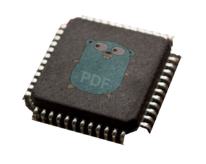
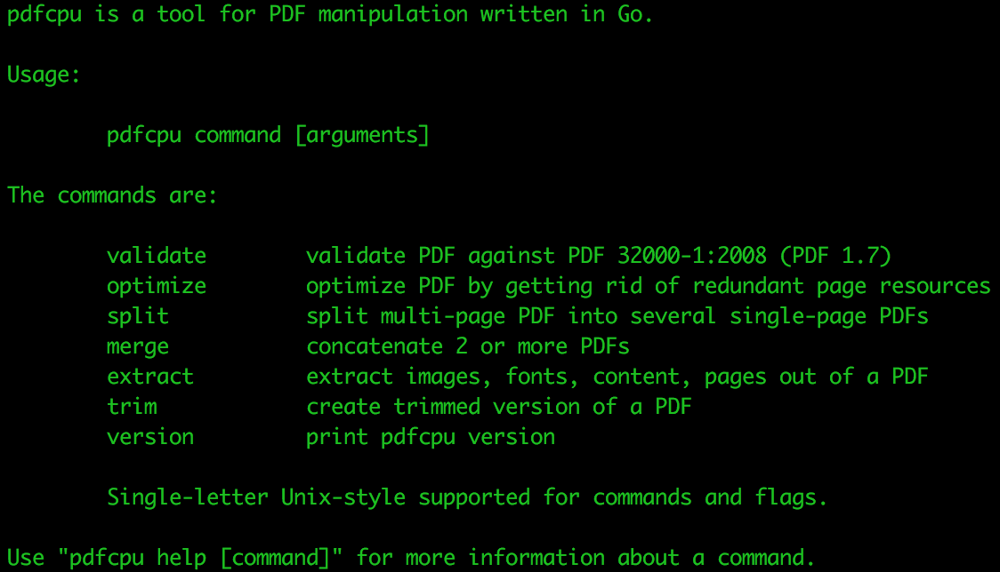

 
 
 

  # pdfcpu: a golang pdf processor

Package pdfcpu is a simple PDF processing library written in [Go](http://golang.org).
It provides both an API and a command line tool.
Supported are all versions up to PDF 1.7 (ISO-32000).

### Motivation

Reducing the size of large PDF files for mass mailings by optimization to the bare minimum.
This can be achieved by analyzing a PDF's cross reference table, removing redundant embedded resources like font files or images and by always writing back the file maxing out PDF compression.

I also wanted to have my own swiss army knife for PDFs written entirely in [Go](http://golang.org) that allows me to trim, split and merge PDF content.

### Features
* Validate (validates PDF files up to version 7.0)
* Read (builds xref table from PDF file)
* Write (writes xref table to PDF file)
* Optimize (gets rid of redundancies like duplicate fonts, images)
* Split (split a multi page PDF file into single page PDF files)
* Merge (a set of PDF files into one consolidated PDF file)
* Trim (generate a custom version of a PDF file)
* Extract Images (extract all embedded images of a PDF file into a given dir)
* Extract Fonts (extract all embedded fonts of a PDF file into a given dir)
* Extract Pages (extract specific pages into a given dir)
* Extract Content (extract the PDF-Source into given dir)

### Demo Screencast

### Installation
`go get github.com/hhrutter/pdfcpu/cmd/...`

### Usage

    pdfcpu validate [-verbose] [-mode strict|relaxed] [-upw userpw] [-opw ownerpw] inFile

    pdfcpu optimize [-verbose] [-stats csvFile] [-upw userpw] [-opw ownerpw] inFile [outFile]
 
    pdfcpu split [-verbose] [-upw userpw] [-opw ownerpw] inFile outDir
 
    pdfcpu merge [-verbose] outFile inFile1 inFile2 ...
 
    pdfcpu extract [-verbose] -mode image|font|content|page [-pages pageSelection] [-upw userpw] [-opw ownerpw] inFile outDir
 
    pdfcpu trim [-verbose] -pages pageSelection [-upw userpw] [-opw ownerpw] inFile outFile

 [Please read the documentation ](https://godoc.org/github.com/hhrutter/pdfcpu)

### Status
Version: 0.0.7

* Encryption support is available for the PDF standard security handler.
* The extraction code for font files and images is experimental and serves as proof of concept only.

### To Do
* validation of the less used PDF page entry element "PresSteps"
* validation of the less used PDF root entry elements "SpiderInfo", "Permissions", "Legal" and "Collection"

I am looking for PDFs using one of these features in order to implement validation. If you have one and you can share let me know.

### Contributing
Pull requests, bug fixes and issue reports are always welcome.

Please open an issue if you want to propose a change.

PDF files that will increase pdfcpu's coverage are very much welcome.

### Disclaimer
Usage of pdfcpu assumes you know about and respect all copyrights of any PDF content you may be processing. This applies to the PDF files as such, their content and in particular all embedded resources like font files or images. Credit goes to [Renee French](https://instagram.com/reneefrench) for creating our beloved Gopher.

### License
MIT

	