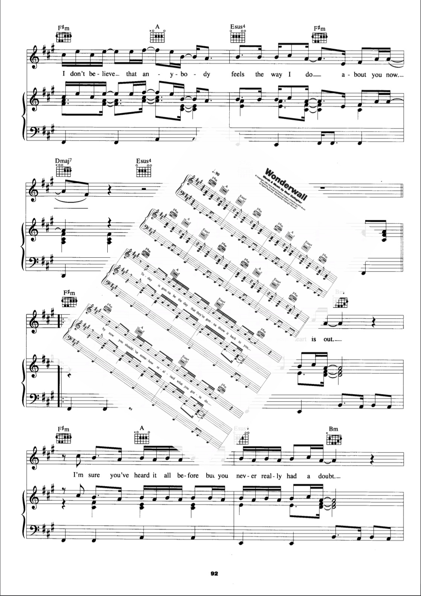

# pdfcpu: a golang pdf processor

Package pdfcpu is a simple PDF processing library written in [Go](http://golang.org) supporting encryption.
It provides both an API and a CLI. Supported are all versions up to PDF 1.7 (ISO-32000).

## Status

Version: 0.1.20

The Xmas release is here bringing you something to play with over the holidays with two new commands:

* Import 
* Rotate

The <i>Import</i>  command converts images to PDF or creates a PDF photo album tailored to your specific needs:

Create a quick single page PDF containing an image: 
`pdfcpu import photo.pdf photo.png` 
By using the implied default positioning parameter `p:full` the page size is going to be equal to the image size.

Generate a PDF gallery of image files assuming the folder pics contains jpg,png or tif files only: 
`pdfcpu import album.pdf pics/*` 
This is my favorite one :green_heart:

Generate a PDF gallery of image files each of them centered on its page with the default relative scaling 0.5: 
`pdfcpu import 'p:c' album.pdf pics/*` 

The following command also generates a PDF gallery but additionally configures the <i>Letter</i> output format and positioning anchored to the bottom left corner with a horizontal offset of 10 and a vertical offset of 15 points in PDF user space with a scaling of 0.3 relative to page dimensions: 
`pdfcpu import 'f:Letter, p:bl, o:10 20, s:0.3' album.pdf *.jpg`

<i>Import</i> will create the output file if it does not exist otherwise it will append the new pages to an existing PDF. This is a nice feature enabling to append the gallery to a prepared cover page. 
Please refer to `pdfcpu help import` for details about this command including the <i>description</i> string and available positioning anchors.  

If a gallery created by <i>Import</i> ends up having some pages with images not in upright position <i>Rotate</i> comes to the rescue. 
The Rotate command rotates selected pages clockwise by a multiple of 90 degrees: 

Rotate all pages clockwise by 90 degrees: 
`pdfcpu rotate test.pdf 90`

Rotate the first two pages counter clockwise by 90 degrees: 
`pdfcpu rotate -pages 1-2 -90`

  &nbsp;&nbsp;&nbsp;
  &nbsp;&nbsp;&nbsp;
  &nbsp;&nbsp;&nbsp;
  

## Motivation

This is an effort to build a PDF processing library from the ground up written in Go with strong support for batch processing via a rich command line. Over time `pdfcpu` aims to support the standard range of PDF processing features and also any interesting use cases that may present themselves along the way.

One example is reducing the size of large PDF files for mass mailings by optimization to the bare minimum. This can be achieved by analyzing a PDF's cross reference table, removing redundant embedded resources like font files or images and by always writing back the file maxing out PDF compression. I also wanted to have my own swiss army knife for PDFs written entirely in [Go](http://golang.org) that allows me to trim, split, stamp and merge PDF content.

## Features

* Validate (validates PDF files up to version 7.0)
* Read (builds xref table from PDF file)
* Write (writes xref table to PDF file)
* Optimize (gets rid of redundancies like duplicate fonts, images)
* Split (split multi-page PDF into several PDFs according to split span)
* Merge (a set of PDF files into one consolidated PDF file)
* Extract Images (extract all embedded images of a PDF file into a given dir)
* Extract Fonts (extract all embedded fonts of a PDF file into a given dir)
* Extract Pages (extract specific pages into a given dir)
* Extract Content (extract the PDF-Source into given dir)
* Extract Metadata (extract XML metadata)
* Trim (generate a custom version of a PDF file including selected pages)
* Stamp/Watermark selected pages with text, image or PDF page
* Import convert/import images into PDF
* Rotate selected pages
* Manage (add,remove,list,extract) embedded file attachments
* Encrypt (sets password protection)
* Decrypt (removes password protection)
* Change user/owner password
* Manage (add,list) user access permissions

## Demo Screencast (this is an older version with a smaller command set)

## Installation

Required build version: go1.9 and up

`go get github.com/hhrutter/pdfcpu/cmd/...`

## Usage

    pdfcpu validate [-verbose] [-mode strict|relaxed] [-upw userpw] [-opw ownerpw] inFile
    pdfcpu optimize [-verbose] [-stats csvFile] [-upw userpw] [-opw ownerpw] inFile [outFile]
    pdfcpu split [-verbose] [-upw userpw] [-opw ownerpw] inFile outDir [span]
    pdfcpu merge [-verbose] outFile inFile...
    pdfcpu extract [-verbose] -mode image|font|content|page|meta [-pages pageSelection] [-upw userpw] [-opw ownerpw] inFile outDir
    pdfcpu trim [-verbose] -pages pageSelection [-upw userpw] [-opw ownerpw] inFile outFile
    
    pdfcpu stamp [-verbose] -pages pageSelection description inFile [outFile]
    pdfcpu watermark [-verbose] -pages pageSelection description inFile [outFile]
    pdfcpu import [-v(erbose)|vv] [description] outFile imageFile...
    pdfcpu rotate [-v(erbose)|vv] [-pages pageSelection] inFile rotation

    pdfcpu attach list [-verbose] [-upw userpw] [-opw ownerpw] inFile
    pdfcpu attach add [-verbose] [-upw userpw] [-opw ownerpw] inFile file...
    pdfcpu attach remove [-verbose] [-upw userpw] [-opw ownerpw] inFile [file...]
    pdfcpu attach extract [-verbose] [-upw userpw] [-opw ownerpw] inFile outDir [file...]

    pdfcpu encrypt [-verbose] [-mode rc4|aes] [-key 40|128] [-perm none|all] [-upw userpw] [-opw ownerpw] inFile [outFile]
    pdfcpu decrypt [-verbose] [-upw userpw] [-opw ownerpw] inFile [outFile]
    pdfcpu changeupw [-verbose] [-opw ownerpw] inFile upwOld upwNew
    pdfcpu changeopw [-verbose] [-upw userpw] inFile opwOld opwNew

    pdfcpu perm list [-verbose] [-upw userpw] [-opw ownerpw] inFile
    pdfcpu perm add [-verbose] [-perm none|all] [-upw userpw] -opw ownerpw inFile

    pdfcpu version

 [Please read the documentation](https://godoc.org/github.com/hhrutter/pdfcpu)

## Contributing

### What

* Please open an issue if you find a bug or want to propose a change.
* Feature requests - always welcome!
* Bug fixes - always welcome!
* PRs - also welcome, although I can't promise a merge-in right now.
* `pdfcpu` is stable but still _alpha_ and occasionally undergoing heavy changes.

### How

* If you want to report a bug please attach the *very verbose* (`pdfcpu cmd -vv ...`) output and ideally a test PDF that you can share.
* Always make sure your contribution is based on the latest commit.
* Please sign your commits.
* Please sign the [CLA](https://cla-assistant.io/hhrutter/pdfcpu) before you submit a PR.

## Contributors

Thanks goes to these wonderful people:
<!-- ALL-CONTRIBUTORS-LIST:START - Do not remove or modify this section -->
| [ <b>Horst Rutter</b>](https://github.com/hhrutter)  |[ <b>haldyr</b>](https://github.com/haldyr)  | [ <b>Vyacheslav</b>](https://github.com/SimePel)  | [ <b>Erik Unger</b>](https://github.com/ungerik)  ||||
| :---: | :---: | :---: | :---: | :---: | :---: | :---: |
<!-- ALL-CONTRIBUTORS-LIST:END - Do not remove or modify this section -->

## Code of Conduct

Please note that this project is released with a Contributor [Code of Conduct](CODE_OF_CONDUCT.md). By participating in this project you agree to abide by its terms.

## Disclaimer

Usage of `pdfcpu` assumes you know about and respect all copyrights of any PDF content you may be processing. This applies to the PDF files as such, their content and in particular all embedded resources like font files or images. Credit goes to [Renee French](https://instagram.com/reneefrench) for creating our beloved Gopher.

## License

Apache-2.0

## Powered By

  

