> **Try the [v0.14.0-rc.1 pre-release](https://github.com/pdfcpu/pdfcpu/releases/tag/v0.14.0-rc.1).**

# pdfcpu: PDF tooling for Go and the command line

[](https://github.com/pdfcpu/pdfcpu/actions)
[](https://coveralls.io/github/pdfcpu/pdfcpu?branch=master)
[](https://pkg.go.dev/github.com/pdfcpu/pdfcpu)
[](https://opensource.org/licenses/Apache-2.0)
[](https://github.com/sponsors/hhrutter)

<p align="left">
  <a href="https://pdfcpu.io">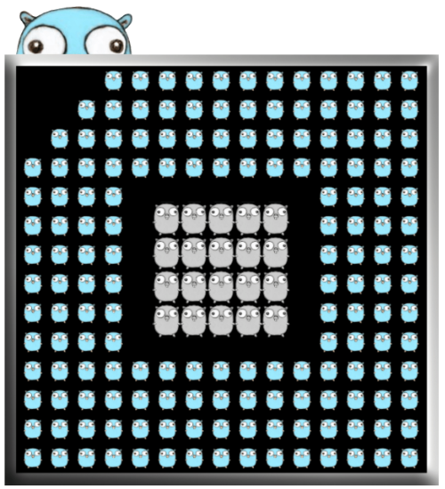</a>
</p>

pdfcpu is a PDF processing library and command-line tool written in Go. It supports validation, optimization,
encryption, signing, document assembly, content extraction, and other common PDF operations.

pdfcpu supports PDF versions through PDF 2.0 (ISO 32000-2). PDF 2.0 validation support is basic and continuously
improving.

<p align="left">
  <a href="https://pdfa.org"></a>
  &nbsp; Horst Rutter, the maintainer of pdfcpu, is a member of the PDF Association.
</p>

---

## Installation

| Command-line interface | Go API |
| --- | --- |
| **[CLI Installation instructions](https://pdfcpu.io/getting_started/install_cli/?src=github-readme)** | **[API Installation instructions](https://pdfcpu.io/getting_started/install_api/?src=github-readme)** |

---

## Usage

### CLI

Validate a PDF:
```
pdfcpu validate input.pdf
```

Merge two PDFs:
```
pdfcpu merge merged.pdf in1.pdf in2.pdf
```

### Go API

See API documentation for usage examples.

---

## Features

* Validate, optimize, split, trim, and merge PDFs
* Extract and manipulate images, fonts, and metadata
* Encrypt and decrypt PDFs
* Resize and rotate pages
* Add and remove stamps and watermarks
* Validate signature integrity, report signature evidence, and remove signatures
* Manage attachments and portfolios

## Examples

Selected examples:

<p align="center">
  <kbd><a href="https://pdfcpu.io/generate/grid">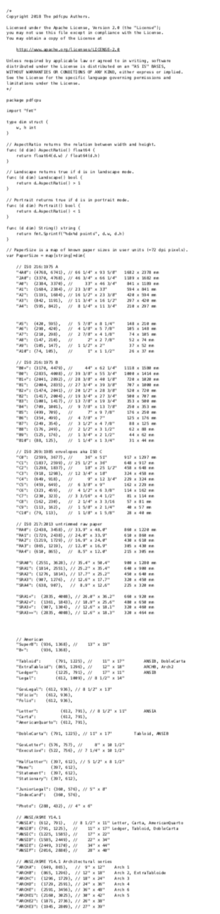</a></kbd>&nbsp;
  <kbd><a href="https://pdfcpu.io/core/watermark">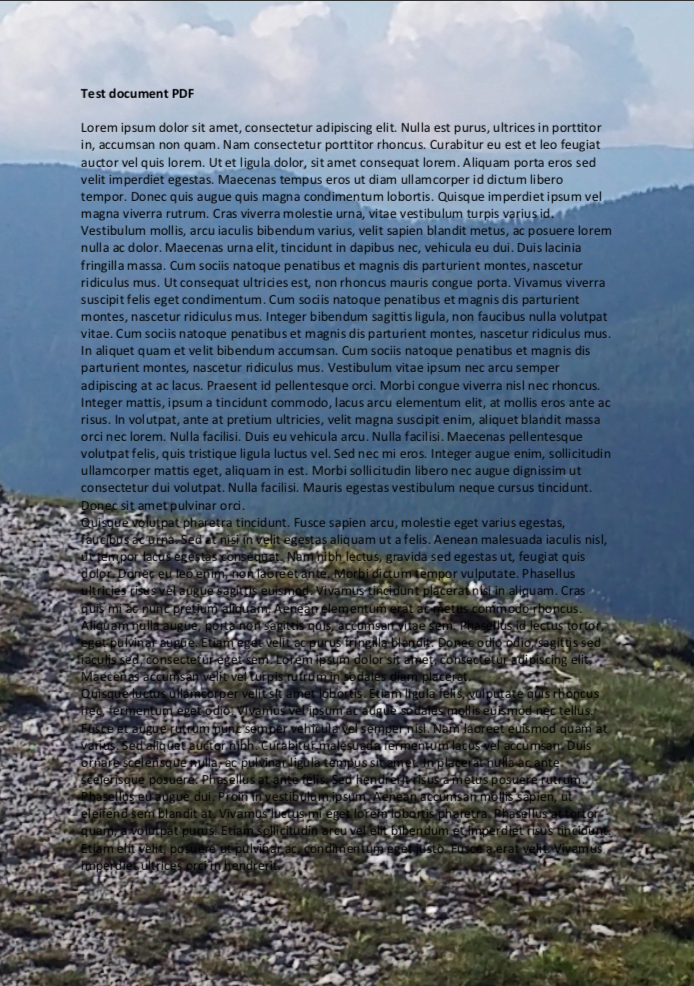</a></kbd>&nbsp;
  <kbd><a href="https://pdfcpu.io/generate/nup">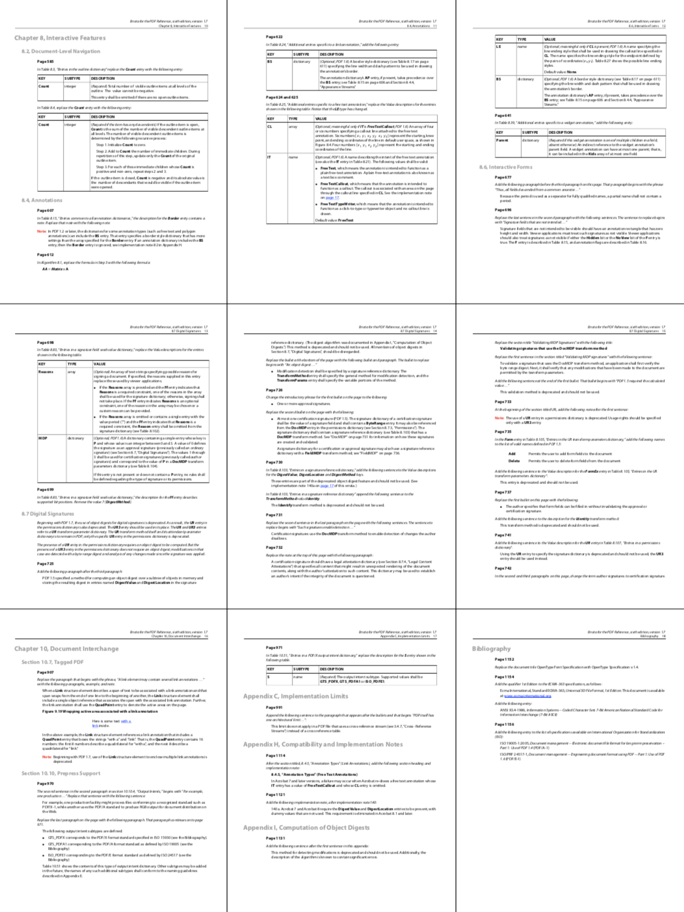</a></kbd>&nbsp;
  <kbd><a href="https://pdfcpu.io/fonts/fonts">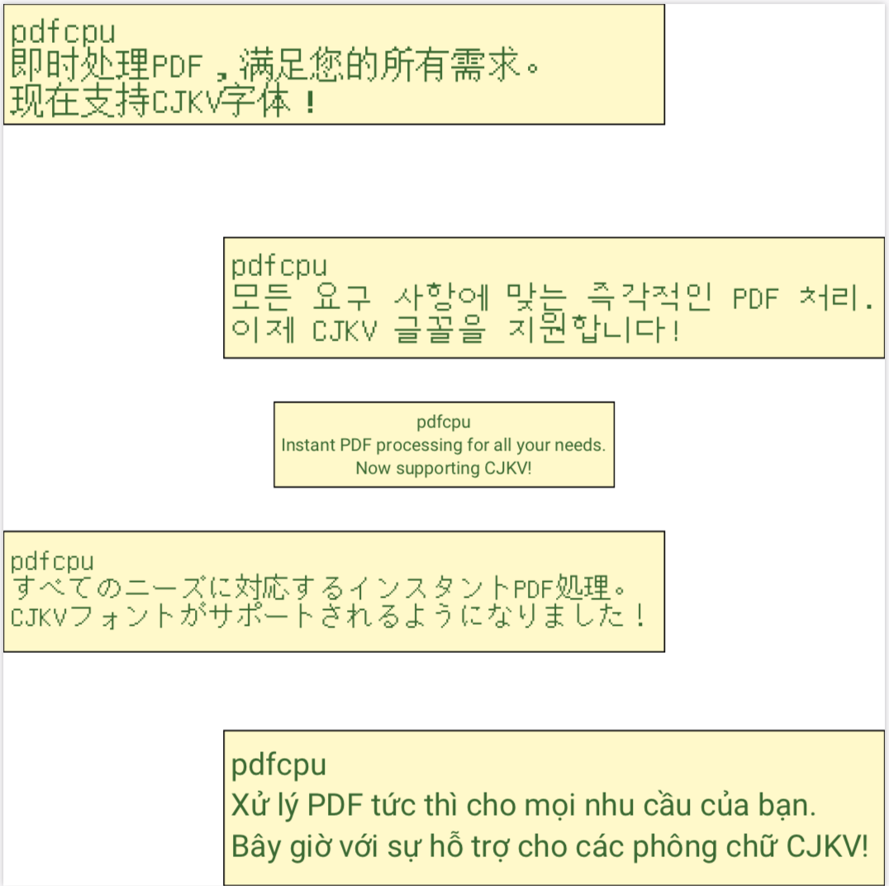</a></kbd>&nbsp;
  <kbd><a href="https://pdfcpu.io/core/stamp">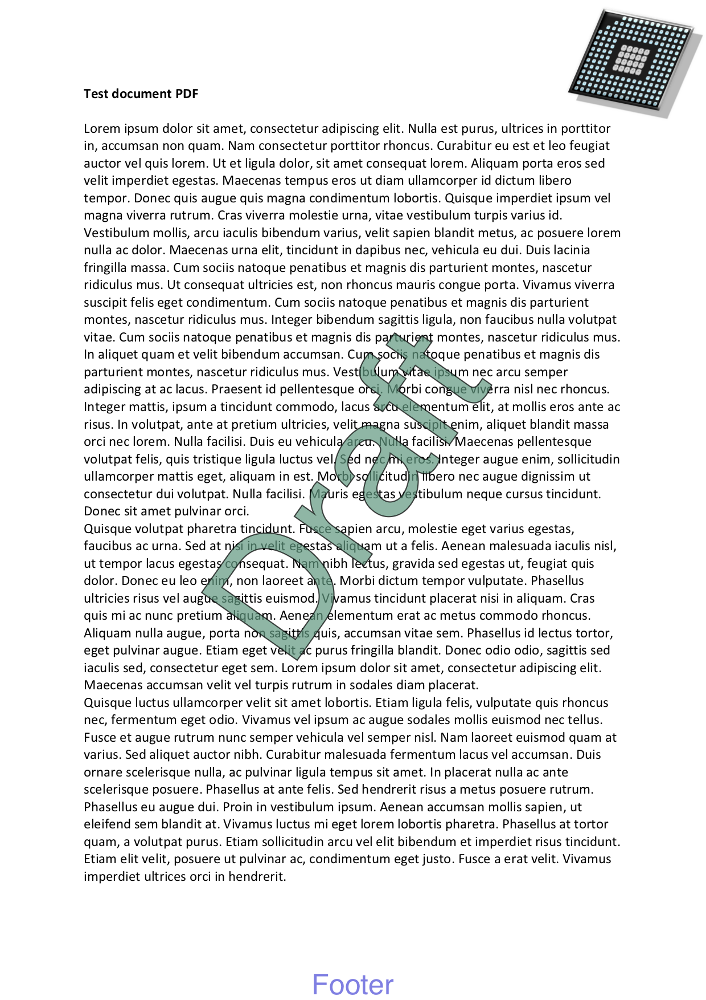</a></kbd>&nbsp;
  <kbd><a href="https://pdfcpu.io/form/form">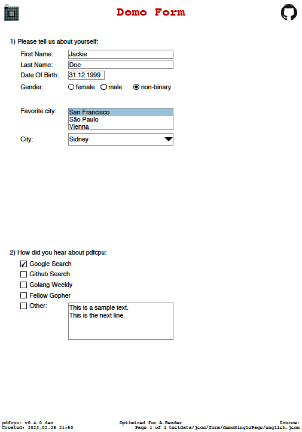</a></kbd><br><br>
  <kbd><a href="https://pdfcpu.io/create/create">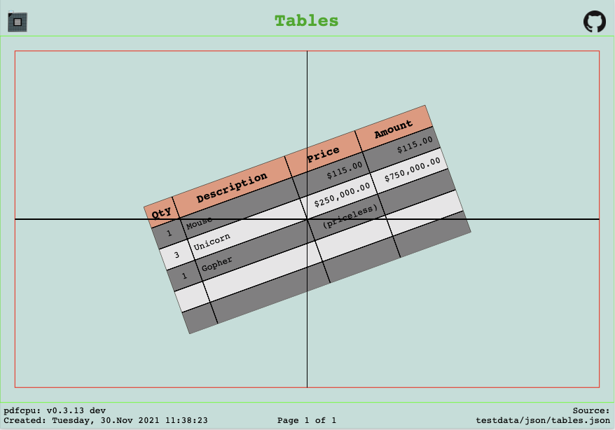</a></kbd>&nbsp;
  <kbd><a href="https://pdfcpu.io/core/stamp">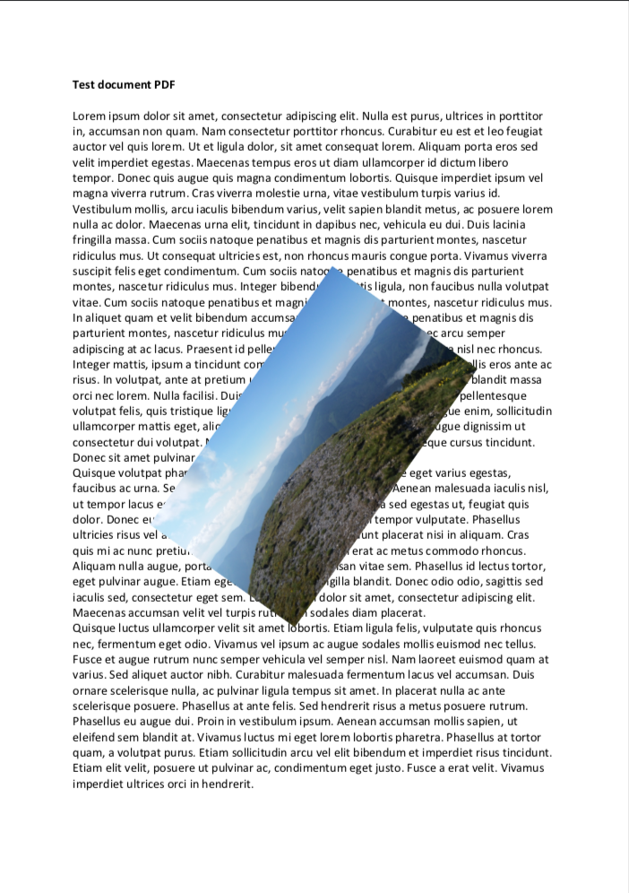</a></kbd>&nbsp;
  <kbd><a href="https://pdfcpu.io/core/watermark">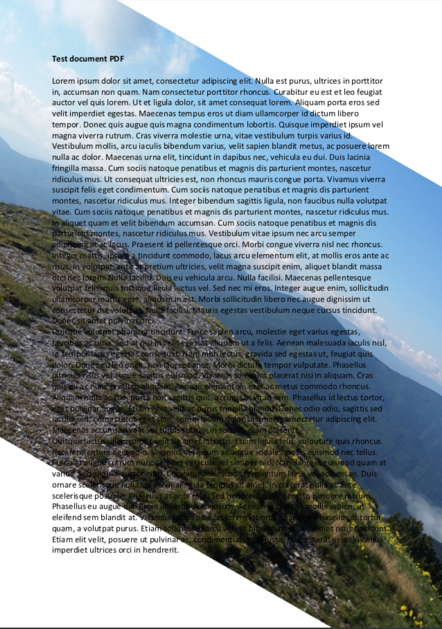</a></kbd>&nbsp;
  <kbd><a href="https://pdfcpu.io/create/create">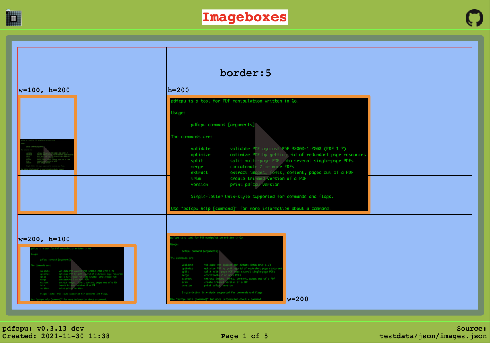</a></kbd>&nbsp;<br><br>
  <kbd><a href="https://pdfcpu.io/generate/booklet">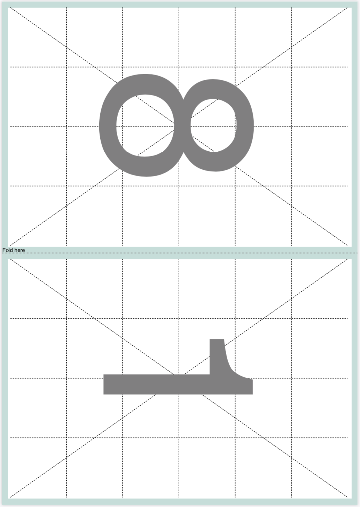</a></kbd>
  <kbd><a href="https://pdfcpu.io/core/stamp">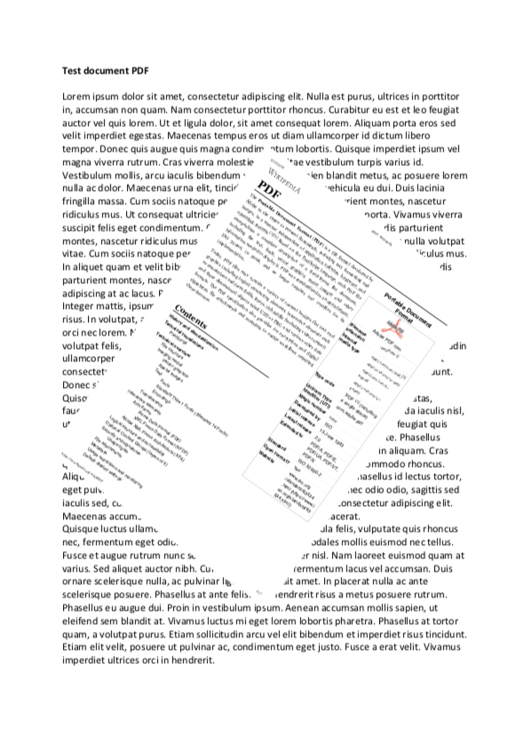</a></kbd>&nbsp;
  <kbd><a href="https://pdfcpu.io/generate/grid"></a></kbd>
  <kbd><a href="https://pdfcpu.io/core/stamp">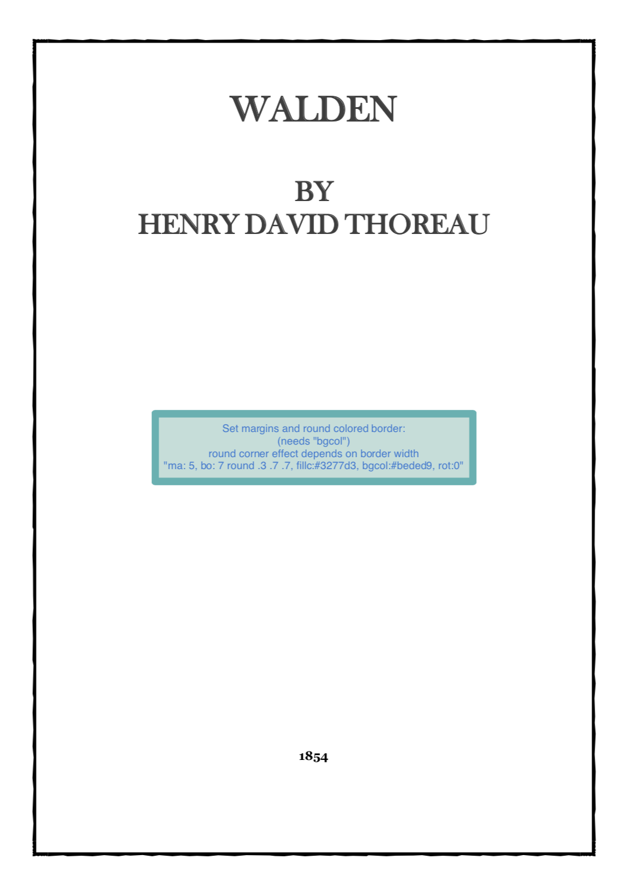</a></kbd>
  <kbd><a href="https://pdfcpu.io/generate/booklet"></a></kbd>
</p>

---

## Commands

Complete list of supported commands:

| | | |
|---|---|---|
| [annotations](https://pdfcpu.io/annot/annot) | [attachments](https://pdfcpu.io/attach/attach) | [booklet](https://pdfcpu.io/generate/booklet) |
| [bookmarks](https://pdfcpu.io/bookmarks/bookmarks) | [boxes](https://pdfcpu.io/boxes/boxes) | [certificates](https://pdfcpu.io/core/certs) |
| [change owner password](https://pdfcpu.io/encrypt/change_opw) | [change user password](https://pdfcpu.io/encrypt/change_upw) | [collect](https://pdfcpu.io/core/collect) |
| [config](https://pdfcpu.io/config/config) | [create](https://pdfcpu.io/create/create) | [crop](https://pdfcpu.io/core/crop) |
| [cut](https://pdfcpu.io/generate/cut) | [decrypt](https://pdfcpu.io/encrypt/decryptpdf) | [encrypt](https://pdfcpu.io/encrypt/encryptpdf) |
| [extract](https://pdfcpu.io/extract/extract) | [fonts](https://pdfcpu.io/fonts/fonts) | [form](https://pdfcpu.io/form/form) |
| [grid](https://pdfcpu.io/generate/grid) | [images](https://pdfcpu.io/images/images) | [import](https://pdfcpu.io/generate/import) |
| [info](https://pdfcpu.io/info) | [keywords](https://pdfcpu.io/keywords/keywords) | [merge](https://pdfcpu.io/core/merge) |
| [ndown](https://pdfcpu.io/generate/ndown) | [nup](https://pdfcpu.io/generate/nup) | [optimize](https://pdfcpu.io/core/optimize) |
| [pagelayout](https://pdfcpu.io/pagelayout/pagelayout) | [pagemode](https://pdfcpu.io/pagemode/pagemode) | [pages](https://pdfcpu.io/pages/pages) |
| [permissions](https://pdfcpu.io/encrypt/perm_set) | [portfolio](https://pdfcpu.io/portfolio/portfolio) | [poster](https://pdfcpu.io/generate/poster) |
| [properties](https://pdfcpu.io/properties/properties) | [resize](https://pdfcpu.io/core/resize) | [rotate](https://pdfcpu.io/core/rotate) |
| [signatures](https://pdfcpu.io/core/sign) | [split](https://pdfcpu.io/core/split) | [stamp](https://pdfcpu.io/core/stamp) |
| [trim](https://pdfcpu.io/core/trim) | [validate](https://pdfcpu.io/core/validate) | [viewerpref](https://pdfcpu.io/viewerpref/viewerpref) |
| [watermark](https://pdfcpu.io/core/watermark) | [zoom](https://pdfcpu.io/core/zoom) | |

---

## Motivation

pdfcpu aims to provide comprehensive PDF processing capabilities implemented in Go for both individual files and
automated batch processing.

It focuses on correctness, robustness and independence from external dependencies.

---

## Focus

- comprehensive PDF processing functionality  
- minimal external dependencies  
- predictable and stable behavior  

---

## Documentation

* Project documentation: https://pdfcpu.io
* Changelog: https://pdfcpu.io/changelog
* [Contributing guidelines](CONTRIBUTING.md)
* [Security policy](SECURITY.md)

### CLI

* Command help: `pdfcpu [command] --help`

### Go API

* Package documentation: https://pkg.go.dev/github.com/pdfcpu/pdfcpu
* API documentation: https://pkg.go.dev/github.com/pdfcpu/pdfcpu/pkg/api
* Examples:

  * https://github.com/pdfcpu/pdfcpu/tree/master/pkg/api/test
  * https://github.com/pdfcpu/pdfcpu/tree/master/pkg/samples

---

## Contributing

Contributions are welcome. See the [contributing guidelines](CONTRIBUTING.md) and the
[complete list of contributors](https://github.com/pdfcpu/pdfcpu/graphs/contributors).

### Reporting PDF issues

For triage, we use Adobe Acrobat Reader and macOS Preview as practical compatibility references.
<br>
Reports are especially helpful when a PDF opens in either application but cannot be processed by pdfcpu, as these cases may
reveal opportunities to improve validation or parser compatibility.
<br>
If neither application can open the PDF, it is unlikely that pdfcpu will be able to process it reliably.

Start by validating the file:

```bash
pdfcpu validate -vv <file.pdf>
```

Include the command, its verbose output, and a sample PDF with the report.
<br>
Please submit only files that you have permission to share and that contain no confidential information or personal data.

---

## Security

Please do not report security vulnerabilities through public GitHub issues.
<br>
See the [security policy](SECURITY.md) for private reporting instructions.

---

## Code of Conduct

This project is released with a Contributor [Code of Conduct](CODE_OF_CONDUCT.md).
By participating, you agree to abide by its terms.

---
## Disclaimer

Use of pdfcpu assumes compliance with all applicable copyrights for any processed PDF content, including embedded resources such as fonts and images.

Gopher artwork by [Renee French](https://www.instagram.com/reneefrenchphoto)

---

## License

Apache License 2.0

---


