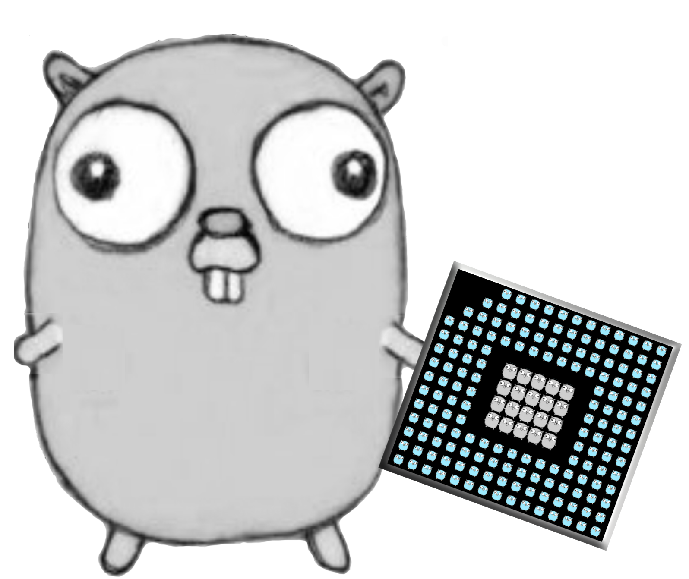

# pdfcpu: a PDF processor written in Go with CLI and API support

[](https://github.com/pdfcpu/pdfcpu/actions)
[](https://coveralls.io/github/pdfcpu/pdfcpu?branch=master)
[](https://pkg.go.dev/github.com/pdfcpu/pdfcpu)
[](https://goreportcard.com/report/github.com/pdfcpu/pdfcpu)
[](https://opensource.org/licenses/Apache-2.0)
[](https://github.com/sponsors/hhrutter)

<p align="left">
  <a href="https://pdfcpu.io"></a>
  <a href="https://pdfa.org"></a>
</p>

pdfcpu is a PDF processing library written in Go.

It is compatible with all PDF versions. Support for PDF 2.0 (ISO-32000-2) is evolving and continuously improving.

---

## Installation

### CLI

Prebuilt binaries and installation instructions (Homebrew, Docker, packages):

[Installation instructions](https://pdfcpu.io/install/cli)


### Go API

Install pdfcpu as a Go module:

```
go get github.com/pdfcpu/pdfcpu
```

API documentation:

[Installation and usage](https://pdfcpu.io/install/api)


---

## Usage

### CLI

Validate against PDF 2.0 (ISO-32000-2):
```
pdfcpu validate input.pdf
```

Merge two PDFs:
```
pdfcpu merge out.pdf in1.pdf in2.pdf
```

### Go API

See API documentation for usage examples.

---

## Features

* Validate, optimize, split, trim, and merge PDFs
* Extract and manipulate images, fonts, and metadata
* Encrypt and decrypt PDFs
* Resize and rotate pages
* Add and remove stamps and watermarks
* Manage digital signatures (ongoing work)
* Manage attachments and more...

## In Action

Common operations and examples:

<p align="center">
  <kbd><a href="https://pdfcpu.io/generate/grid"></a></kbd>&nbsp;
  <kbd><a href="https://pdfcpu.io/core/watermark"></a></kbd>&nbsp;
  <kbd><a href="https://pdfcpu.io/generate/nup"></a></kbd>&nbsp;
  <kbd><a href="https://pdfcpu.io/fonts/fonts"></a></kbd>&nbsp;
  <kbd><a href="https://pdfcpu.io/core/stamp"></a></kbd>&nbsp;
  <kbd><a href="https://pdfcpu.io/form/form"></a></kbd><br><br>
  <kbd><a href="https://pdfcpu.io/generate/create"></a></kbd>&nbsp;
  <kbd><a href="https://pdfcpu.io/core/stamp"></a></kbd>&nbsp;
  <kbd></kbd>&nbsp;
  <kbd><a href="https://pdfcpu.io/core/watermark"></a></kbd>&nbsp;
  <kbd><a href="https://pdfcpu.io/generate/create"></a></kbd>&nbsp;<br><br>
  <kbd><a href="https://pdfcpu.io/generate/booklet"></a></kbd>
  <kbd><a href="https://pdfcpu.io/core/stamp"></a></kbd>&nbsp;
  <kbd><a href="https://pdfcpu.io/generate/grid"></a></kbd>
  <kbd><a href="https://pdfcpu.io/core/stamp"></a></kbd>
  <kbd><a href="https://pdfcpu.io/generate/booklet"></a></kbd>
</p>

---

## Command Set

Complete list of supported commands:

| | | |
|---|---|---|
| [annotations](https://pdfcpu.io/annot/annot) | [attachments](https://pdfcpu.io/attach/attach) | [booklet](https://pdfcpu.io/generate/booklet) |
| [bookmarks](https://pdfcpu.io/bookmarks/bookmarks) | [boxes](https://pdfcpu.io/boxes/boxes) | [certificates](https://pdfcpu.io/core/certs) |
| [change owner password](https://pdfcpu.io/encrypt/change_opw) | [change user password](https://pdfcpu.io/encrypt/change_upw) | [collect](https://pdfcpu.io/core/collect) |
| [config](https://pdfcpu.io/config/config) | [create](https://pdfcpu.io/create/create) | [crop](https://pdfcpu.io/core/crop) |
| [cut](https://pdfcpu.io/generate/cut) | [decrypt](https://pdfcpu.io/encrypt/decryptPDF) | [encrypt](https://pdfcpu.io/encrypt/encryptPDF) |
| [extract](https://pdfcpu.io/extract/extract) | [fonts](https://pdfcpu.io/fonts/fonts) | [form](https://pdfcpu.io/form/form) |
| [grid](https://pdfcpu.io/generate/grid) | [images](https://pdfcpu.io/images/images) | [import](https://pdfcpu.io/generate/import) |
| [info](https://pdfcpu.io/info) | [keywords](https://pdfcpu.io/keywords/keywords) | [merge](https://pdfcpu.io/core/merge) |
| [ndown](https://pdfcpu.io/generate/ndown) | [nup](https://pdfcpu.io/generate/nup) | [optimize](https://pdfcpu.io/core/optimize) |
| [pagelayout](https://pdfcpu.io/pagelayout/pagelayout) | [pagemode](https://pdfcpu.io/pagemode/pagemode) | [pages](https://pdfcpu.io/pages/pages) |
| [permissions](https://pdfcpu.io/encrypt/perm_set) | [portfolio](https://pdfcpu.io/portfolio/portfolio) | [poster](https://pdfcpu.io/generate/poster) |
| [properties](https://pdfcpu.io/properties/properties) | [resize](https://pdfcpu.io/core/resize) | [rotate](https://pdfcpu.io/core/rotate) |
| [signatures](https://pdfcpu.io/core/sign) | [split](https://pdfcpu.io/core/split) | [stamp](https://pdfcpu.io/core/stamp) |
| [trim](https://pdfcpu.io/core/trim) | [validate](https://pdfcpu.io/core/validate) | [viewerpref](https://pdfcpu.io/viewerpref/viewerpref) |
| [watermark](https://pdfcpu.io/core/watermark) | [zoom](https://pdfcpu.io/core/zoom) | |

---

## Motivation

pdfcpu aims to provide comprehensive PDF processing capabilities implemented in Go.

It focuses on correctness, robustness and independence from external dependencies.

---

## Focus

- comprehensive PDF processing functionality  
- minimal external dependencies  
- predictable and stable behavior  

---

## Documentation

* Project documentation: https://pdfcpu.io

### CLI

* Command help: `pdfcpu [command] --help`

### Go API

* Package documentation: https://pkg.go.dev/github.com/pdfcpu/pdfcpu
* API documentation: https://pkg.go.dev/github.com/pdfcpu/pdfcpu/pkg/api
* Examples:

  * https://github.com/pdfcpu/pdfcpu/tree/master/pkg/api/test
  * https://github.com/pdfcpu/pdfcpu/tree/master/pkg/samples

---

## Contributing

Contributions are welcome.

* Report bugs or propose changes via [issues](https://github.com/pdfcpu/pdfcpu/issues/new/choose)
* Discuss ideas on the [discussion board](https://github.com/pdfcpu/pdfcpu/discussions)
* For PRs, please open an issue or discussion first
v
### Guidelines

* Base your work on the latest commit
* Include verbose output (`pdfcpu cmd -vv ...`) and a sample PDF when reporting issues
* Please sign your commits

### Reporting crashes

Crashes may occur due to the wide variety of PDF producers and formats in use, including older or non-compliant files. In many cases this is related to validation issues or edge cases in the parser.

Even with relaxed validation, some files cannot be processed. These cases are essential for improving pdfcpu by extending validation and handling additional real-world PDFs.

If you encounter a crash, please report it.

Start by validating the file using the CLI:

```bash
pdfcpu validate -vv <file.pdf>
```

Include in your report:

* the command used
* verbose output (`-vv`)
* a sample PDF (if possible)

If validation crashes for a PDF that opens in Adobe Reader or macOS Preview, it is likely we can extend relaxed validation and provide a fix.

If the file cannot be opened by both Adobe Reader and macOS Preview, we cannot support it.

Please include a sample PDF to reproduce the issue whenever possible.

---

## Contributors

Thanks 💚 to all contributors:

<!-- ALL-CONTRIBUTORS-LIST:START - Do not remove or modify this section -->

||||||||
| :---: | :---: | :---: | :---: | :---: |  :---: | :---: |
| [<br/><sub><b>Horst Rutter</b></sub>](https://github.com/hhrutter) | [<br/><sub><b>haldyr</b></sub>](https://github.com/haldyr) | [<br/><sub><b>Vyacheslav</b></sub>](https://github.com/SimePel) | [<br/><sub><b>Erik Unger</b></sub>](https://github.com/ungerik) | [<br/><sub><b>Richard Wilkes</b></sub>](https://github.com/richardwilkes) | [<br/><sub><b>minenok-tutu</b></sub>](https://github.com/minenok-tutu) | [<br/><sub><b>Mateusz Burniak</b></sub>](https://github.com/matbur) |
| [<br/><sub><b>Dmitry Harnitski</b></sub>](https://github.com/dharnitski) | [<br/><sub><b>ryarnyah</b></sub>](https://github.com/ryarnyah) | [<br/><sub><b>Sam Giffney</b></sub>](https://github.com/s01ipsist) | [<br /><sub><b>Carlos Eduardo Witte</b></sub>](https://github.com/cewitte) | [<br/><sub><b>minusworld</b></sub>](https://github.com/minusworld) | [<br/><sub><b>Witold Konior</b></sub>](https://github.com/jozuenoon) | [<br/><sub><b>joonas.fi</b></sub>](https://github.com/joonas-fi) |
| [<br/><sub><b>Henrik Reinstädtler</b></sub>](https://github.com/henrixapp) | [<br/><sub><b>VMorozov-wh</b></sub>](https://github.com/VMorozov-wh) | [<br/><sub><b>Benoit KUGLER</b></sub>](https://github.com/benoitkugler) | [<br/><sub><b>Adam Greenhall</b></sub>](https://github.com/adamgreenhall) | [<br/><sub><b>moritamori</b></sub>](https://github.com/moritamori) | [<br/><sub><b>JanBaryla</b></sub>](https://github.com/JanBaryla) | [<br/><sub><b>TheDiscordian</b></sub>](https://github.com/TheDiscordian) |
| [<br/><sub><b>Rafael Garcia Argente</b></sub>](https://github.com/rgargente) | [<br/><sub><b>truyet</b></sub>](https://github.com/truyet) | [<br/><sub><b>Christian Nicola</b></sub>](https://github.com/christiannicola) | [<br/><sub><b>Benjamin Krill</b></sub>](https://github.com/kben) | [<br/><sub><b>Peter Wyatt</b></sub>](https://github.com/petervwyatt) | [<br/><sub><b>Kroum Tzanev</b></sub>](https://github.com/kpym) | [<br/><sub><b>Stefan Huber</b></sub>](https://github.com/signalwerk) |
| [<br/><sub><b>Juan Iscar</b></sub>](https://github.com/juaismar) | [<br/><sub><b>Eng Zer Jun</b></sub>](https://github.com/Juneezee) | [<br/><sub><b>Dmitry Ivanov</b></sub>](https://github.com/hant0508)|[<br/><sub><b>Rene Kaufmann</b></sub>](https://github.com/HeavyHorst)|[<br/><sub><b>Christian Heusel</b></sub>](https://github.com/christian-heusel) | [<br/><sub><b>Chris</b></sub>](https://github.com/freshteapot) | [<br/><sub><b>Lukasz Czaplinski</b></sub>](https://github.com/scoiatael) |
[<br/><sub><b>Joel Silva Schutz</b></sub>](https://github.com/joelschutz) | [<br/><sub><b>semvis123</b></sub>](https://github.com/semvis123) | [<br/><sub><b>guangwu</b></sub>](https://github.com/testwill) | [<br/><sub><b>Yoshiki Nakagawa</b></sub>](https://github.com/yyoshiki41) | [<br/><sub><b>Steve van Loben Sels</b></sub>](https://github.com/stevevls) | [<br/><sub><b>Yaofu</b></sub>](https://github.com/mygityf) | [<br/><sub><b>vsenko</b></sub>](https://github.com/vsenko) |
[<br/><sub><b>Alexis Hildebrandt</b></sub>](https://github.com/afh) | [<br/><sub><b>Sivukhin Nikita</b></sub>](https://github.com/sivukhin)  | [<br/><sub><b>Joachim Bauch</b></sub>](https://github.com/fancycode) | [<br/><sub><b>kalimit</b></sub>](https://github.com/kalimit) | [<br/><sub><b>Andreas Erhard</b></sub>](https://github.com/xelan) | [<br/><sub><b>Matsumoto Toshi</b></sub>](https://github.com/toshi1127) | [<br/><sub><b>Carl Wilson</b></sub>](https://github.com/carlwilson) |
[<br/><sub><b>LNAhri</b></sub>](https://github.com/LNAhri) | [<br/><sub><b>vishal</b></sub>](https://github.com/vishal-at) | [<br/><sub><b>Andreas Deininger</b></sub>](https://github.com/deining) | [<br/><sub><b>Robert Raines</b></sub>](https://github.com/solintllc-robert) | [<br/><sub><b>Frank Anderson</b></sub>](https://github.com/frob) |  [<br/><sub><b>Sven Lilienthal</b></sub>](https://github.com/SveLil) |  [<br/><sub><b>Florian Kinder</b></sub>](https://github.com/fank) |
[<br/><sub><b>mdmcconnell</b></sub>](https://github.com/mdmcconnell) | [<br/><sub><b>Bradley Erickson</b></sub>](https://github.com/13rac1) | [<br/><sub><b>doronbehar</b></sub>](https://github.com/doronbehar) |[<br/><sub><b>joeyave</b></sub>](https://github.com/joeyave) ||||

<!-- ALL-CONTRIBUTORS-LIST:END - Do not remove or modify this section -->

---

## Code of Conduct

This project is released with a Contributor [Code of Conduct](CODE_OF_CONDUCT.md).
By participating, you agree to abide by its terms.

---

## Disclaimer

Use of pdfcpu assumes compliance with all applicable copyrights for any processed PDF content, including embedded resources such as fonts and images.

Gopher artwork by [Renee French](https://www.instagram.com/reneefrenchphoto)

---

## License

Apache License 2.0

---


