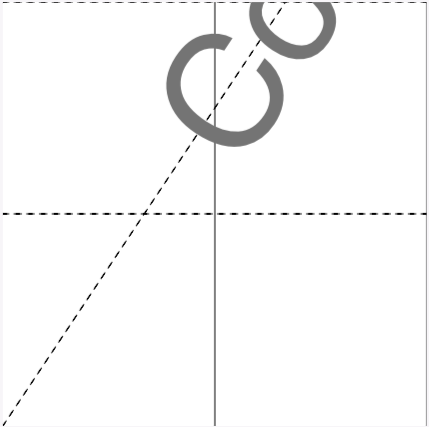

# Add Boxes

* This command adds specific page boundaries for selected pages.

* Media Box is mandatory and serves as default/parent box for Crop Box.

* Crop Box serves as default/parent box for Art Box, Bleed Box and Trim Box.

Have a look at some [examples](#examples).

## Usage

```
pdfcpu boxes add [-p(ages) selectedPages] -- description inFile [outFile]
```

<br>

### Flags

| name                                         | description    | required
|:---------------------------------------------|:---------------|---------
| [p(ages)](../getting_started/page_selection) | selected pages | no

<br>

### [Common Flags](../getting_started/common_flags)

<br>

### Arguments

| name         | description         | required
|:-------------|:--------------------|:--------
| [description](../getting_started/box.md)  | box configuration string | yes
| inFile       | PDF input file      | yes
| outFile      | PDF output file     | no

<br>


### Description

A string representation for a sequence of box definitions and assignments:

    m(edia): {box}
     c(rop): {box}
      a(rt): {box} | m(edia) | c(rop) | b(leed) | t(rim)
    b(leed): {box} | m(edia) | c(rop) | a(rt)   | t(rim)
     t(rim): {box} | m(edia) | c(rop) | a(rt)   | b(leed)

## Examples

 Given the following page with a sole media box represented by the rectangular region [0 0 400 600]:

<p align="center">
  
</p>

<br>

Set a 200 x 200 Crop Box located in lower left corner of media box:

```sh
$ pdfcpu box add -- "crop:[0 0 200 200]" in.pdf cropped.pdf
adding cropBox for in.pdf
writing cropped.pdf...
pages: all
```

<p align="center">
  
</p>

Using the [crop](../core/crop.md) command we can achieve the same:
```sh
$ pdfcpu crop -- "[0 0 200 200]" in.pdf cropped.pdf
cropping in.pdf
writing cropped.pdf...
pages: all
```

<br>

The following command sets an absolute Trim Box in user space and assigns it in turn to Bleed Box for page 2 only: 

```
$ pdfcpu box add -pages 2 -- "trim:[10 10 50 50], bleed:trim" in.pdf out.pdf
adding trimBox, bleedBox for in.pdf
writing out.pdf...
```

<br>

Here we define a Crop Box for all pages in terms of a general margin of 1 inch within Media Box.

We also define a Bleed Box in terms of relative margins within Crop Box and assign it to Art Box and Trim Box:  

```
$ pdfcpu box add -u inches -- "c:1, b:15%, a:b, t:b" in.pdf out.pdf
adding cropBox, trimBox, bleedBox, artBox for test.pdf
writing out.pdf...
pages: all
```

Learn more about [box description](../getting_started/box.md)