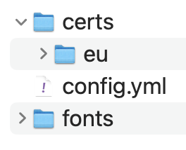
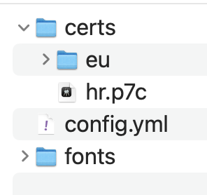

# Certificates


* Have a look at some [examples](#examples).


## Usage

```
pdfcpu certificates list
pdfcpu certificates import inFile..
pdfcpu certificates reset
```

<br>

### [Common Flags](../getting_started/common_flags)

<br>

### Arguments

| name         | description                | required 
|:-------------|:---------------------------|:--------
| inFile       | certificate(s) .pem or .p7c|   yes

<br>

## Examples

pdfcpu comes preloaded with about 4300 certificates maintained by the [EU/EEA Trusted List](https://eidas.ec.europa.eu/efda/trust-services/browse/eidas/tls).

You can list certificates managed by pdfcpu using the following command:

```sh
$ pdfcpu cert list
certDir: /Users/horstrutter/Library/Application Support/pdfcpu/certs

/eu/ades-lotl.p7c:
001:
    Subject:
             org       :
             name      : Patrick Kremer (Signature)
             country   : BE
     Issuer:
             org       : Certipost N.V./S.A.
             name      : Citizen CA
             locality  : Brussels
             country   : BE
       from: 2018-06-01
       thru: 2028-05-30
         CA: false

002:
    Subject:
             org       : EUROPEAN COMMISSION
             unit      : Certificate Profile - Qualified Certificate - Member,Entitlement - EC STATUTORY STAFF,RemoteQSCDManagement
             name      : APOSTOLOS APLADAS
             country   : GR
     Issuer:
             org       : DigitalSign Certificadora Digital
             name      : DIGITALSIGN QUALIFIED CA G1
             country   : PT
       from: 2024-04-26
       thru: 2027-04-26
         CA: false

...

/eu/uk.p7c:
001:
    Subject:
             org       : British Telecommunications plc
             unit      : BT Managed Secure Messaging
             name      : BT Managed Secure Messaging Issuing CA FL-CA-3006
     Issuer:
             org       : British Telecommunications plc
             name      : BT Infrastructure for Secure Communication ROOT CA
             country   : GB
       from: 2009-09-22
       thru: 2019-09-22
         CA: true

002:
    Subject:
             org       : Exostar UK Limited
             name      : Exostar Digital Certificate Service Signing CA 1
             country   : GB
     Issuer:
             org       : Exostar LLC
             unit      : Certification Authorities
             name      : Exostar Federated Identity Service Root CA 2
             country   : US
       from: 2016-05-26
       thru: 2026-05-26
         CA: true

003:
    Subject:
             org       : NHS
             unit      : CA
             name      : NHS Root Authority
     Issuer:
             org       : NHS
             unit      : CA
             name      : NHS Root Authority
       from: 2004-06-04
       thru: 2024-06-04
         CA: true

004:
    Subject:
             org       : Police
             name      : Police Service PKI Root Certificate Authority
             country   : GB
     Issuer:
             org       : Police
             name      : Police Service PKI Root Certificate Authority
             country   : GB
       from: 2009-06-10
       thru: 2029-06-10
         CA: true

005:
    Subject:
             org       : Police
             unit      : IAM CS
             name      : Authentication Issuing Authority
             country   : GB
     Issuer:
             org       : Police
             name      : Police Service PKI Root Certificate Authority
             country   : GB
       from: 2010-09-30
       thru: 2020-09-30
         CA: true

006:
    Subject:
             org       : Police
             unit      : Met
             name      : Met Police Class 3 Primary CA
             country   : GB
     Issuer:
             org       : Police
             unit      : Met
             name      : Met Police Root CA
             country   : GB
       from: 2014-11-06
       thru: 2024-11-06
         CA: true

007:
    Subject:
             org       : Police
             unit      : Met
             name      : Met Police Class 3 Secondary CA
             country   : GB
     Issuer:
             org       : Police
             unit      : Met
             name      : Met Police Root CA
             country   : GB
       from: 2014-11-06
       thru: 2024-11-06
         CA: true

008:
    Subject:
             org       : Registers of Scotland
             unit      : ARTL Issuing Authority
             country   : GB
     Issuer:
             org       : Registers of Scotland
             unit      : Registers of Scotland Root CA
             country   : GB
       from: 2006-10-05
       thru: 2016-10-05
         CA: true

009:
    Subject:
             org       : The Royal Bank of Scotland plc
             unit      : The Royal Bank of Scotland plc TrustAssured Infrastructure
             name      : The Royal Bank of Scotland Plc TrustAssured CA
     Issuer:
             org       : IdenTrust Inc.
             unit      : IdenTrust Root Certificate Authority
             name      : IdenTrust Root Certificate Authority
       from: 2013-10-09
       thru: 2020-10-09
         CA: true

total installed certs: 4364
```

<br>

Users located in other regions may add any missing certificates to `.../pdfcpu/certs`.

<p align="center">
  
</p>

The recommended way to achieve this is:

```sh
$ pdfcpu cert import hr.p7c
hr.p7c: 156 certificates
imported 156 certificates
```

<p align="center">
  
</p>

Importing certificates also validates them meaning pdfcpu ensures it can handle any involved encryption/hashing algorithms.
This is important because these evolve over time and corresponding support will need to be implemented after the fact.
<br><br>
Case in point - the elliptic curve algorithms which are constantly improved.


**Hint:** 
Popular PDF Viewers can export their rootCAs, but you have to make sure you are not violating any usage restrictions before importing them into pdfcpu.

Once your certs are imported you are free to move them around within `pdfcpu/certs` any way you like including
creating special folders.

<br>

If you want to reset certificates managed by pdfcpu do this:

```sh
$ pdfcpu cert reset
Are you ready to reset your certificates to your system root certificates?
(yes/no): yes
resetting..
Finished
```


