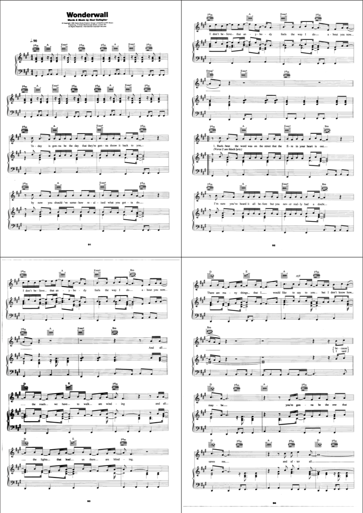
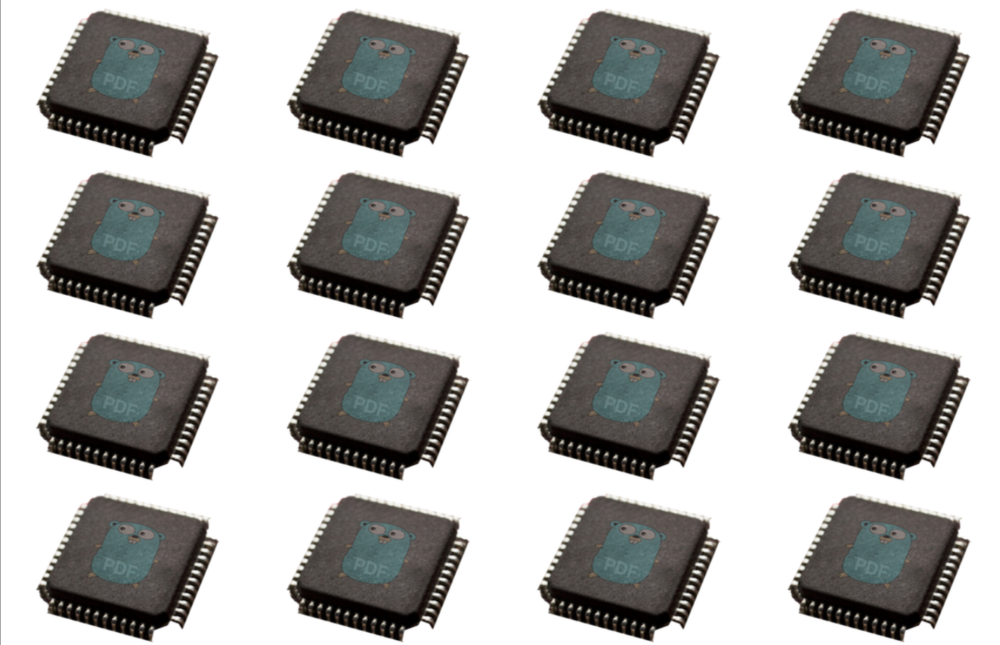

# Crop

* Define a crop box for selected pages.

* The crop box is a region to which the contents of a page shall be clipped (cropped) when displayed or printed.

* The media box is mandatory and serves as default for the crop box and as its parent box.
  
* The crop box serves as default for art box, bleed box and trim box and as their parent box.

* Please refer to the *PDF Specification 14.11.2 Page Boundaries* for details.

* Have a look at some [examples](#examples).

<br>


## Usage

```
usage: pdfcpu crop [-pages selectedPages] [-upw userpw] [-opw ownerpw] description inFile [outFile]
```

<br>

### Flags

| flag                             | description     | required
|:---------------------------------|:----------------|---------
| [p(ages)](../getting_started/page_selection) | selected pages | no
| [opw](../getting_started/common_flags.md)      | owner password | no
| [upw](../getting_started/common_flags.md)   | user password      | no

<br>

### Common Flags

| flag                             | description     | required
|:---------------------------------|:----------------|---------
| [v(erbose)](../getting_started/common_flags.md) | turn on logging | no
| [vv](../getting_started/common_flags.md)      | verbose logging | no
| [q(uiet)](../getting_started/common_flags.md)   | quiet mode      | no
| [u(nits)](../getting_started/common_flags.md) | display units  | no

### Arguments

| name         | description          | required
|:-------------|:---------------------|:---------
| [description](../getting_started/box_.md)  | cropBox configuration string | yes
| inFile       | PDF input file       | yes
| outFile      | PDF output file      | no

<br>


## Examples

Given the following page with a sole media box [0 0 400 600]:

<p align="center">
  
</p>

<br>

Crop a 200x200 points region located in lower left corner:

```sh
pdfcpu crop '[0 0 200 200]' in.pdf cropped.pdf
```

<p align="center">
  
</p>

<br>

Crop a 500x500 points region located in lower left corner:

```sh
pdfcpu crop 'pos:ll, off:5 5, dim:25% 25%' in.pdf cropped.pdf
```

<p align="center">
  
</p>

<br>

Crop relative to media box using a 20mm margin:

```sh
pdfcpu crop -u mm '20' in.pdf cropped.pdf
```

<p align="center">
  
</p>

<br>


Create `out.pdf` by applying 4-up to `in.pdf`. Each page fits `4` original pages of `in.pdf` into a 2x2 grid:
```sh
pdfcpu nup out.pdf 4 in.pdf
```

<p align="center">
  
</p>

<br>

The output file will use the page size of the input file unless explicitly declared by a description string like so:
```sh
pdfcpu nup 'f:A4' out.pdf 9 in.pdf
```

<p align="center">
  
</p>

<br>

`nup` also accepts a list of image files with the result of rendering all images
in N-up fashion into a PDF file using the specified paper size (default=A4).
Generate `out.pdf` using `A4 L`andscape mode where each page fits 4 images onto a 2x2 grid.
The grid element border lines are rendered by default as well is the default margin of 3 points applied:

```sh
pdfcpu nup 'f:A4L' out.pdf 4 *.jpg *.png *.tif
````


<p align="center">
  
</p>

<br>

A single image input file supplied will produce a single page PDF ouput file.<br>
In the following example `logo.jpg` will be `16`-up'ed onto `out.pdf`.
Both grid borders and margins are suppressed and the output format is `Ledger`:

```sh
pdfcpu nup 'f:Ledger, b:off, m:0' out.pdf 16 logo.jpg
```


<p align="center">
  
</p>