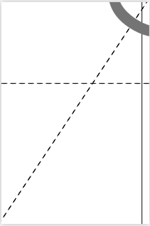
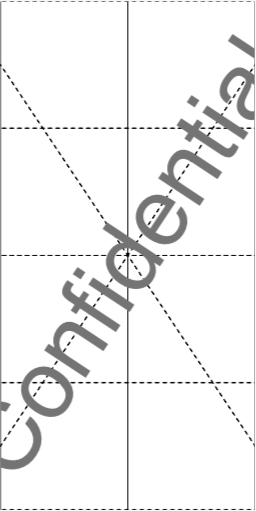

# Crop

* Define a crop box for selected pages.

* The crop box is a region to which the contents of a page shall be clipped (cropped) when displayed or printed.

* The media box is mandatory and serves as default for the crop box and as its parent box.
  
* The crop box serves as default for art box, bleed box and trim box and as their parent box.

* Please refer to the *PDF Specification 14.11.2 Page Boundaries* for details.

* Have a look at some [examples](#examples).

<br>


## Usage

```
pdfcpu crop [-p(ages) selectedPages] -- description inFile [outFile]
```

<br>

### Flags

| name                             | description     | required
|:---------------------------------|:----------------|---------
| [p(ages)](../getting_started/page_selection) | selected pages | no


<br>

### Common Flags

| name                                            | description     | values
|:------------------------------------------------|:----------------|:-------
| [v(erbose)](../getting_started/common_flags.md) | turn on logging |
| [vv](../getting_started/common_flags.md)        | verbose logging |
| [q(uiet)](../getting_started/common_flags.md)   | quiet mode      |
| [u(nit)](../getting_started/common_flags.md)    | display unit    | po(ints),in(ches),cm,mm
| [c(onf)](getting_started/common_flags.md)       | config dir      | $path, disable
| [upw](getting_started/common_flags.md)          | user password   |
| [opw](getting_started/common_flags.md)          | owner password  |

<br>

### Arguments

| name         | description          | required
|:-------------|:---------------------|:---------
| [description](../getting_started/box.md)  | box configuration string | yes
| inFile       | PDF input file       | yes
| outFile      | PDF output file      | no

<br>


## Examples

Given the following page with a sole media box represented by the rectangular region [0 0 400 600]:

<p align="center">
  
</p>

<br>

Crop a 200 x 200 points region located in lower left corner of media box:

```sh
pdfcpu crop -- "[0 0 200 200]" in.pdf cropped.pdf
```

<p align="center">
  
</p>

<br>


Margins and offsets may be expressed in any display unit you like (po,cm,mm,in). Crop a region located in the bottom left corner of the media box with dimension expressed as relative width and height of the media box applying a horizontal/vertical offset of 1 cm:

```sh
pdfcpu crop -u cm -- "pos:bl, off:1 1, dim:25% 25%" in.pdf cropped.pdf
```

<p align="center">
  
</p>

<br>

Crop relative to media box using 100 points for each of the four margins:

```sh
pdfcpu crop -- "100" in.pdf cropped.pdf
```

<p align="center">
  
</p>

<br>

The following command would set display unit to mm in order to express top, left/right and bottom margins relative to the media box defining the rectangular regions that we want to use as crop box:
```sh
pdfcpu crop -u mm -- "15 10 15" in.pdf cropped.pdf
```

<br>

The following command uses negative margins for cropping and therefore expands the media box:

```sh
pdfcpu crop -- "-10" in.pdf cropped.pdf
```
