# Stamp

Add stamps to selected pages of `inFile`. Have a look at some [examples](#examples).


Stamps may be stacked on top of each other. 
This allows for producing more complex page stamps - a mixture of text, images and foreign PDF page content.
Using `description` you can configure various aspects like position, offset, rotation, scaling and opacity. For text based stamps you can also configure font name, font size, fill color and render mode.

## Usage

```
pdfcpu stamp add    [-p(ages) selectedPages] -m(ode) text|image|pdf -- string|file description inFile [outFile]
pdfcpu stamp update [-p(ages) selectedPages] -m(ode) text|image|pdf -- string|file description inFile [outFile]
pdfcpu stamp remove [-p(ages) selectedPages] inFile [outFile]
```

<br>

---
NOTE<br>
In the Adobe world a watermark is text or an image that appears either in front of or behind existing document content, unlike a stamp comment aka stamp annotation that anybody reading the PDF can open, edit, move around and delete. The difference here is that a watermark is integrated into a PDF page as a fixed element. Within `pdfcpu` the meaning of these terms is slightly different:

* `stamp` is any accumulated *content* that appears in front of the existing page content - sitting on top of everything else on a page at a fixed position.

* `watermark` is any accumulated *content* that appears behind the existing page content - residing in the page background at a fixed position.

where *content* may be text, an image or a PDF page.

---
<br>

### Flags

| flag                             | description          | required
|:---------------------------------|:---------------------|:--------
| [p(ages)](../getting_started/page_selection) | selected pages | no
| [m(ode)](../getting_started/common_flags.md)    | text, image or pdf       | yes


<br>

### Common Flags

| name                                            | description     | values
|:------------------------------------------------|:----------------|:-------
| [v(erbose)](../getting_started/common_flags.md) | turn on logging |
| [vv](../getting_started/common_flags.md)        | verbose logging |
| [q(uiet)](../getting_started/common_flags.md)   | quiet mode      |
| [u(nit)](../getting_started/common_flags.md)    | display unit    | po(ints),in(ches),cm,mm
| [c(onf)](../getting_started/common_flags.md)       | config dir      | $path, disable
| [upw](../getting_started/common_flags.md)          | user password   |
| [opw](../getting_started/common_flags.md)          | owner password  |

<br>

### Arguments

| name         | description          | required | 
|:-------------|:---------------------|:---------|
| string       | display string       | for text stamps
| file         | file name            | for image or pdf stamps
| description  | configuration string | yes
| inFile       | PDF input file       | yes
| outFile      | PDF output file      | no

<br>

Special note for text stamps:

Use the following format strings:
* %p ... current page number
* %P ... total pages
         
```
pdfcpu stamp add -mode text "Page %p of %P" -- "sc:1.0 abs, pos:bc, rot:0" in.pdf out.pdf
```

<br>

Special note for pdf stamps:

If you want to use a specific page as your stamp,
specify the page number after the stamp file and use ':' as separator:

```
pdfcpu stamp add -mode pdf -- "stamp.pdf:1" "" in.pdf out.pdf
```

You can also apply a `multi-stamp`.
This means you repeatedly apply stamp.pdf's pages to stamp pages of in.pdf in an orderly fashion.
If in.pdf has more pages than stamp.pdf, the last page of stamp.pdf gets applied for the remaining pages.
Omit the stamp page number for multi stamping:

```
pdfcpu stamp add -mode pdf -- "stamp.pdf" "" in.pdf out.pdf
```

<br>

### Description

A configuration string to specify the stamp parameters.

You may use parameter prefixes as long as the parameter can be identified.
eg. `o: .7` is ambiguous because there is `opacity` and `offset`
but `op: .7` will do the job.

| parameter | description                            | values                                              | default
|:-----------------|:--------------------------------|:----------------------------------------------------|:---------
| fontname         | a basefont                      | Please refer to `pdfcpu fonts list`                 | font: Helvetica
| points           | fontsize in points              | in combination with absolute scaling only           | points: 24
| rtl              | right to left userfont          | on/off, true/false, t/f                             | off
| position         | the stamps lower left corner    | one of `full` or the anchors: `tl, tc, tr, l, c, r, bl, bc, br`| pos: c
| offset           |                                 | (dx,dy) in user units eg. '15 20'                   | off: 0 0
| scalefactor      |                                 | 0.0 < i <= 1.0 followed by optional `abs` or `rel`  | sc: 0.5 rel
| aligntext        | horizontal text alignment       | l..left, c..center, r..right, j..justified          | al:c
| strokecolor      | for rendering text (see mode)   | 0.0 <= r,g,b <= 1.0, eg. 1.0, 0.0 0.0 = red         | strokec: 0.5 0.5 0.5 = gray
|                  |                                 | or the hex RGB value: #RRGGBB
| fillcolor        | for rendering text (see mode)   | 0.0 <= r,g,b <= 1.0, eg. 1.0, 0.0 0.0 = red         | fillc: 0.5 0.5 0.5 = gray
|                  | (=color)                        | or the hex RGB value: #RRGGBB                       |
| backgroundcolor  | bounding box background         | 0.0 <= r,g,b <= 1.0, eg. 1.0, 0.0 0.0 = red         | none
|                  | (=bgcolor)                      | or the hex RGB value: #RRGGBB                       |
| rotation         | rotation angle                  | -180.0 <= i <= 180.0                                | rot: 0.0
| diagonal         | render along diagonal           | 1 .. lower left to upper right                      | d:1
|                  |                                 | 2 .. upper left to lower right                      |
| opacity          |                                 | 0.0 <= i <= 1.0                                     | op:1
| mode, rendermode | apply fill color                | 0 .. fill                                           | mo:0
|                  | apply stroke color              | 1 .. stroke                                         |
|                  | apply both fill & stroke color  | 2 .. fill & stroke                                  |
| margins          | bounding box margins for text   | i .. set all four margins                           | ma:0
|                  | requires bgcolor                | i j .. set t/b margins to i, set l/r margins to j   |
|                  |                                 | i j k .. set top to i, left/right to j, bot to k    |
|                  |                                 | i j k l .. set top, right, bottom, left margins     |
| border           | bounding box border for text    | i {round} {color}                                   | bo:0
|                  | requires bccolor                | i .. border width > 0                               |
|                  |                                 | round .. set round bounding box corners             |
|                  |                                 | color .. border color                               |

Only one of rotation and diagonal is allowed.

The following description parameters are for text based stamps only:

* fontname
* points
* aligntext
* strokecolor 
* fillcolor (=color)
* bgcolor
* rendermode
* margins
* border
* rtl (for user fonts only)

<br>

#### Anchors for positioning

|||||
|-|-|-|-|
|       | left | center |right
|top    | `tl` | `tc`   | `tr`
|       | `l`  | `c`    |  `r`
|bottom | `bl` | `bc`   | `br`

<br>

#### Default description

```sh
'f:Helvetica, points:24, rtl:off, sc:0.5 rel, pos:c, off:0 0, align:c, fillc:#808080, strokec:#808080, rot:0, d:1, op:1, mo:0, ma:0, bo:0'
```
The default stamp configuration is:

* fixed center page position (for 'free' positioning use pos:bl)
* scale factor `0.5 rel`ative to page dimensions
* positive rotation along the diagonale from the lower left to the upper right page corner (`d:1`).
* fully opaque stamp by defining `op`acity `1`

In addition for text based stamps:

* font name `Helvetica`
* font size `24` points
* align: `c`
* stroke color gray (`0.5 0.5 0.5`)
* fill color gray (`0.5 0.5 0.5`)
* no background color and therefore no bounding box
* render mode fill (`mo:0`)
* margins `0`
* border `0`
* rtl `off`

You only have to specify parameters that differ from the default.

<br>

## Examples

### Text Based Stamps

Create a stamp using defaults only:
```sh
pdfcpu stamp add -mode text -- "This is a stamp" "" in.pdf out.pdf
```
<p align="center">
  
</p>

<br>
Create a stamp using scale factor 1:

```sh
pdfcpu stamp add -mode text -- "This is a stamp" "sc:1" in.pdf out.pdf
```

<p align="center">
  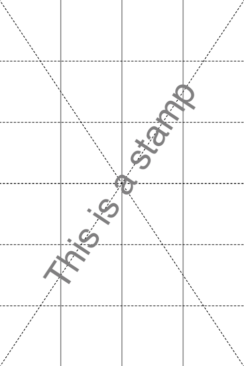 &nbsp; &nbsp; &nbsp; &nbsp;
  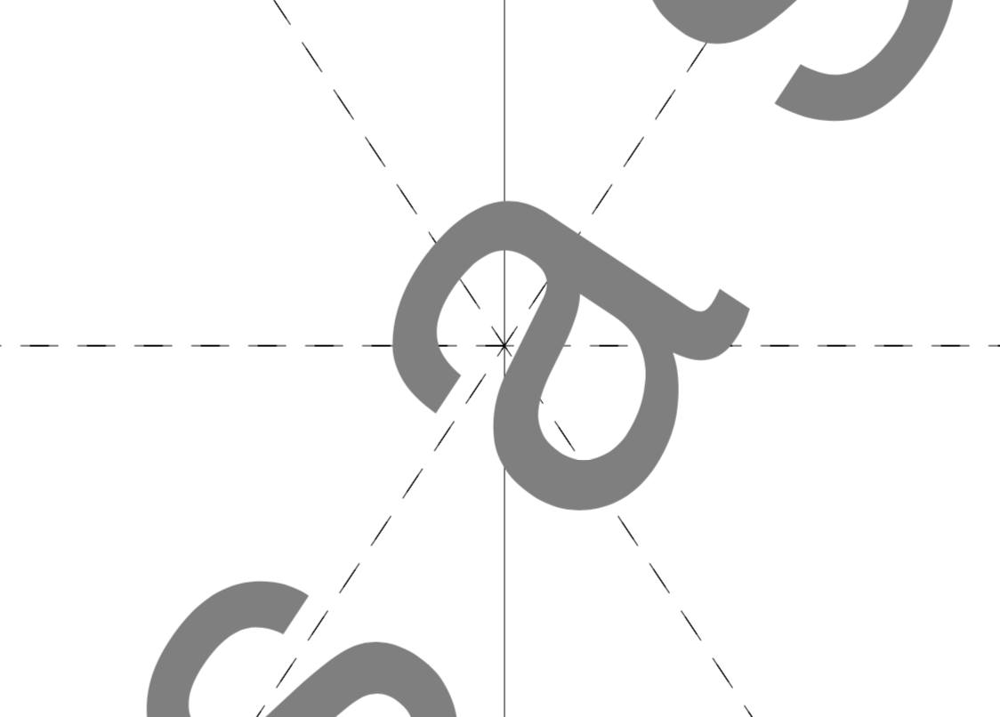
</p>

<br>

Create a stamp along the second diagonale using scale factor 0.9, default render mode `fill` and a fill color:

```sh
pdfcpu stamp add -mode text -- "This is a stamp" "sc:.9, d:2, c:.6 .2 .9 in.pdf out.pdf
```

<p align="center">
  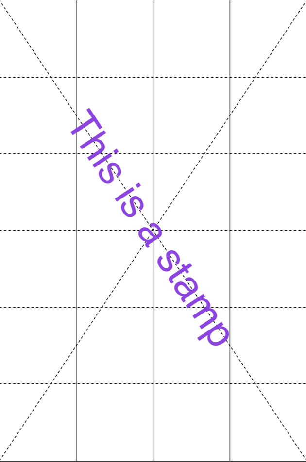
</p>

<br>

Create a stamp with 0 degree rotation using scale factor 0.9 and render mode `stroke`:

```sh
pdfcpu stamp add -mode text -- "This is a stamp" "sc:.9, rot:0, mo:1" in.pdf out.pdf
```

<p align="center">
  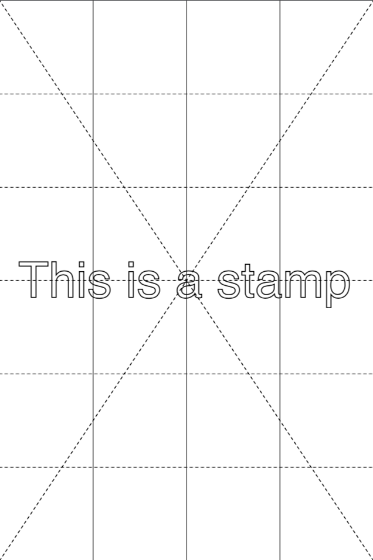
</p>

<br>

Create a stamp with a counterclockwise rotation of 45 degrees using scale factor 1, render mode `fill & stroke` and a fill color:

```sh
pdfcpu stamp add -mode text -- "This is a stamp" "scale:1, rot:45, mode:2, color:.2 .7 .9" in.pdf out.pdf
```

<p align="center">
  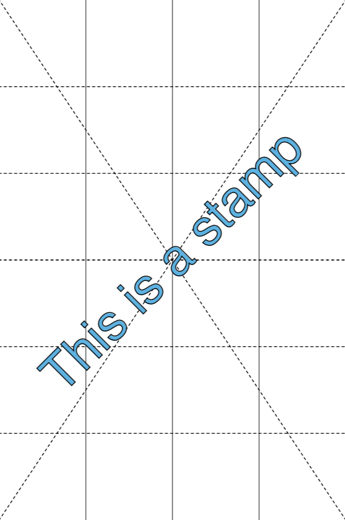
</p>

<br>

Create a stamp of some multi line text, show its bounding box by setting bgcol, set all margins to 5 and a border width of 7 rendering round corners.

```sh
pdfcpu stamp add -mode text -- "Some multi\nline text" "ma:5, bo:7 round .3 .7 .7, fillc:#3277d3, bgcol:#beded9, rot:0" in.pdf out.pdf
```

<p align="center">
  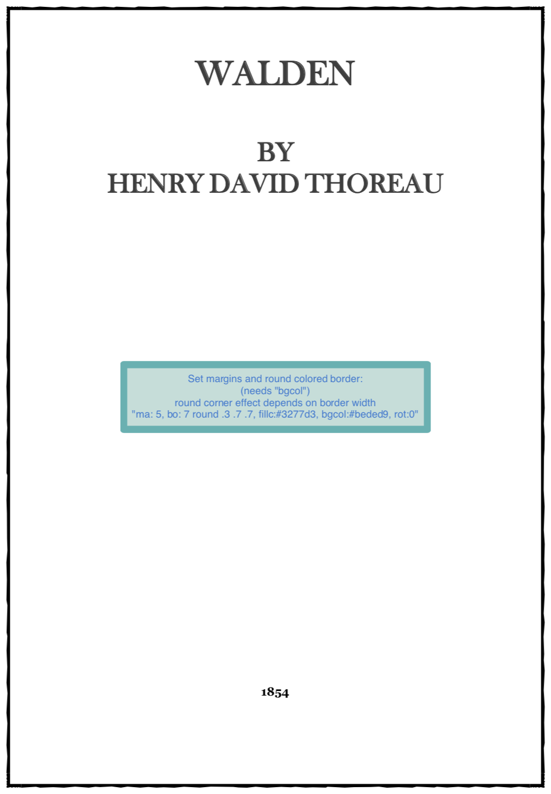
</p>

<br>

Create a stamp with default rotation, using scale factor 1, font size 48, default render mode `fill`, a fill color and increasing opacity from 0.3 to 1. By setting an opacity < 1 you can fake a watermark. This may be useful in scenarios where `pdfcpu watermark` does not produce satisfying results for a particular PDF file:

```sh
pdfcpu stamp add -mode text -- "Draft" "points:48, sc:1, fillc:.8 .8 .4, op:.3" in1.pdf out1.pdf
pdfcpu stamp add -mode text -- "Draft" "points:48, sc:1, fillc:.8 .8 .4, op:0.6" in2.pdf out2.pdf
pdfcpu stamp add -mode text -- "Draft" "points:48, sc:1, fillc:.8 .8 .4, op:1" in3.pdf out3.pdf
```

<p align="center">
  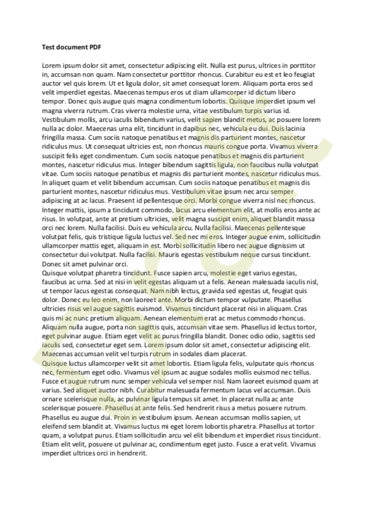 &nbsp;
  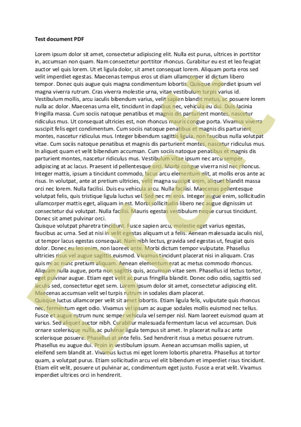 &nbsp;
  
</p>

<br>

### Image Based Stamps

Create a stamp using defaults only:
```sh
pdfcpu stamp add -mode image -- "pic.jpg" "" in.pdf out.pdf
```

<p align="center">
  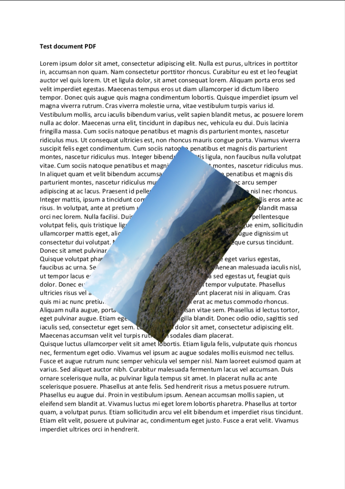
</p>

<br>

Create a stamp using 0 degree rotation and relative scaling of 1.0:

```sh
pdfcpu stamp add -mode image -- "pic.jpg" "scalef:1 rel, rot:0" in.pdf out.pdf
```

<p align="center">
  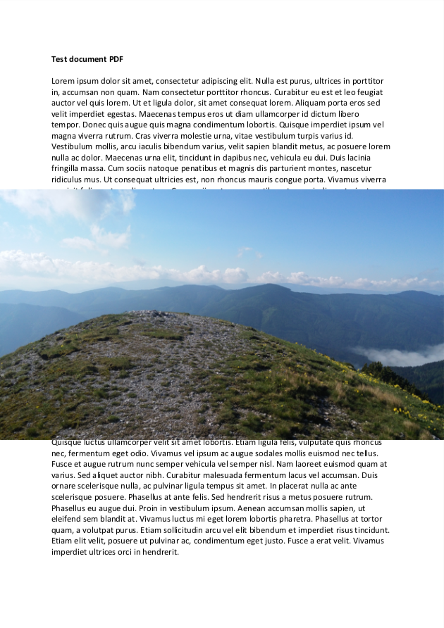
</p>

<br>

### PDF Based Stamps

Create a stamp using defaults only. This will apply page 1 of `some.pdf`:

```sh
pdfcpu stamp add -mode pdf -- "some.pdf:1" "" in.pdf out.pdf
```

<p align="center">
  
</p>

<br>

Create a multi stamp using `stamp.pdf`, apply a 0 degree rotation and 0.3 relative scaling.

Page 1 of in.pdf gets stamped with page 1 of stamp.pdf,
page 2 of in.pdf gets stamped with page 2 of stamp.pdf and so forth.

```sh
pdfcpu stamp add -mode pdf -- "stamp.pdf" "rot:0, scale:.3 rel" in.pdf out.pdf
```

<p align="center">
  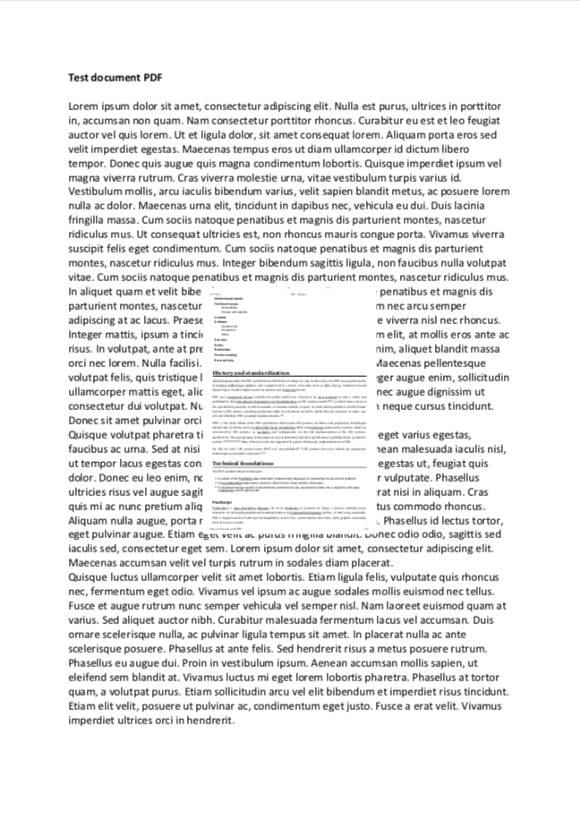
</p>

<br>

### Stamp Lifecycle

Create a stamp using the default options.
```sh
pdfcpu stamp add -mode text -- "Draft" "" template.pdf work.pdf
```
<p align="center">
  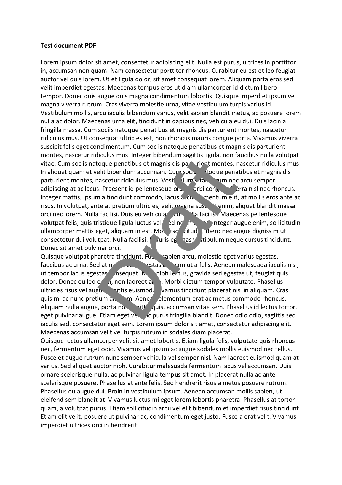
</p>

<br>

Let's edit the stamps color, render mode and opacity
```sh
pdfcpu stamp update -mode text -- "Draft" "c: .2 .6 .5, rendermode:2, op:.7" work.pdf
```
<p align="center">
  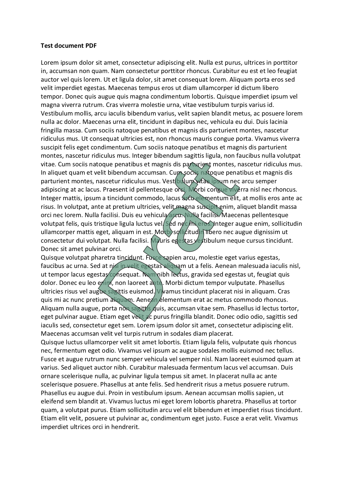
</p>

<br>

We add a centered footer on the bottom of the page.
```sh
pdfcpu stamp add -mode text -- "Footer" "pos:bc, scale: 1.0 abs, rot:0, c: .5 .5 .9" work.pdf
```
<p align="center">
  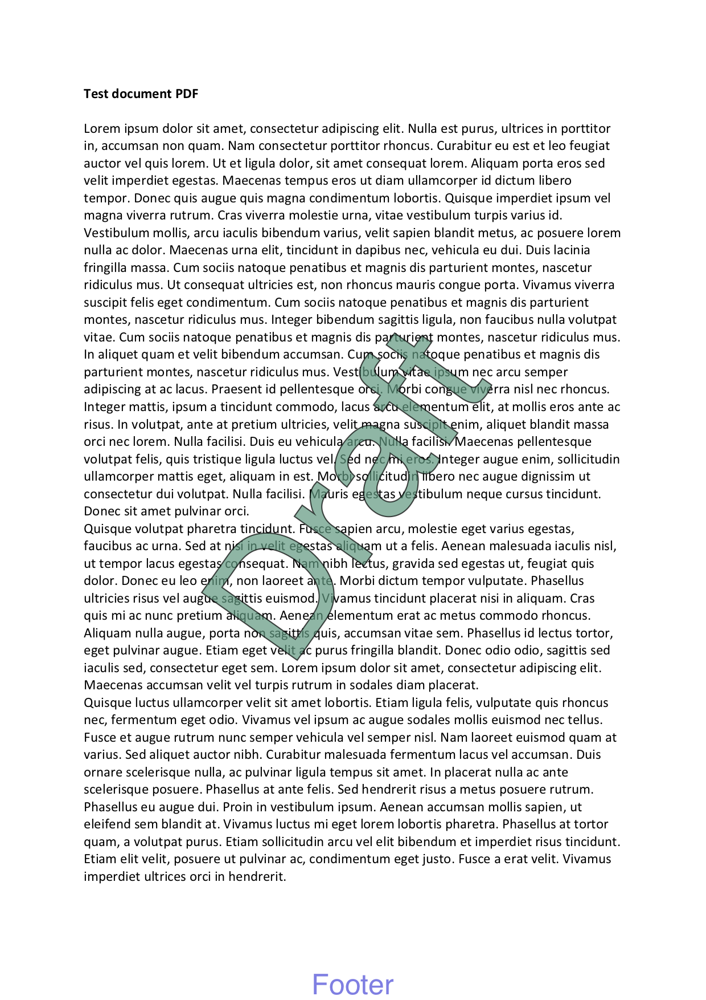
</p>

<br>

Let's add a logo in the top right corner.
```sh
pdfcpu stamp add -mode image -- "logo.png" "pos:tr, rot:0, sc:.2" work.pdf
```
<p align="center">
  
</p>

<br>

Let's get rid of the stamp on page 1
```
pdfcpu stamp remove -pages 1 work.pdf
```
<p align="center">
  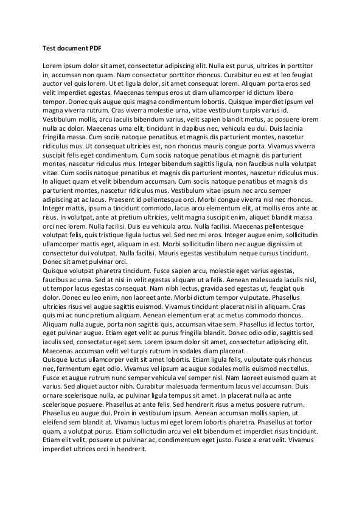
</p>

Finally let's remove all stamps of this file.
```
pdfcpu stamp remove work.pdf
``` 

<br>

## Userfonts

Let's create a Unicode text stamp using a user font:

1) Choose your favorite TrueType font or collection.
2) Follow [the instructions](../fonts/fonts_install.md) to install the font you would like to use.

<br>

### Left-to-right, Simple Chinese

```
pdfcpu stamp add -mode text "这是一个测试" "fo:SimSun" in.pdf out.pdf
writing out.pdf...
pages: all
```
<p align="center">
  
</p>


### Right-to-left, Arabic

```
pdfcpu stamp add -mode text "هذا اختبار" "rtl:true, fo:UnifontMedium" in.pdf out.pdf
writing out.pdf...
pages: all
```

<p align="center">
  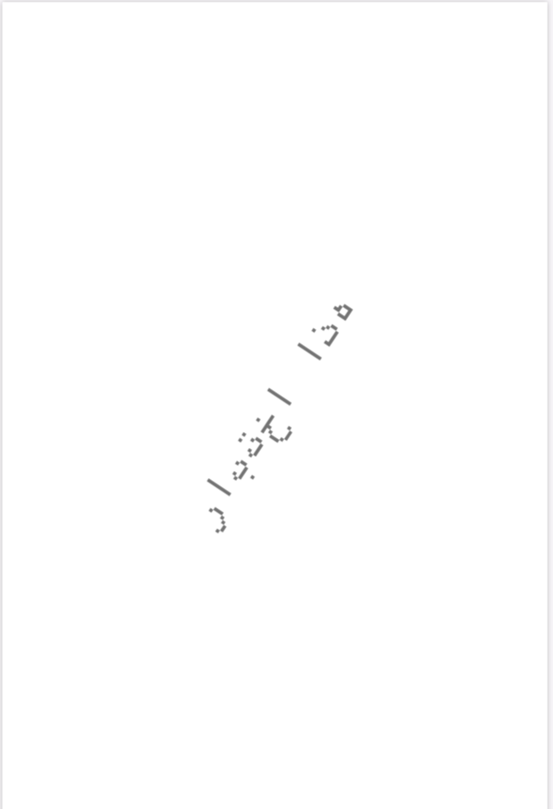
</p>
