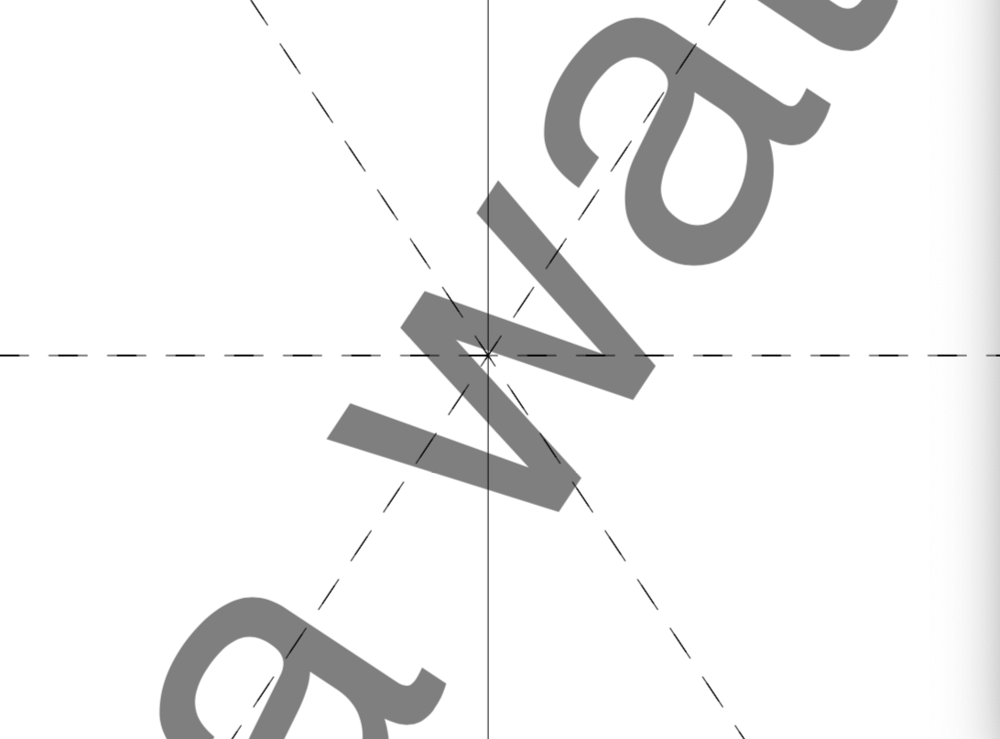
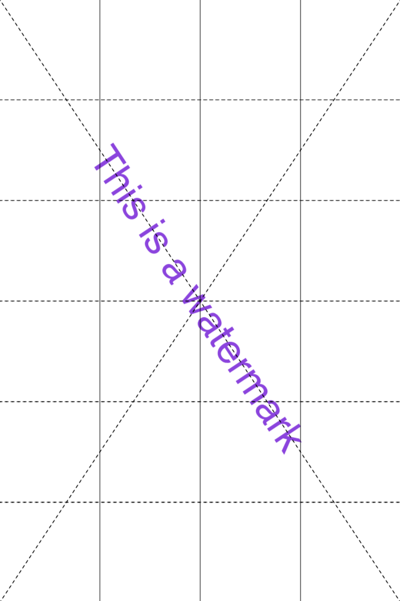
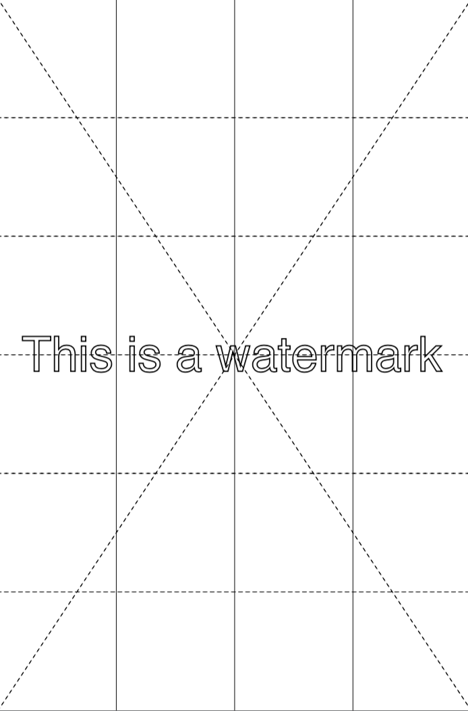
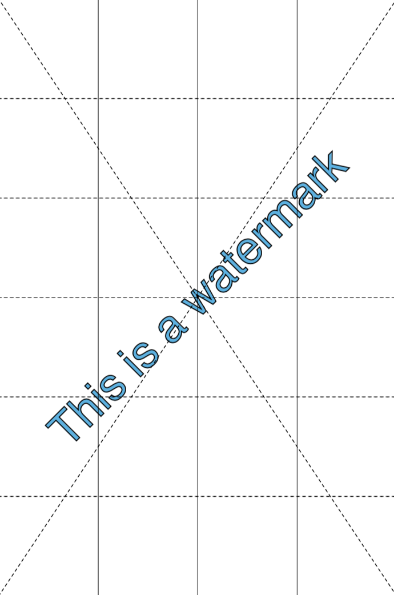
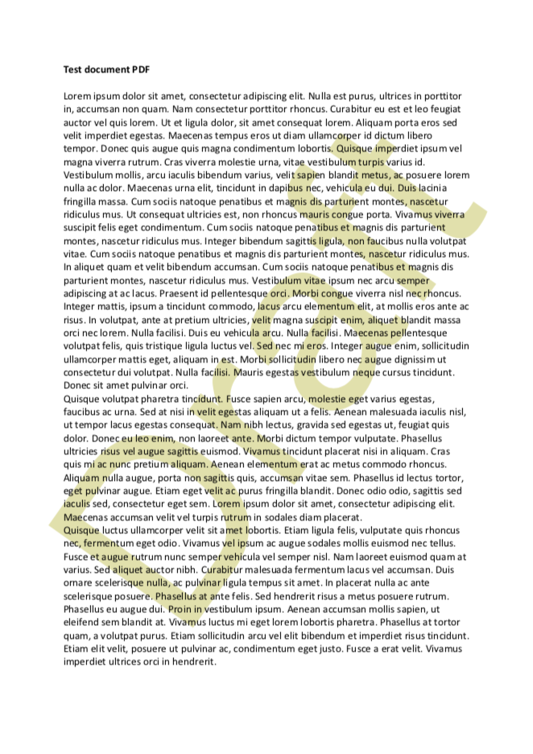
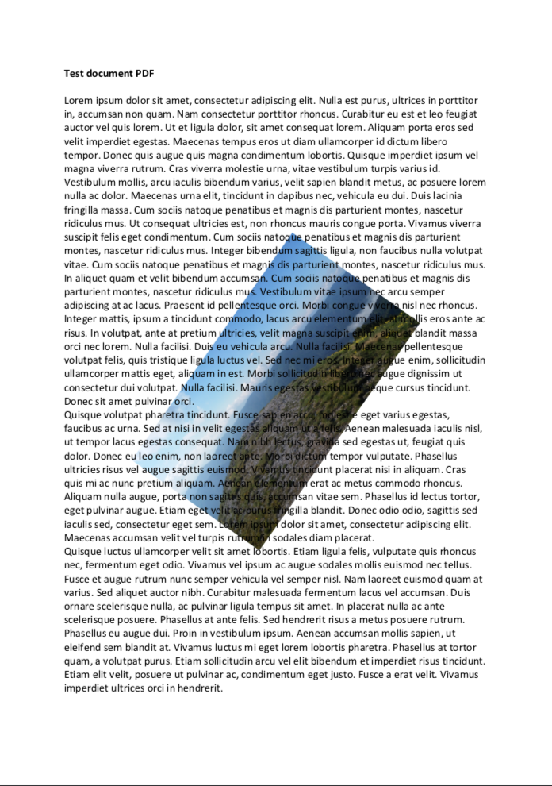
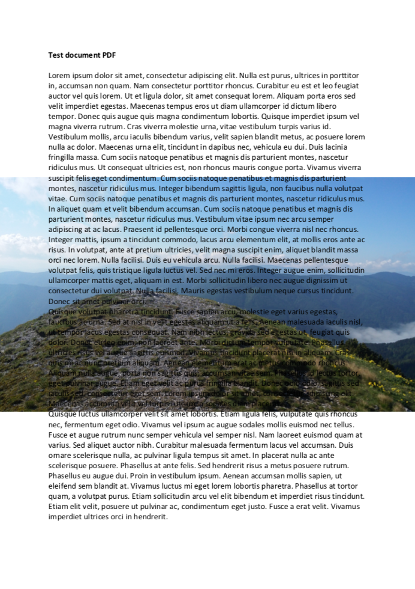
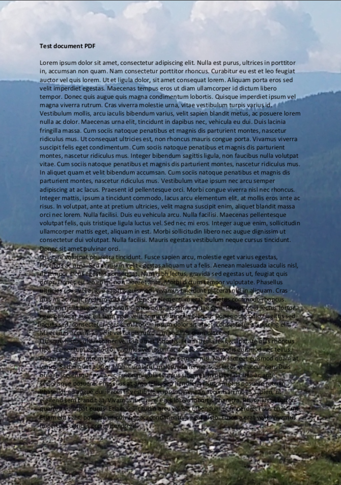
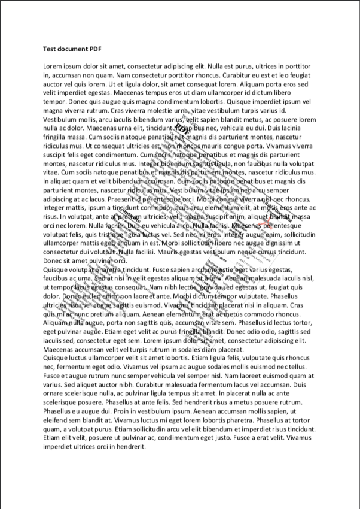

# Watermark

Add a watermark to selected pages of `inFile`. Have a look at some [examples](#examples).

You can watermark `inFile` exactly once. The watermark is centered on the page and using `description` you can configure various aspects like rotation, scaling and opacity. For text based watermarks you can also configure font name, font size, fill color and render mode.

---
WARNING<br>
A watermark resides in the background of a page. How much of the watermark will be rendered visible on a page depends on the layers on top and the transparency involved. This applies to PDF in general. Eg. scanned PDF files usually consist of bitmap images spanning whole pages and will hide anything in the background including any watermark. For these cases use `pdfcpu stamp` with an opacity < 1 instead to get a similar result.

---


## Usage

```
pdfcpu watermark [-v(erbose)|vv] [-q(uiet)] [-pages pageSelection] [-upw userpw] [-opw ownerpw] description inFile [outFile]
```


---
NOTE<br>
In the Adobe world a watermark is text or an image that appears either in front of or behind existing document content, like a stamp comment aka stamp annotation that anybody reading the PDF can open, edit, move around and delete. The difference here is that a watermark is integrated into a PDF page as a fixed element. Within `pdfcpu` the meaning of these terms is slightly different:

* `stamp` is any *content* that appears in front of the existing page content - sitting on top of everything else on a page

* `watermark` is any *content* that appears behind the existing page content - residing in the page background

where *content* may be text, an image or a PDF page.


---
<br>

### Flags

| flag                             | description          | required
|:---------------------------------|:---------------------|:--------
| [verbose](../getting_started/common_flags.md) | turn on logging      | no
| [vv](../getting_started/common_flags.md)      | verbose logging      | no
| [quiet](../getting_started/common_flags.md)   | quiet mode      | no
| [pages](../getting_started/page_selection) | page selection  | no
| [upw](../getting_started/common_flags.md)     | user password        | no
| [opw](../getting_started/common_flags.md)     | owner password       | no

<br>

### Arguments

| name         | description          | required | default
|:-------------|:---------------------|:---------|:-
| description  | configuration string | yes
| inFile       | PDF input file       | yes
| outFile      | PDF output file      | no       | inFile_new.pdf

<br>

### Description

A configuration string to specify watermark parameters.

The first entry of the description configures the type. It is one of the following:

* text string (Use \n for a multiline watermark)
* image file name
* PDF file name followed by an optional page number

| parameter | description                     | values                                              | default
|:----------|:--------------------------------|:----------------------------------------------------|:-
| f         | fontname, a basefont            | Helvetica, Times-Roman, Courier                     | Helvetica
| p         | fontsize in points              | in combination with absolute scaling only           | 24
| s         | scale factor                    | 0.0 < i <= 1.0 followed by optional `abs` or `rel`  | 0.5 rel
| c         | color, 3 fill color intensities | 0.0 <= r,g,b <= 1.0, eg. 1.0, 0.0 0.0 = red         | 0.5 0.5 0.5 = gray
| r         | rotation angle                  | -180.0 <= i <= 180.0                                | 0.0
| d         | render along diagonal           | 1 .. lower left to upper right                      | 1
|           |                                 | 2 .. upper left to lower right                      |
| o         | opacity                         | 0.0 <= i <= 1.0                                     | 1
| m         | render mode                     | 0 .. fill                                           | 0
|           |                                 | 1 .. stroke                                         |
|           |                                 | 2 .. fill & stroke                                  |

Only one of rotation and diagonal is allowed.

The following description parameters are for text based watermarks only:

* font name
* font size
* color
* render mode

<br>

#### Default description

```sh
'f:Helvetica, p:24, s:0.5 rel, c:0.5 0.5 0.5, r:0, d:1, o:1, m:0'
```

The default watermark configuration is:

* fixed center page position (free positioning will be part of a future release)
* scale factor `0.5 rel`ative to page dimensions
* positive rotation along the diagonale from the lower left to the upper right page corner (`d:1`).
* fully opaque watermark by defining `o`pacity `1`

In addition for text based watermarks:

* font name `Helvetica`
* font size `24` points
* fill color gray (`0.5 0.5 0.5`)
* render mode fill (`m:0`)

You only have to specify parameters that differ from the default.
<br>

## Examples

### Text Based Watermarks

Create a watermark using defaults only:
```sh
pdfcpu watermark 'This is a watermark' test.pdf out.pdf
```
<p align="center">
  
</p>

<br>
Create a watermark using scale factor 1:

```sh
pdfcpu watermark 'This is a watermark, s:1' test.pdf out.pdf
```

<p align="center">
   &nbsp; &nbsp; &nbsp; &nbsp;
  
</p>

<br>

Create a watermark along the second diagonale using scale factor 0.9, default render mode `fill` and a fill color:

```sh
pdfcpu watermark 'This is a watermark, s:.9, d:2, c:.6 .2 .9' test.pdf out.pdf
```

<p align="center">
  
</p>

<br>

Create a watermark with 0 degree rotation using scale factor 0.9 and render mode `stroke`:

```sh
pdfcpu watermark 'This is a watermark, s:.9, r:0, m:1' test.pdf out.pdf
```

<p align="center">
  
</p>

<br>

Create a watermark with a counterclockwise rotation of 45 degrees using scale factor 1, render mode `fill & stroke` and a fill color:

```sh
pdfcpu watermark 'This is a watermark, s:1, r:45, m:2, c:.2 .7 .9' test.pdf out.pdf
```

<p align="center">
  
</p>

<br>

Create a watermark with default rotation, using scale factor 1, font size 48, default render mode `fill`, a fill color and set opacity to 0.6:

```sh
pdfcpu watermark 'Draft, p:48, s:1, c:.8 .8 .4, o:.6' test.pdf out.pdf
```

<p align="center">
  
</p>

<br>
Let's assume we have a PDF where even pages are blank. We can add a watermark for theses pages saying "Intentionally left blank" like so:

```sh
pdfcpu watermark -pages even 'Intentionally left blank" test.pdf out.pdf
```

We also could have used `pdfcpu stamp`. There is really no difference since we apply only to empty pages here.

<br>

### Image Based Watermarks

Create a watermark using defaults only:
```sh
pdfcpu watermark 'pic.jpg' test.pdf out.pdf
```

<p align="center">
  
</p>

<br>

Create a watermark using 0 degree rotation and relative scaling of 1.0:

```sh
pdfcpu watermark 'pic.jpg, s:1 rel, r:0' test.pdf out.pdf
```

<p align="center">
  
</p>

<br>

Create a watermark using 0 degree rotation and absolute scaling of 1.0:

```sh
pdfcpu watermark 'pic.jpg, s:1 abs, r:0' test.pdf out.pdf
```

<p align="center">
  
</p>

<br>

Create a watermark using a clockwise rotation of 30 degrees and absolute scaling of 1.0:

```sh
pdfcpu watermark 'pic.jpg, r:-30, s:1 abs' test.pdf out.pdf
```

<p align="center">
  
</p>

<br>

Create a watermark using a clockwise rotation of 30 degrees and absolute scaling of 0.25:

```sh
pdfcpu watermark 'pic.jpg, r:-30, s:.25 abs' test.pdf out.pdf
```

<p align="center">
  
</p>

### PDF Based Watermarks

Create a watermark using defaults only. This will apply page 1 of `some.pdf`:

```sh
pdfcpu watermark 'some.pdf' test.pdf out.pdf
```

<p align="center">
  
</p>

<br>

This is how to create a watermark using defaults and page 2 of `some.pdf`:

```sh
pdfcpu watermark 'some.pdf:2' test.pdf out.pdf
```
