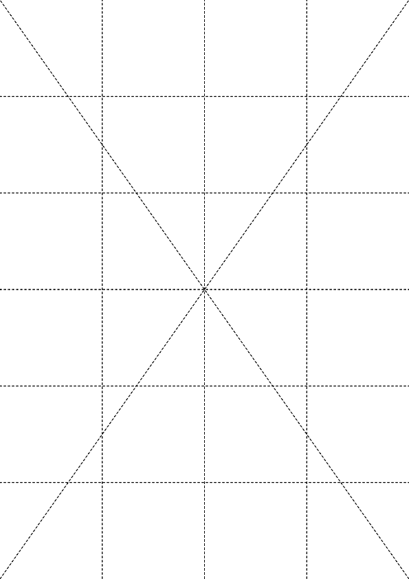
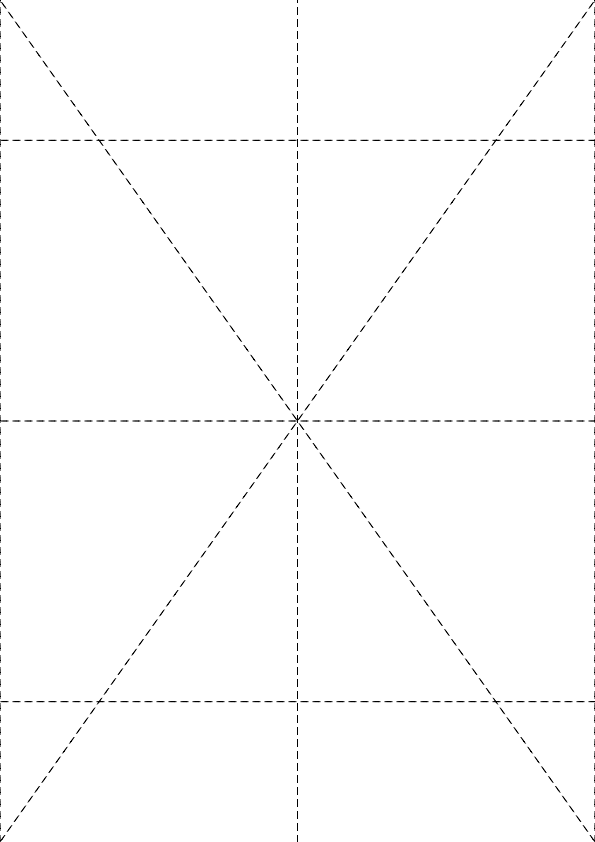
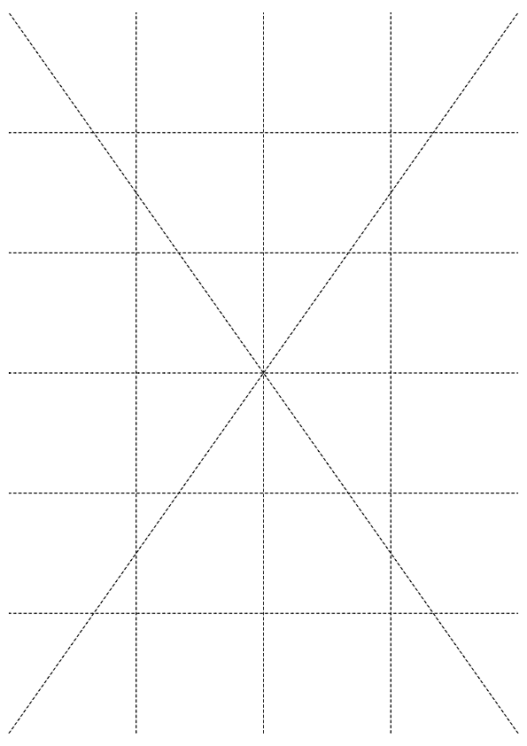
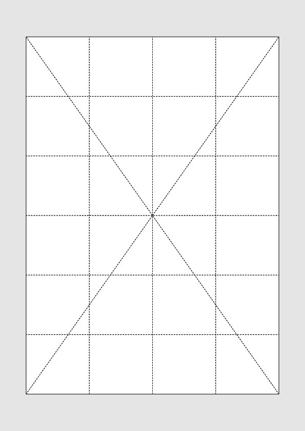

# Zoom

Zoom in/out of selected pages either by magnification factor or corresponding margin. <br>
Optionally when zooming out draw a border around content and/or fill unused page space with some background color.

Have a look at some [examples](#examples).

## Usage

```
pdfcpu zoom [-p(ages) selectedPages] -- description inFile [outFile]
```

<br>

### Flags

| name                                         | description    | required
|:---------------------------------------------|:---------------|---------
| [p(ages)](../getting_started/page_selection) | selected pages | no

<br>

### [Common Flags](../getting_started/common_flags)

<br>

### Arguments

| name         | description          | required 
|:-------------|:---------------------|:---------
| description  | configuration string | yes
| inFile       | PDF input file       | yes
| outFile      | PDF output file      | no


 factor, hmargin, vmargin, border, bgcolor


<br>

### Description

A configuration string with input parameters for the zoom command.

| parameter           | values                                                        
|:--------------------|:------------------------------------------------------
| factor              | 0.0 < x < 1.0 or x > 1.0      
| hmargin             | x < 0 for zooming in, x > 0 for zooming out         
| vmargin             | x < 0 for zooming in, x > 0 for zooming out  
| border   	          | true/false, t/f
| bgcolor             | [color](../getting_started/color.md)  

Zoom in and out of page content by some factor.

Zooming out results in some horizontal and vertical margins implied by unused page content space.
Usually these will not be equal.

Another way to look at zooming is eg. I'd like to zoom out a little in order to create some
desired horizontal or vertical margin.

<br>

## Examples

Given in.pdf:
<p align="center">
  
</p>

Zoom in by factor.
```sh
$ pdfcpu zoom -- "factor: 2"  in.pdf out.pdf
```
<p align="center">
  
</p>

<br>

Zoom out by factor.
```sh
$ pdfcpu zoom -- "factor: .5"  in.pdf out.pdf
```
<p align="center">
  
</p>

<br>

Zoom out by horizontal margin of 10 points.
```sh
$ pdfcpu zoom -- "hmargin: -10" in.pdf out.pdf
```
<p align="center">
  
</p>

<br>

Zoom out by vertical margin of 1 inch.
Draw border around content and fill background light gray.
```sh
$ pdfcpu zoom -unit inch -- "vmargin: 1, border:true, bgcolor:lightgray" in.pdf out.pdf
```
<p align="center">
  
</p>
