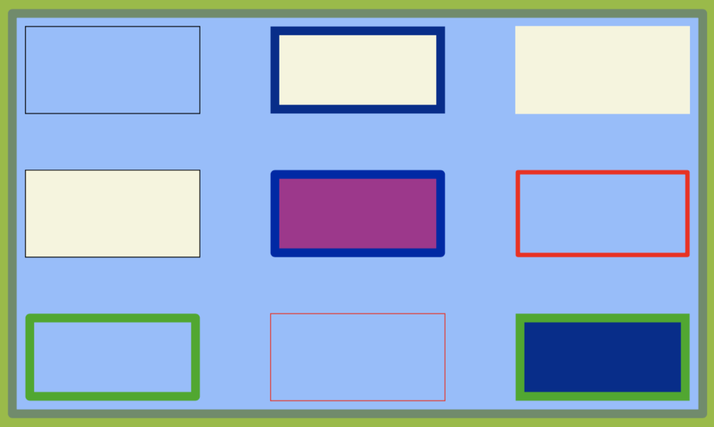

# Render Boxes

# box
This primitive renders a rectangular region.

A box has a position.
The position may be defined by the coordinates of its lower left corner:
"pos": [100,100]

A box max also be anchored and thereby positioned::
"anchor": 

You may nudge the position by some horizontal/vertical delta dx/dy
"dx": 50,
"dy": 50,

A box needs a width and a height.

A box may have a border:
A Border has a width, a color and an optional style:
"border": { "name": "$myBorder",
            "width: 100,
			"col": "White" or "#1E90FF"
            "style: miter\", \"round\" or \"bevel
		  },

A box may have a margin:
"margin": { "width": 10 },

You may specify a fill color.
"fillCol": "black"

You may specify a rotation angle:
"rot":  90

Finally a named box may serve as a template.
"name": "$colorBox"

You disable rendering the box like with all primitives: "hide":true

  

