# The Create JSON Structure

* Global: paper size, background color etc.  
* Attribute: font, border, margin, padding, color, dir, file
* Primitives: bar, text, box, image, table, form fields

A number of [global definitions](#globals), [attribute](#attributepools) and [primitive pools](#primitivepools) followed by a page dictionary consisting of `page number:page definition` key:value pairs:

```
{
	...
	"pages": {
		"1": {...},
		"2": {...},
		"3": {...}
	}
}
```

You may either create a new PDF file or append or overlay existing pages.

## Page Sequence Gaps

There may be gaps in the defined page sequence:
```
{
	...
	"pages": {
		"1": {...},
		"3": {...}
	}
}
```

* If you provide an existing input file, missing page definitions implied by page sequence gaps will only be appended but not modified.<br>

* If you create a new PDF file, missing page definitions will result in blank pages.

## Globals

Global flags & defaults

| name           | description                 | type   | default
|:---------------|:----------------------------|--------|--------
| origin         | coordinate system           | string | LL     
| contentBox     | highlight crop & contentbox | bool   | false  
| debug          | highlight positions         | bool   | false  
| guides         | render layout guidelines    | bool   | false 
| timestamp      | current timestamp format    | string | [config](../getting_started/config_dir.md) 
| dateFormat     | current date format         | string | [config](../getting_started/config_dir.md) 


Global page defaults:

| name           | description              | type   | default   
|:---------------|:-------------------------|--------|-----------
| paper          | [page size](../paper.md) | string | A4 (=A4P) 
| crop           | [crop box](../getting_started/box.md)           | string | media box 
| bgcol          | background [color](../getting_started/color.md) | string |          
| border         | The default border for content regions          | obj    |         
| margin         | The default margin for content regions          | obj    |          
| padding        | The default padding for content regions          | obj    |          

You may also define `header` and `footer` as part of the global section.
## AttributePools

Different pages may share attributes like colors, fonts etc.<br>
Attribute pools defined outside of the page sequence contain the definitions of `named attributes` and may serve as templates for inheritance.<br>
Eg. you may overwrite the font size or color at page/content level.<br>
You may reference `named attributes` using `name: $myName`.

| name           | description              
|:---------------|:------------------
| colors         | color pool/templates
| dirs           | dir pool/templates                    
| files          | file pool/templates   
| fonts          | font pool/templates    
| borders        | border pool/templates    
| margins        | margin pool/templates     
| paddings       | padding pool/templates    

## PrimitivePools

Different pages may share primitives like text, images etc.<br>
Primitive pools defined outside of the page sequence contain the definitions of `named primitives` and may serve as  templates for inheritance.<br>
Eg. you may overwrite the background color or font for a `text` at page/content level.<br>
You may reference `named primitives` using `name: $myName`.

| name           | description              
|:---------------|:--------------------
| boxes          | box pool/templates        
| images         | imagebox pool/templates      
| texts          | textbox pool/templates   
| tables         | table pool/templates    
| fieldgroups    | form element group pool/templates  

## Page Definition

A number of [page defaults](#globals), [attribute](#attributepools) and [primitive pools](#primitivepools) followed by the [content](#content) element.


## Content

Optional [attribute](#attributepools) and [primitive pools](#primitivepools) followed by arrays for each used primitive containing the positioned primitive instances aka. content elements:

| name   | description              
|:-------|:-----------
| bar    | horizontal/vertical bar
| box    | simple box / rectangular region        
| image  | image box     
| text   | text box  
| table  | table  
 
For PDF form creation you may also add form fields:

| name             | description              
|:-----------------|:--------------------
| textfield        | text input field       
| datefield        | date input field     
| checkbox         | checkbox input field   
| radiobuttongroup | radiobutton input field   
| listbox          | single/multi list selection  
| combobox         | dropdown selection 
| fieldgroup       | container for associated form fields  

### Guides

You may also define an array of guides supporting you during your page design. A guide is a haircross at a specified position within your content box. 
You enable your guides using the global `guides` flag.

## Getting Started
We start out by creating a simple page using A6 in landscape mode.<br>
A page has a single content region per default.<br><br>
We use the predefined coordinate system with its origin in the lower left corner of the content box and add a single text box positioned at (50/40) using 24 point Helvetica:

<p align="center">
 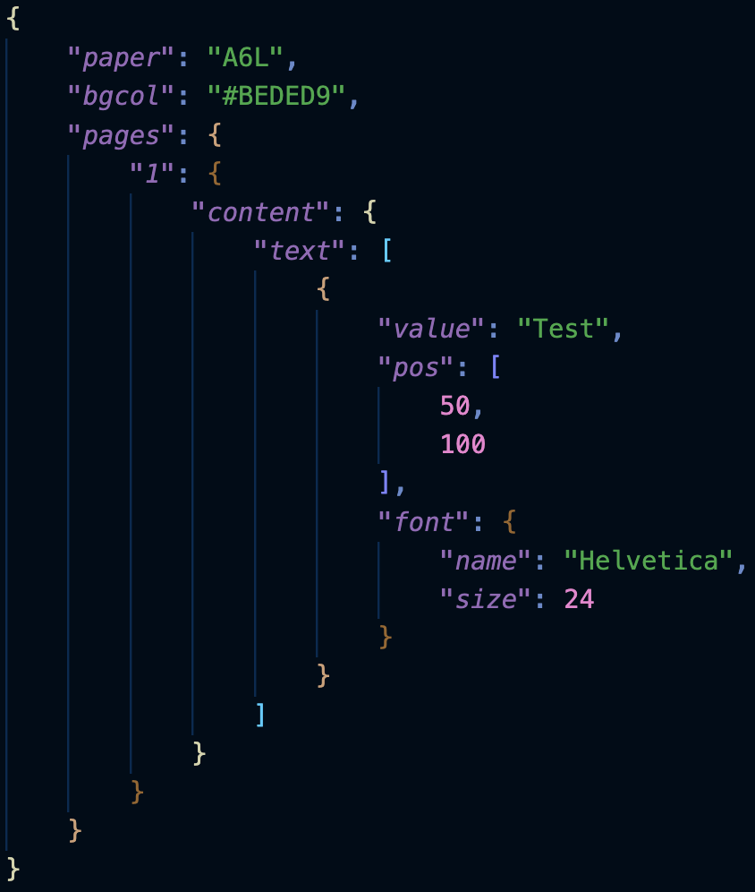<br>
  
</p>

<br>

## Border

A content region is surrounded by margin, border and padding.<br>
Let's add a border to the content region..<br>
We define the global border element which serves as default border for all content regions:

<p align="center">
 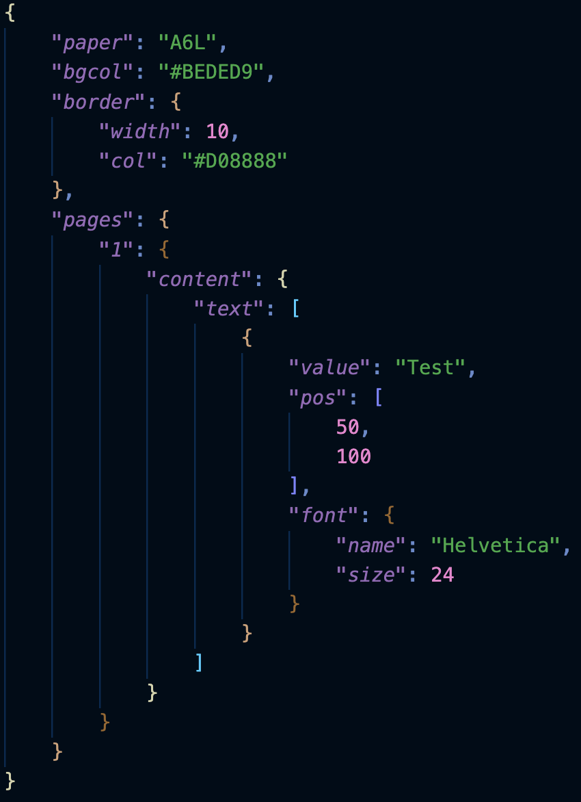<br>
 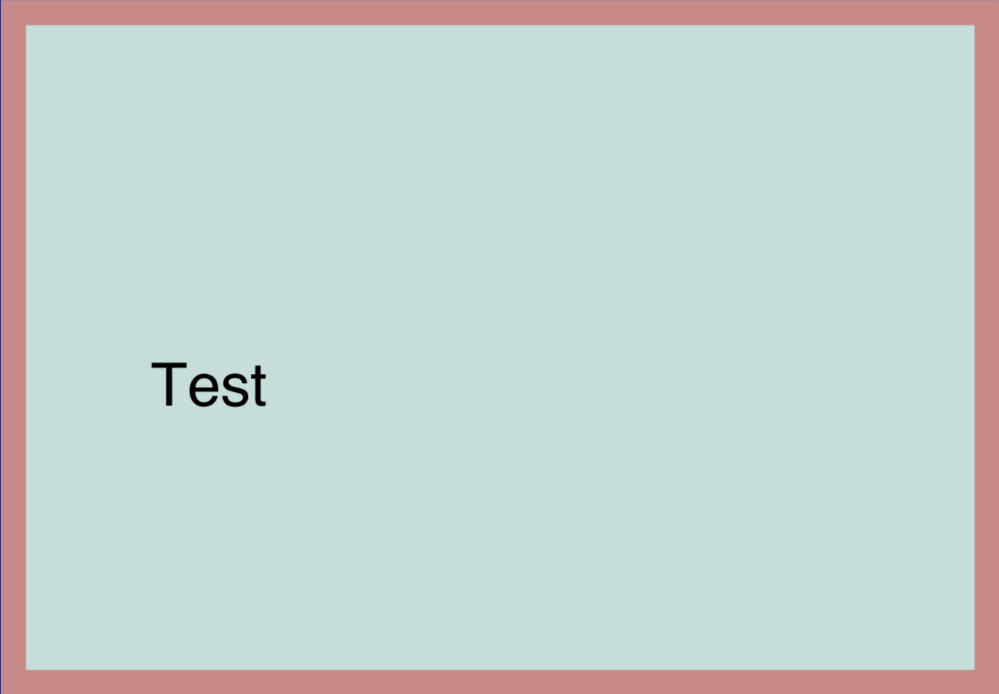
</p>

<br>

## Margin And Padding

Let's add margin and padding to the content region..<br>
We define the global margin and padding elements which serve as default margin and padding for all content regions:

<p align="center">
 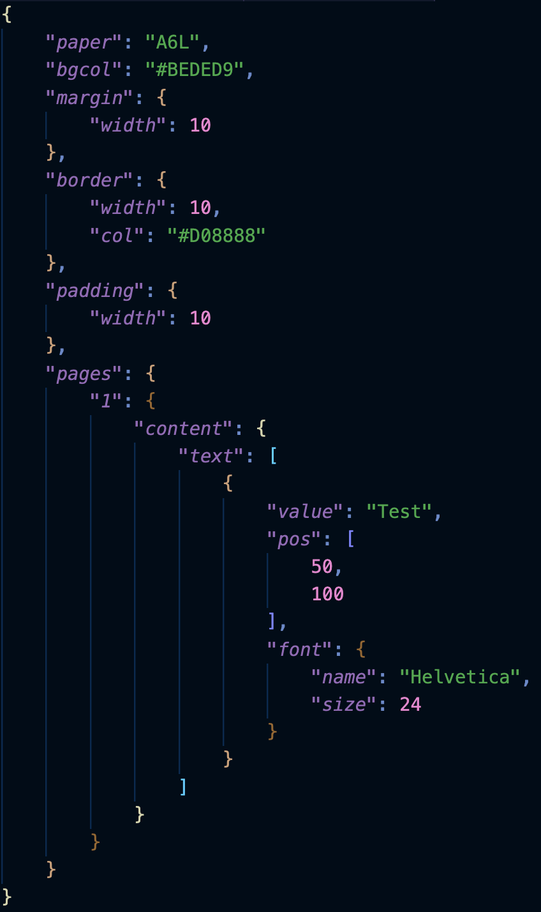<br>
 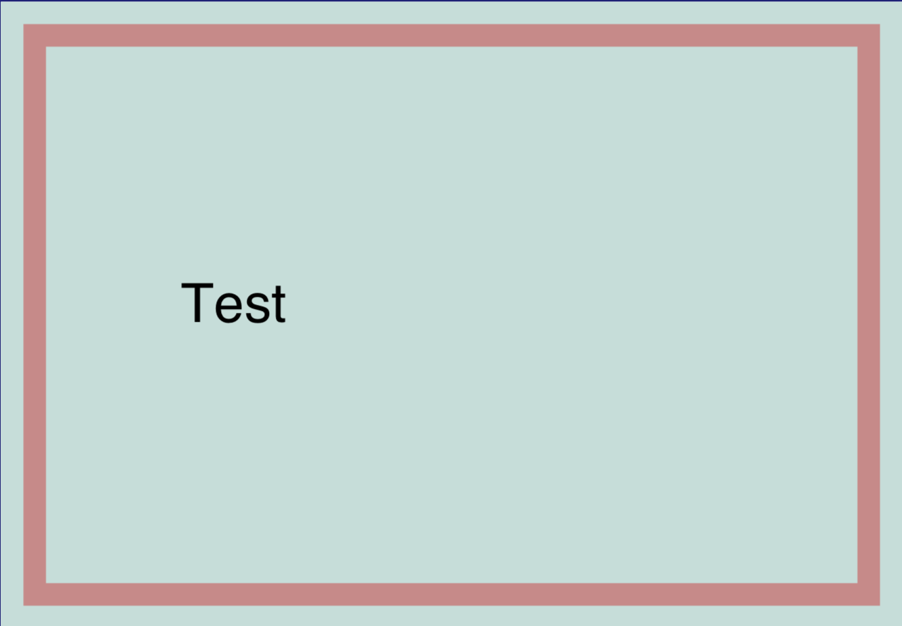
</p>

<br>

## ContentBox

A page has a single content region per default.<br>
The content box is the bounding box of a content region.<br>
We highlight the content box in red by turning on the global flag `contentBox`. This flag also highlights the crop box in green.<br>

If you have not specified a crop box using `crop` your crop box defaults to your media box which corresponds to the dimensions of your chosen paper size.<br>

<p align="center">
 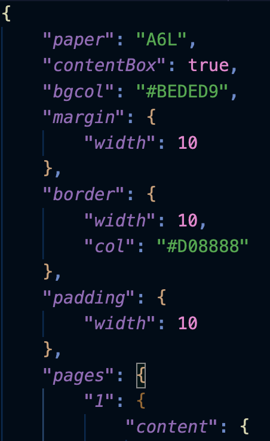<br>
  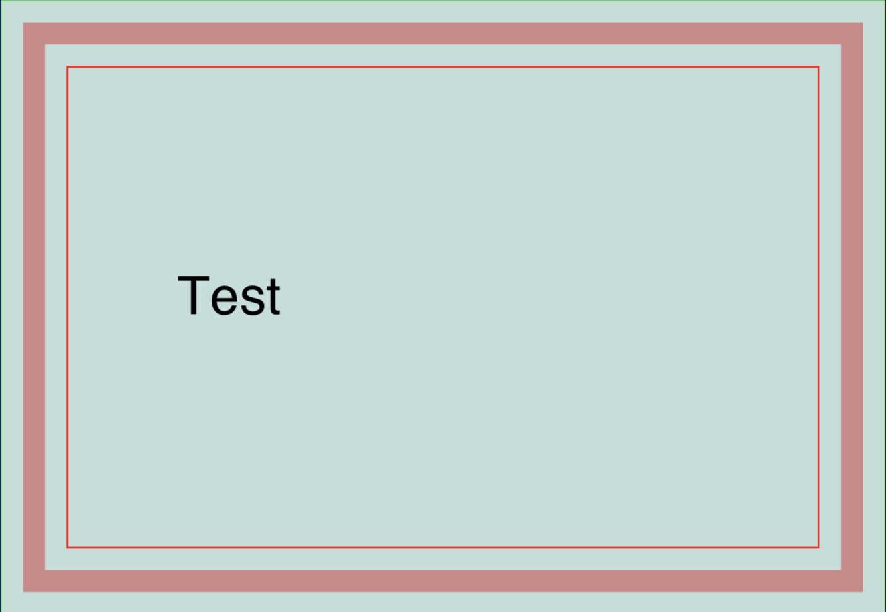
</p>

<br>

## Debug

We highlight the position of all content elements by turning on the global `debug` flag. 
This is especially useful during the layout phase when using different alignments:

<p align="center">
 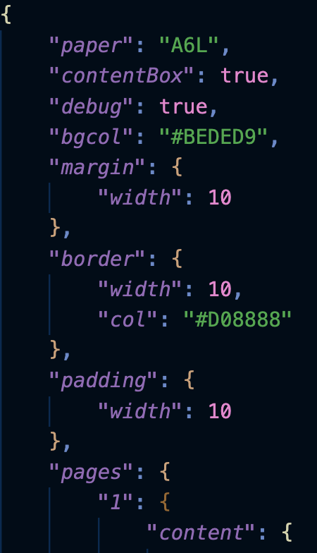<br>
  
</p>

<br>

## Origin

The default coordinate system has its origin in the lower left corner of the content box. You may choose either corner of the content box instead.<br><br>
**Warning**:
❗This does not change the fact that an elements position usually corresponds to its lower left corner. ❗<br><br>
Let's switch the origin to the upper left corner. We can achieve this using `ul` or `upperleft` and are not case sensitive:

<p align="center">
 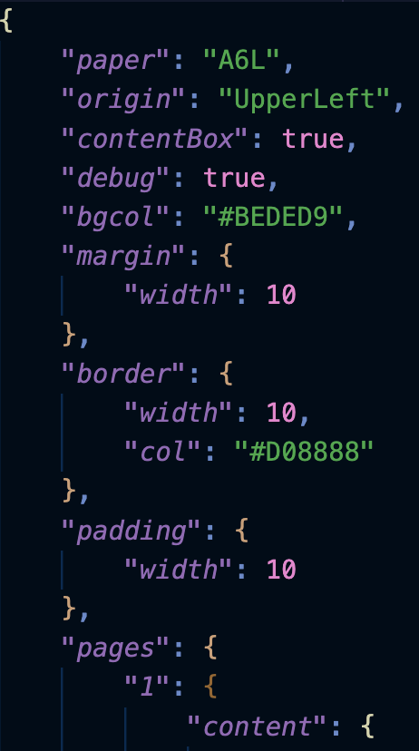<br>
  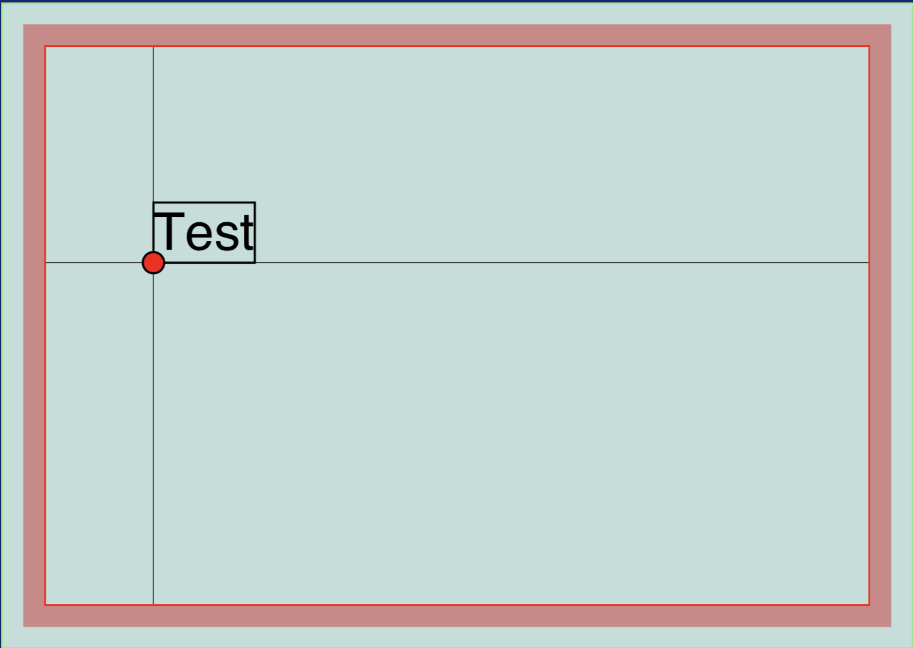
</p>

<br>

## Guides

There are a couple of pdfcpu features supporting you throughout your design phase. We already discussed `contentbox` and `debug`. An important part during layouting is defining your layout regions.<br>

A haircross is a pair of horizontal and vertical lines intersecting at a certain position, let's call this a `guide`. Using a couple of `guides` helps you to keep track of your layout regions.<br>

`Guides` is an array of elements wrapping `guide` positions.<br>

You need to enable guides rendering by turning on the global `guides` flag.

If you use -1 for one of the position coordinates pdfcpu will apply the center position for content box width/height:


<p align="center">
 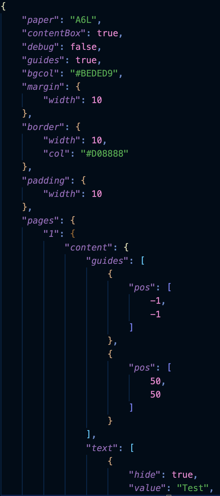<br>
  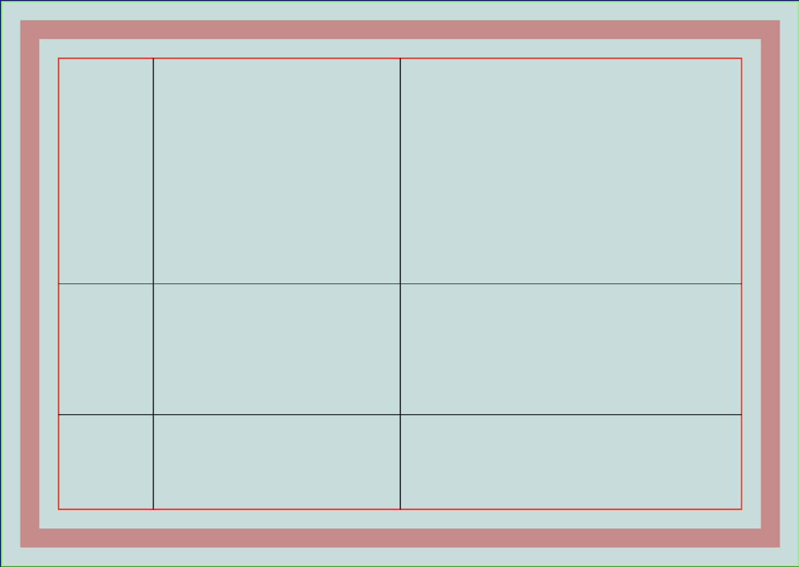
</p>

<br>

## Putting all together

Let's finish up by extending this JSON in order to demonstrate text alignment:<br>

`align` is an attribut of `text`.<br>
The possible values are: `left`, `center`, `right`, `justify`<br>
The default alignment is `left`.<br><br>
We want to render a short text in the center of the page with three different alignments.
We need three text boxes with corresponding alignment and also want to use different font colors.
The rest of the used `text` attributes `value`, `pos` and `font` are all the same.<br>
Let's use a named text box defining `value`, `pos` and `font` and call it `sample1`.<br><br>
We also want to render a multi line text box using all four possible alignments.
This time we will use individual positions, alignment and width.
The rest of the used `text` attributes `value`, `font`, `bgcol`, `padding` and `border` are shared.
Let's use a named text box defining `value`, `font`, `bgcol`, `padding` and `border` and call it `sample2`.<br><br>
We want to use Helvetica for all text boxes, so we define a named font and call it `myFont`.
Font size and color will be overriden appropriately either within the text pool (`texts`) or within the final content elements:

<p align="center">
 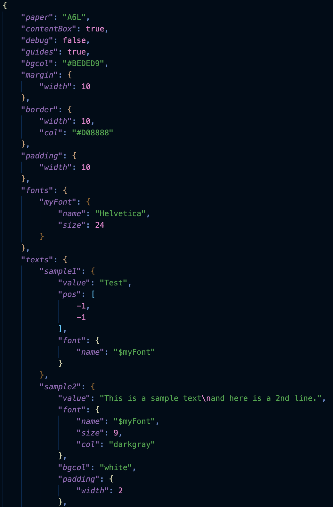<br>
 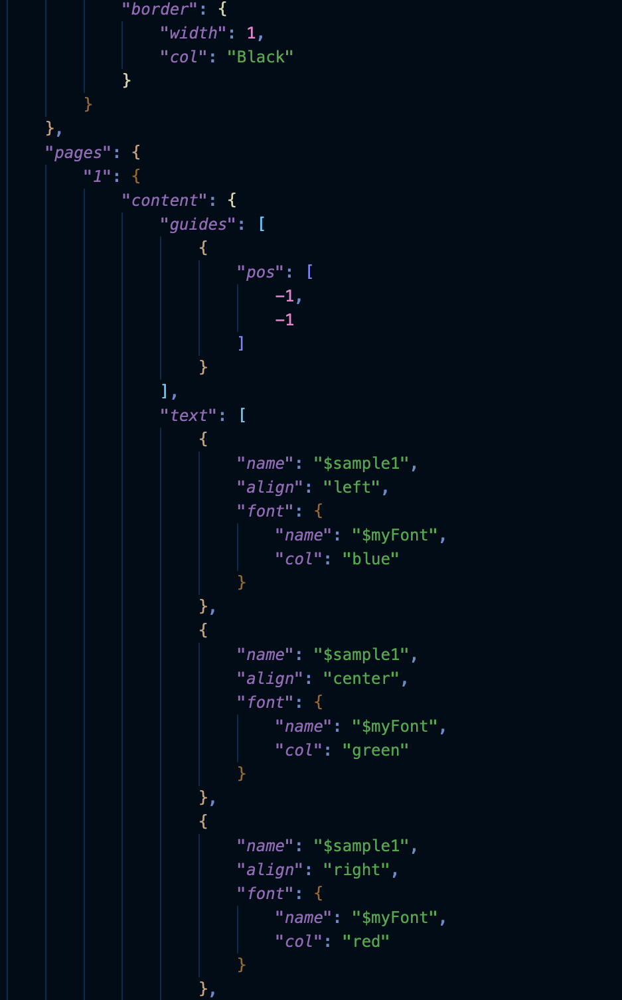<br>
 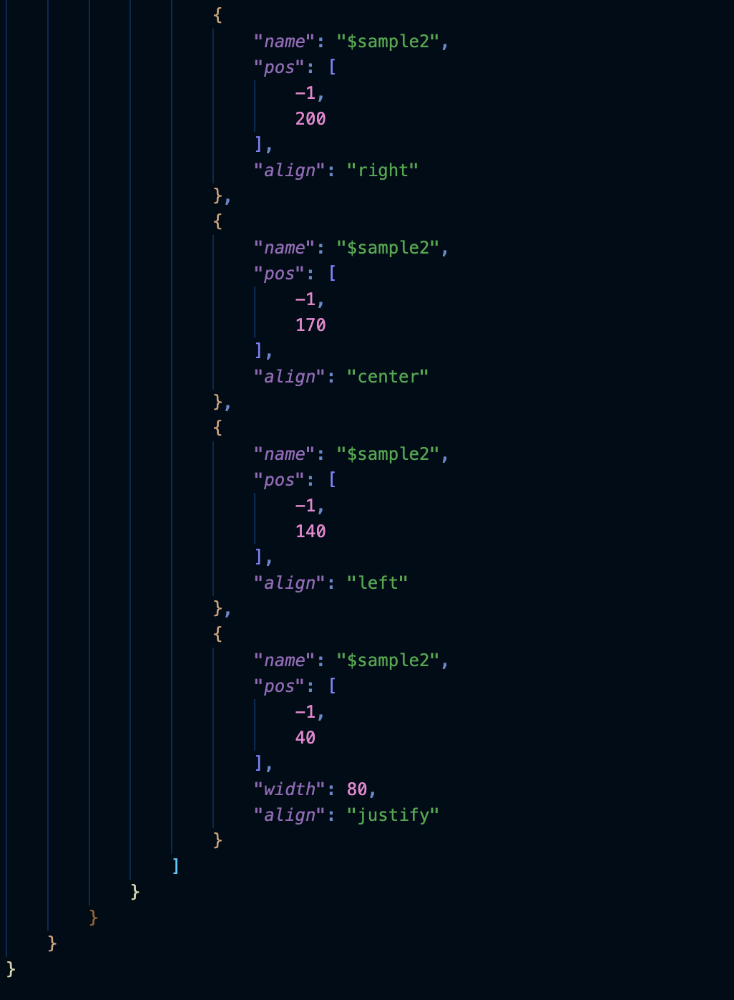<br>
  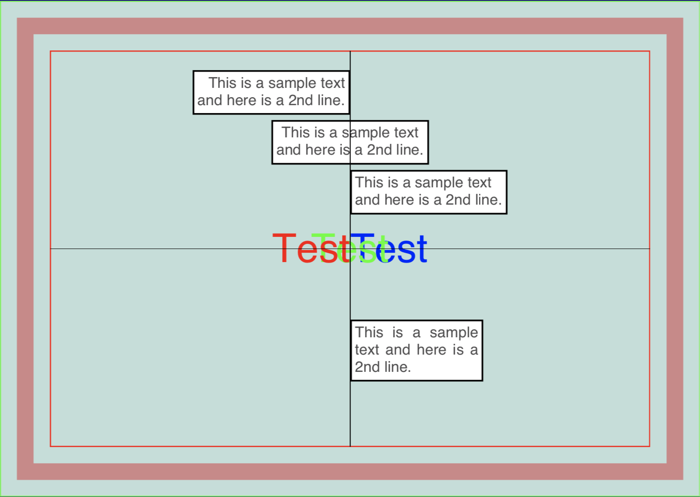
</p>

<br>
