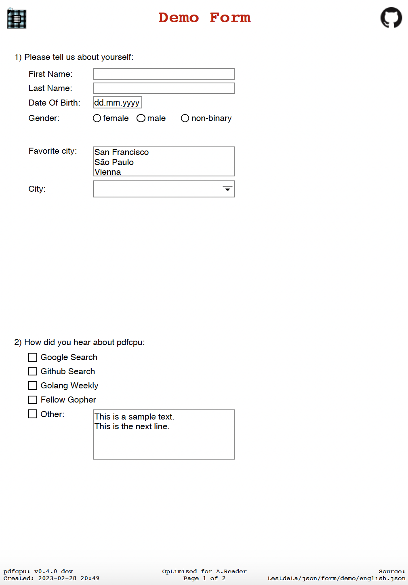
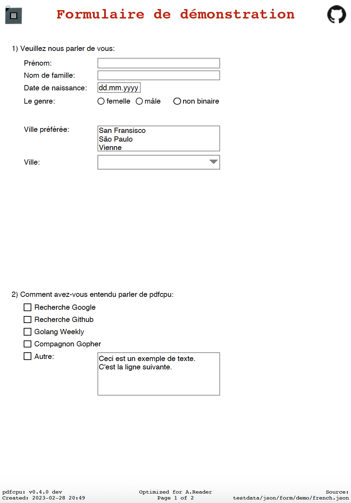
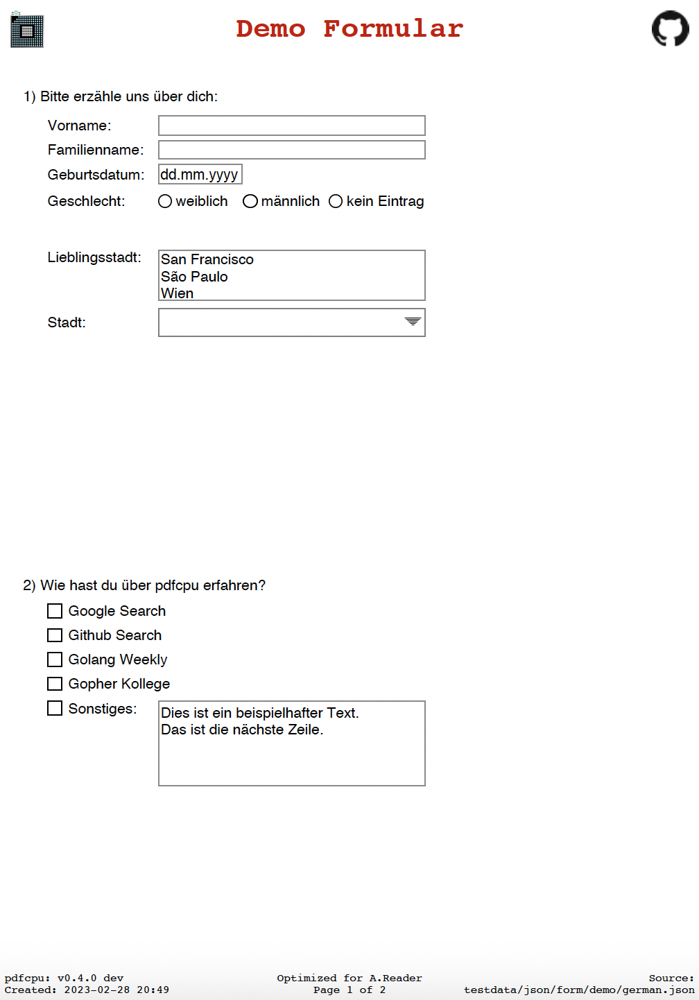
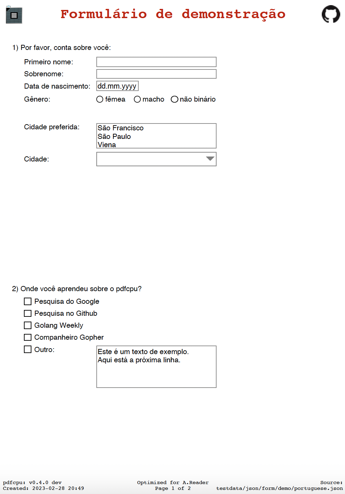
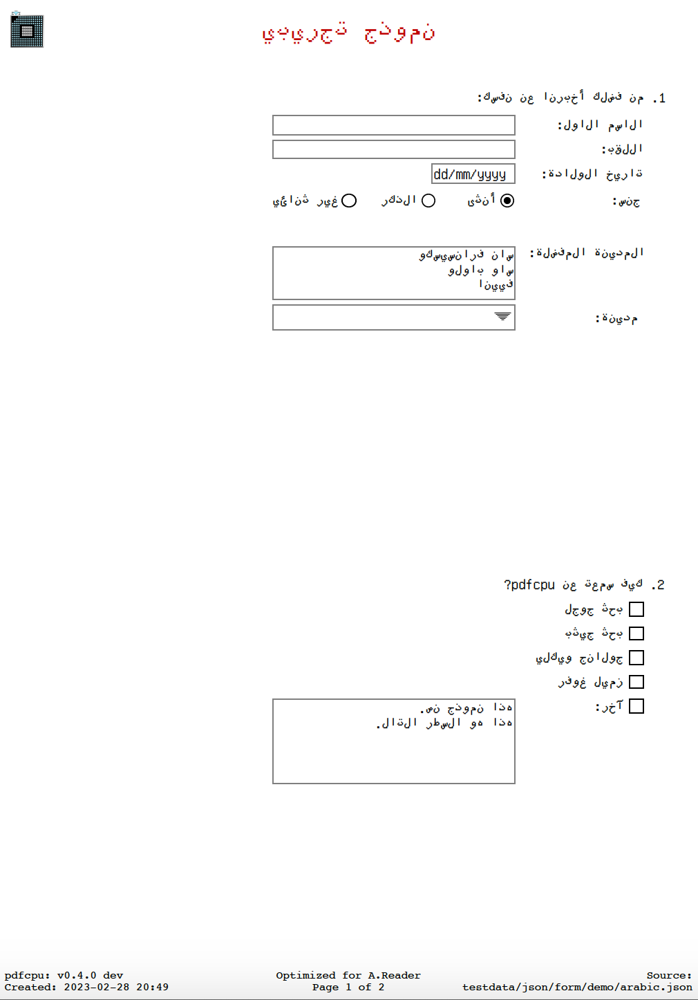
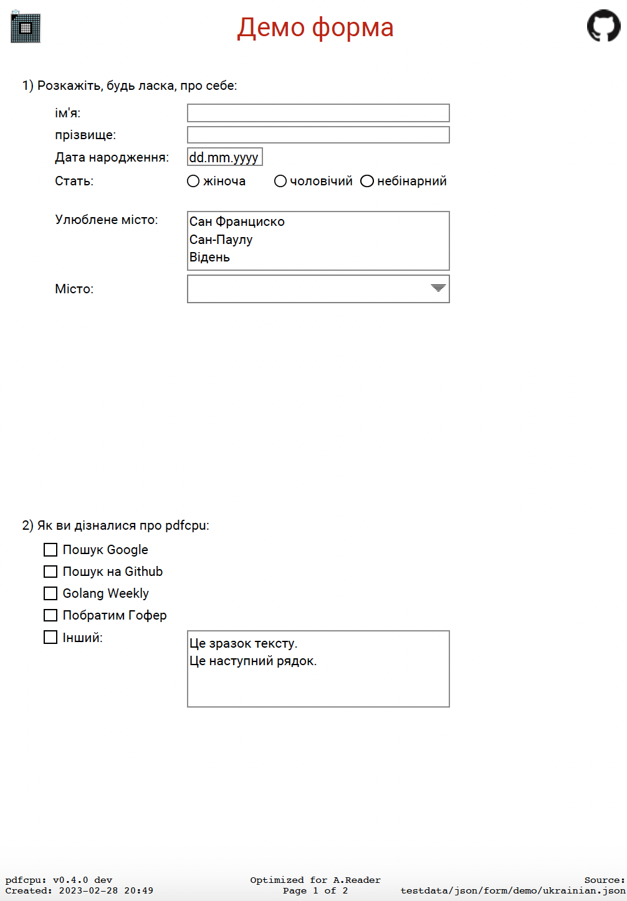
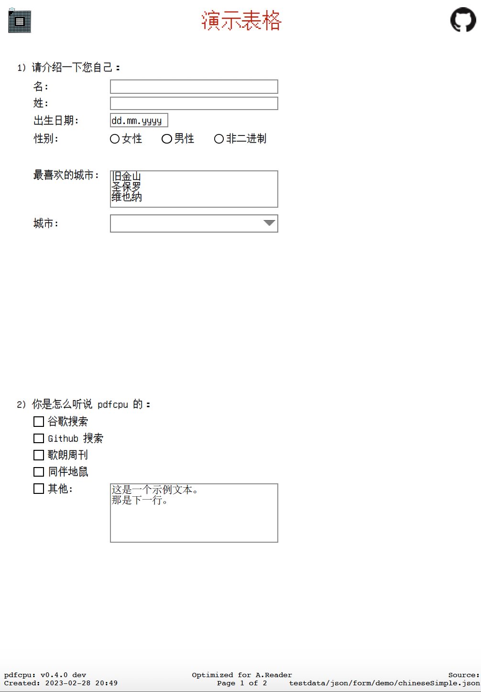

# Forms

Manage your PDF forms.

* List form fields
* Remove fields by id
* Lock fields by id
* Unlock fields by id
* Reset fields by id
* Export form to JSON
* Fill form via JSON
* Multifill forms via JSON/CSV

The focus of this command set is manipulating forms that were created using `pdfcpu create`.

    

To get you started pdfcpu has a [demo form set](https://github.com/pdfcpu/pdfcpu/tree/master/pkg/samples/form/demo) ([JSON sources](https://github.com/pdfcpu/pdfcpu/tree/master/pkg/testdata/json/form/demo)) available covering more than 40 languages:

    &nbsp;
    &nbsp;
    

    &nbsp;
    &nbsp;
    

You are very welcome to try the form commands on existing forms.

Issues are expected though so please report back any strange behavior
based on using Adobe Reader only.

