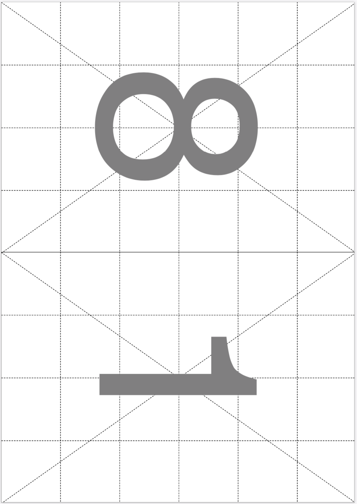
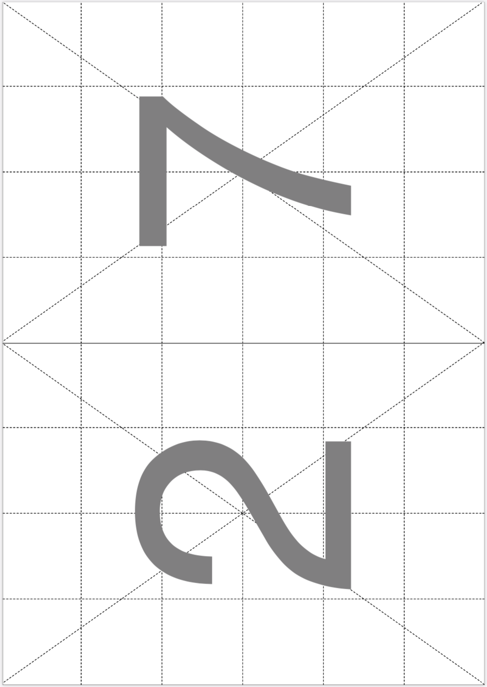
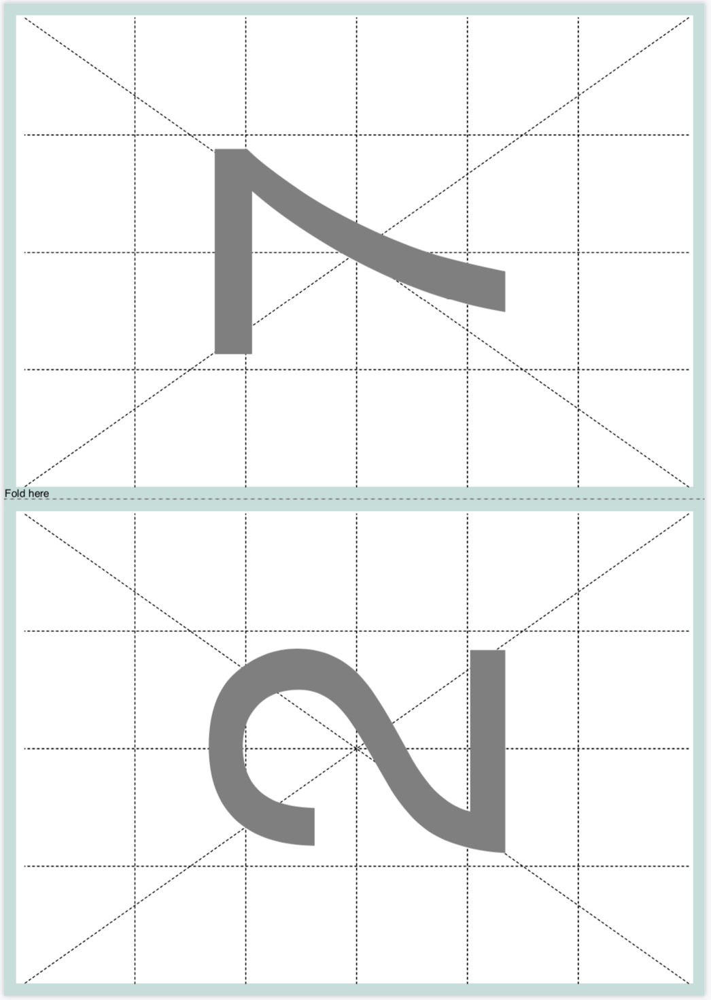
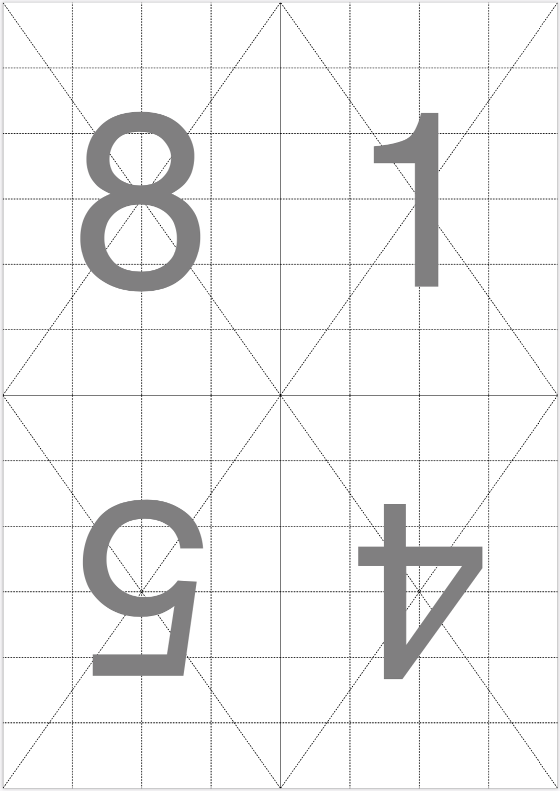
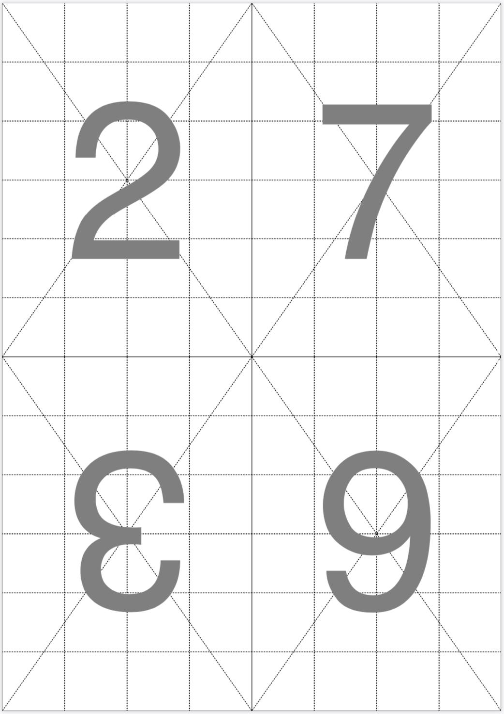
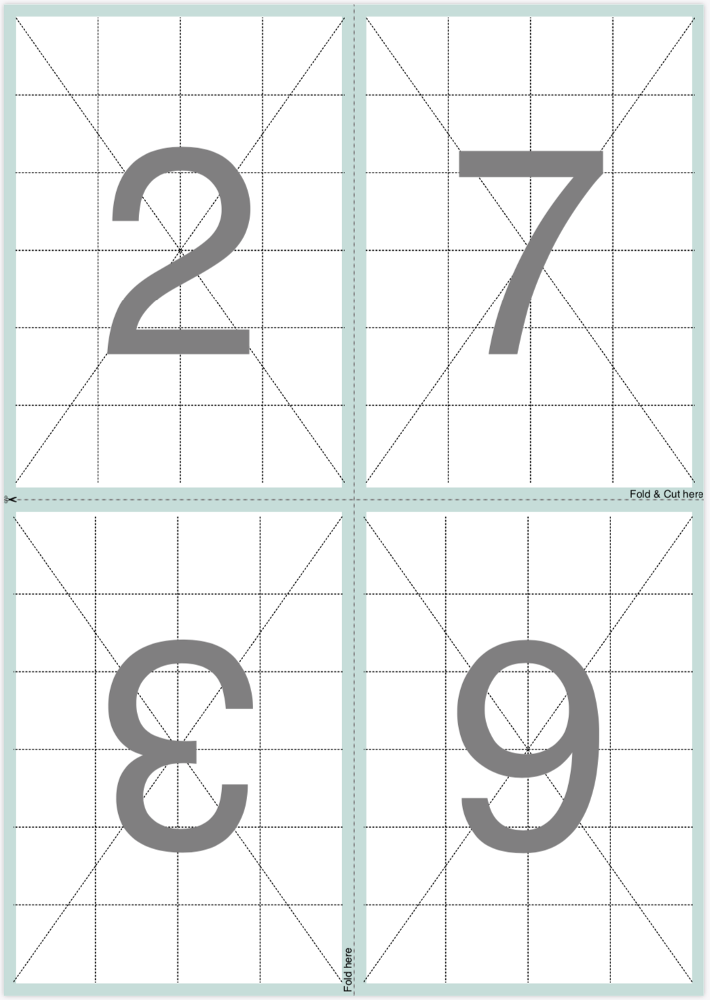
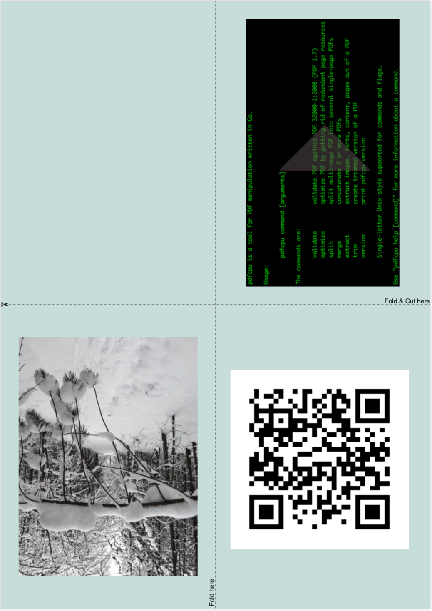
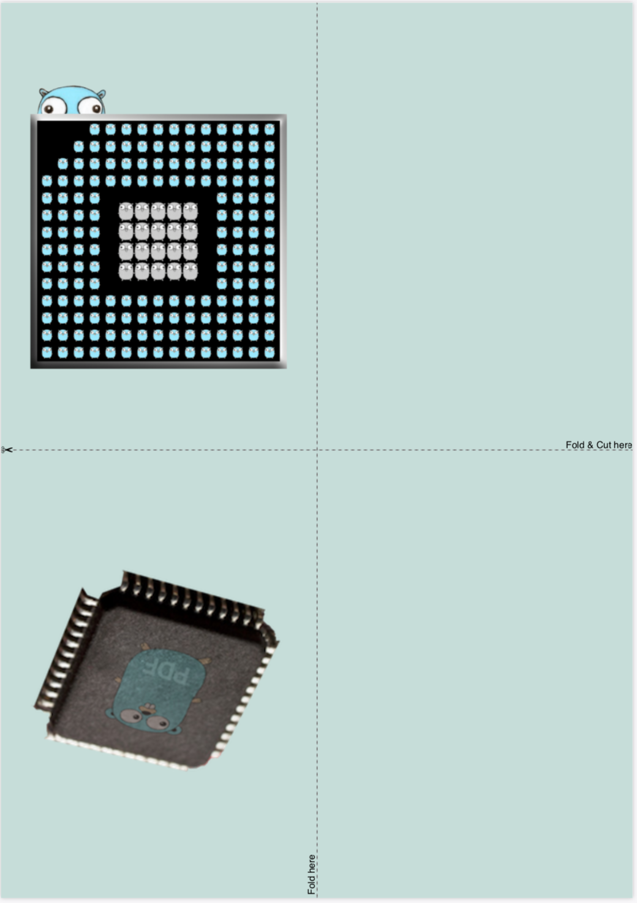

# Booklet

is a useful variation of the N-up command.

* Arrange a sequence of pages of `inFile` onto larger sheets of paper for a small book or zine and write the result to `outFile`.

* Create your booklet or zine out of a sequence of image files.

* Optionally set the sheet background color and render guidelines for folding and cutting.

* Have a look at some [examples](#examples).

<br>


## Usage

```
pdfcpu booklet [-p(ages) selectedPages] [description] outFile n inFile|imageFiles...
```

<br>

### Flags

| name                                         | description    | required
|:---------------------------------------------|:---------------|---------
| [p(ages)](../getting_started/page_selection) | selected pages | no

<br>

### Common Flags

| name                                            | description     | values
|:------------------------------------------------|:----------------|:-------
| [v(erbose)](../getting_started/common_flags.md) | turn on logging |
| [vv](../getting_started/common_flags.md)        | verbose logging |
| [q(uiet)](../getting_started/common_flags.md)   | quiet mode      |
| [u(nit)](../getting_started/common_flags.md)    | display unit    | po(ints),in(ches),cm,mm
| [c(onf)](../getting_started/common_flags.md)    | config dir      | $path, disable
| [upw](../getting_started/common_flags.md)       | user password   |
| [opw](../getting_started/common_flags.md)       | owner password  |

<br>

### Arguments

| name         | description             | required | values
|:-------------|:------------------------|:---------|:-
| description  | configuration string    | no
| outFile      | PDF output file         | yes
| n            | the N-up value          | yes      | 2, 4
| inFile       | PDF input file          | inFile or imageFile(s)
| imageFile... | one or more images      | inFile or imageFile(s)

<br>

### N-up Value

There are two styles of booklet you can choose from, depending on the paper sheet size that's available to you
and the page size used in your input page sequence for your booklet or zine.

#### n=2

Two of your pages fit on one side of a sheet (eg statement on letter, A5 on A4).
Assemble by printing on both sides (odd pages on the front and even pages on the back) and folding down the middle.

#### n=4

Four of your pages fit on one side of a sheet (eg statement on ledger, A5 on A3, A6 on A4).
Assemble by printing on both sides, then cutting the sheets horizontally.
The sets of pages on the bottom of the sheet are rotated so that the cut side of the
paper is on the bottom of the booklet for every page. After cutting, place the bottom
set of pages after the top set of pages in the booklet. Then fold the half sheets.

| value | portrait | landscape
|:------|:---------|----------
| 2     | 1x2      | 2x1
| 4     | 2x2      | 2x2

<br>

### Description

A configuration string to specify the details of the booklet layout.

| parameter            | values                                      | default
|:---------------------|:--------------------------------------------|:--
| dimensions           | (width, height) in user units eg. '400 200' | d: 595 842
| formsize, paper size | [paper size](../paper.md) to be used. Append L or P to enforce landscape/portrait mode| f: A4
| guides               | on/off true/false                           | g: off
| border               | on/off true/false                           | b: off
| margin               | integer >= 0                                | m: 0
| backgroundcolor, bgcol | 0.0 <= r,g,b <= 1.0, eg. 1.0, 0.0, 0.0 = 1,0,0 = red | none
|                      | or the hex RGB value: #RRGGBB               |

<br>

#### Default description

```sh
'formsize:A4, dimensions:595 842, guides:off, border:off, margin:0'
```

* You only have to specify any parameter diverging from the default.

* Only one of dimensions or formsize is allowed.

* You may use parameter prefixes as long as the parameter can be identified.


## Examples

Let's make a booklet where two of your pages fit on one side of a sheet of paper.
We'll be using A4 so the format of the booklet pages will be A5.
This command generates a PDF file representing a sequence of page pairs (front and back side of a sheet of paper).
Once generated we need to print the file two-sided and then assemble our booklet by stacking the printed sheets and folding them down the middle:

```sh
pdfcpu booklet 'p:A4, border:on' booklet.pdf 2 pageSequence.pdf
```


Here is the front and back side of the first printed sheet of paper for an input file with eight pages.
<br>
This also explains that four booklet pages fit on one sheet of paper:

<p align="center">
  
  
</p>

<br>

You can also set margins, the sheet background color and you can even render the guidelines for folding:

```sh
pdfcpu booklet 'formsize:A4, border:off, guide:on, margin:10, bgcol:#beded9' booklet.pdf 2 pageSequence.pdf
```

<p align="center">
  
  
</p>

<br>

Since A4 happens to be the default form size the following command is identical to the one above:
```sh
pdfcpu booklet 'g:on, m:10, bgcol:#beded9' booklet.pdf 2 pageSequence.pdf
```

<br>

Now let's make a little zine also using A4 but now four zine pages shall fit on one sheet of A4 which results
in a zine page size of A6.

The assembly stage looks a little bit different here since we will also need to do some cutting.
After pdfcpu has generated the PDF which holds our zine first we need to print it using two-sided printing.
Then we take the printed stack and cut the sheets horizontally. After cutting, we place the bottom
set of pages after the top set of pages in the zine. Then fold the half sheets:

```sh
pdfcpu booklet 'p:A4, border:on' zine.pdf 4 pageSequence.pdf
```

Here are the first two pages representing the front and back side of the first paper sheet:
<p align="center">
  
  
</p>

<br>

Using guidelines for cutting and folding and a nice combination of margin and background color the assembly steps
may be easier to understand:

```sh
pdfcpu booklet 'p:A4, bo:off, g:on, m:10, bgcol:#beded9' zine.pdf 4 pageSequence.pdf
```

<p align="center">
  
  
</p>

<br>

Similar to *nup* and *grid* the *booklet* command also accepts a sequence of image files instead of a PDF input file.
In this case pdfcpu applies the same logic as above treating each image as a booklet page:

```sh
pdfcpu booklet 'p:A4, g:on, m:25, bgcol:#beded9' bookletFromImages.pdf 4 *.png
```

In this example we have five input image files resulting in a booklet with five pages of content.
Since we want to produce a 4-up booklet we can fit eight booklet pages on one sheet of paper.
<br>
As a result of this pages 6 thru 8 are rendered as empty pages.
<br><br>
Here are all pages (1 and 2) of the output file *bookletFromImages.pdf*:

<p align="center">
  
  
</p>
