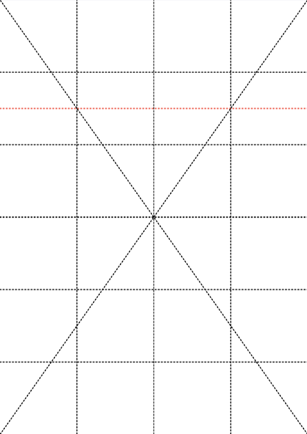
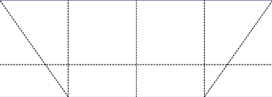
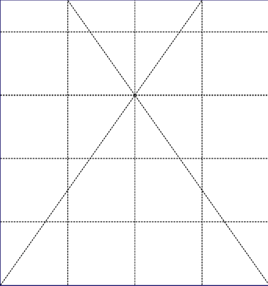
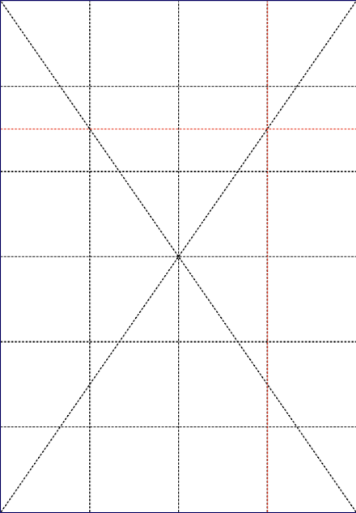
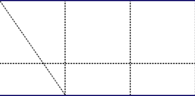
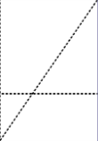
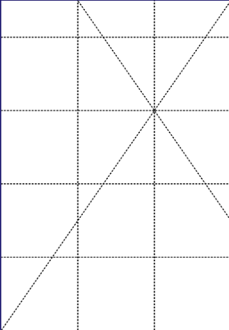

# Cut

* Custom cut pages horizontally or vertically in any way you want.

* This is the low level alternative to [poster](poster.md) and [ndown](ndown.md)

* The result is packaged into a PDF file in outDir for each selected page containing an outline view followed by pages representing cut tiles.

* Have a look at some [examples](#examples).

<br>

## Usage

```
pdfcpu cut [-p(ages) selectedPages] -- description inFile outDir [outFileName]
```

<br>

### Flags

| name                                         | description    | required
|:---------------------------------------------|:---------------|---------
| [p(ages)](../getting_started/page_selection) | selected pages | no

<br>

### Common Flags

| name                                            | description     | values
|:------------------------------------------------|:----------------|:-------
| [v(erbose)](../getting_started/common_flags.md) | turn on logging |
| [vv](../getting_started/common_flags.md)        | verbose logging |
| [q(uiet)](../getting_started/common_flags.md)   | quiet mode      |
| [-o(ffline)](../getting_started/common_flags.md)| disable http traffic |                                 | 
| [c(onf)](../getting_started/common_flags.md)    | config dir      | $path, disable
| [opw](../getting_started/common_flags.md)       | owner password  |
| [upw](../getting_started/common_flags.md)       | user password   |
| [u(nit)](../getting_started/common_flags.md)    | display unit    | po(ints),in(ches),cm,mm

<br>

### Arguments

| name         | description          | required
|:-------------|:---------------------|:--------
| description  | configuration string | yes
| inFile       | PDF input file       | yes
| outDir       | output directory     | yes
| outFileName  | PDF output file name | no

<br>

### Description

A configuration string to specify the cutlines.

| parameter            | description | values                                      
|:---------------------|:---------------|:-----------------------------
| horizontal           | horizontal page cuts at height fraction (origin top left corner) | eg: .25
| vertical             | vertical page cuts at width fraction (origin top left corner) | eg: .25 .5
| margin               | margin / glue area in display units | >= 0.0
| bgcolor              | margin / glue area color value | [color](../getting_started/color.md) 
| border               | draw content region border along set margin | on/off, true/false, t/f   

<br>

## Examples

Apply a horizontal page cut at 0.25 height.<br>
Results in a PDF containing 3 PDF pages for each processed page:
```sh
$ pdfcpu cut -- "hor:.25" test.pdf .
cutting test.pdf into ./ ...
writing test_page_1.pdf
```

<p align="center">
  <br>
  <br>
  
</p>

<br>


 
Apply a horizontal page cut at 0.25 height and a vertical page cut at 0.75 width.<br>
Results in a PDF containing 5 pages for each processed page:
```sh
$ pdfcpu cut -- "hor:.25, vert:.75" test.pdf .
cutting test.pdf into ./ ...
writing test_page_1.pdf
```

<p align="center">
  <br>
  
  <br>
  
  
</p>

<br>


The following has the same effect as: pdfcpu ndown 3 in.pdf outDir:
```sh
$ pdfcpu cut -- "hor:.33 .66" inFile outDir
````

<br>

The following has the same effect as: pdfcpu ndown 4 in.pdf outDir:
```sh
$ pdfcpu cut -- "hor:.5, ver:.5" inFile outDir
````

