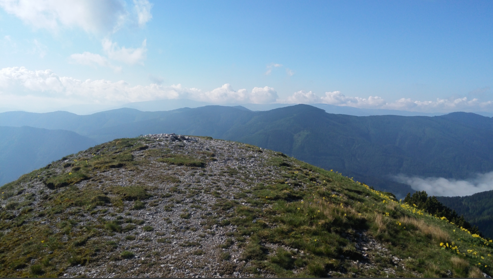
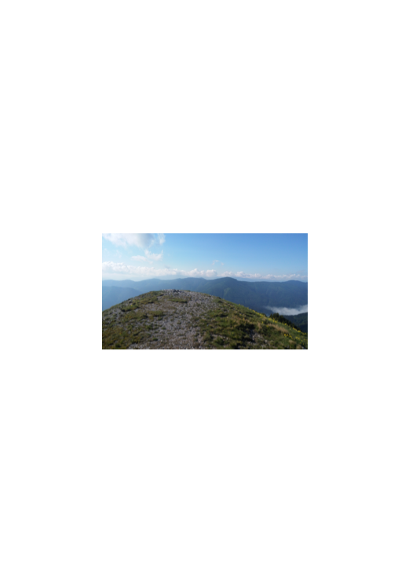
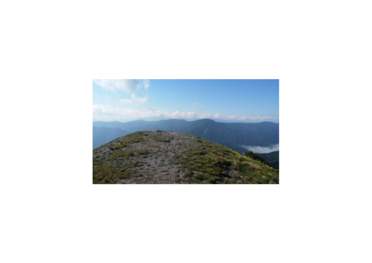
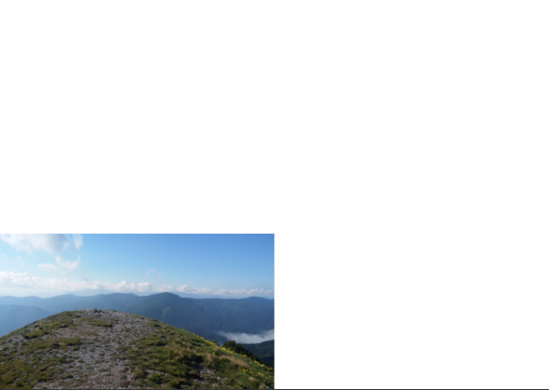
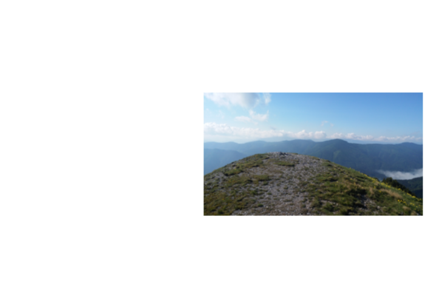
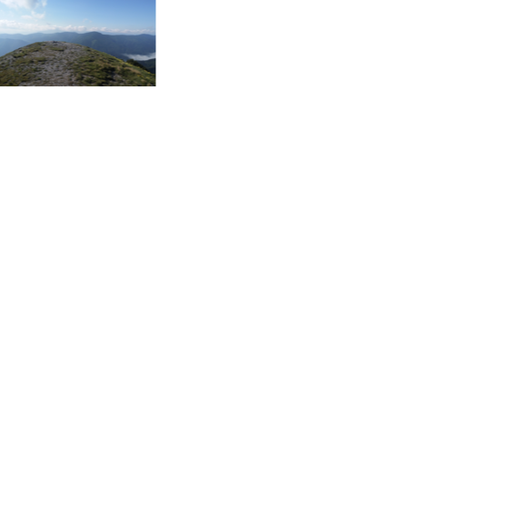
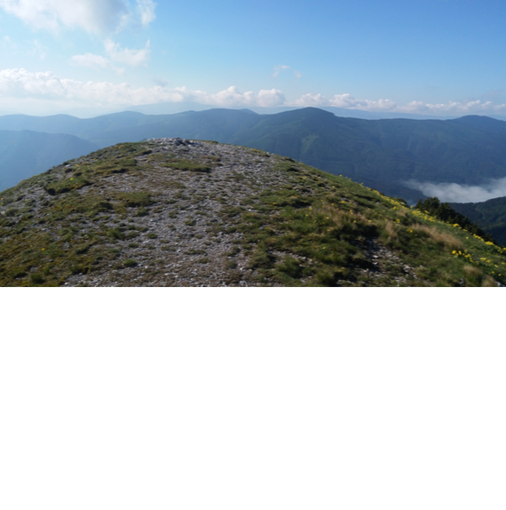

# Import

Convert one or more image files into a PDF file. Have a look at some [examples](#examples).

* Every image file will be rendered onto a separate page.

* If you pass in a single image file name a single page PDF will be created.

* If you pass in a list of image files a photo album gets created as a result of the concatenation of pages containing a single image each.

* By supplying a configuration string you can specify layout details like position, dimensions, scaling and the paper size to be used.

* The command will create the output file if it does not exist otherwise it will append to it. This feature comes in handy when you have a cover page and want to append a photo album to it.

## Usage

```
pdfcpu import [-v(erbose)|vv] [-q()uiet] [description] outFile imageFile...
```
<br>

### Flags

| flag                             | description
|:---------------------------------|:---------------
| [verbose](../getting_started/common_flags.md) | turn on logging   | no
| [vv](../getting_started/common_flags.md)      | verbose logging   | no
| [quiet](../getting_started/common_flags.md)   | quiet mode      | no


<br>

### Arguments

| name         | description                   | required
|:-------------|:------------------------------|:--------
| description  | configuration string          | no
| outFile      | PDF output file               | yes
| imageFile... | one or more input image files | yes

<br>

### Description

A configuration string to specify the details of the image layout on the page.

| parameter | description     | values | default
|:----------|:----------------|:------|:-----------------------------------------------------------------
| d         | dimensions      | (width, height) in user units eg. '400 200'                    | d: 595 842
| f         | form/paper size | [paper size](../paper.md) to be used. Append L or P to enforce landscape/portrait mode| f: A4
| p         | position        | one of `full` or the anchors: `tl, tc, tr, l, c, r, bl, bc, br` | p: full
| o         | offset          | (dx,dy) in user units eg. '15 20'                             | o: 0 0
| s         | scale factor    | 0.0 <= s <= 1.0 followed by optional `abs` or `rel`           | s: 0.5 rel

<br>

#### Anchors for positioning

|||||
|-|-|-|-|
|       | left | center |right
|top    | `tl` | `tc`   | `tr`
|       | `l`  | `c`    |  `r`
|bottom | `bl` | `bc`   | `br`

<br>

#### Default description

```sh
'f:A4, d:595 842, p:full, o:0 0, s:0.5 rel'
```

* You only have to specify any parameter diverging from the default.

* Only one of dimensions or format is allowed.

* The default position `full` enforces image dimensions equal to page dimensions.

<br>

## Examples

Create a single page `photo.pdf` containing `photo.png` using the default positioning `p:full`. The page size dimensions will match the dimensions of the image:

```sh
pdfcpu import photo.pdf photo.png
```

<p align="center">
  
</p>

<br>

Create a single page PDF using paper size `f:A5` using the default orientation *portrait* which could also be expressed with `f:A5P`. Use the positioning parameter `p:c` to center the image on the page and the default relative scaling `s:0.5 rel`:

```sh
pdfcpu import 'f:A5, p:c' photo.pdf photo.jpg
```

<p align="center">
  
</p>

<br>

Create a single page PDF using paper size `f:A5L` using the orientation landscape. Use the positioning parameter `p:c` to center the image on the page and the default relative scaling `s:0.5 rel`:

```sh
pdfcpu import 'f:A5L, p:c' photo.pdf photo.jpg
```

<p align="center">
  
</p>

<br>

Create a single page PDF using A5 landscape mode, a relative scaling of 0.5 and the positioning `p:bl` which anchors the picture to the bottom left page corner:

```sh
pdfcpu import 'f:A5L, p:bl' photo.pdf photo.jpg
```

<p align="center">
  
</p>

<br>

Create a single page PDF using A5 landscape mode, relative scaling 0.5, positioning `p:r` which anchors the picture to the right side vertically centered. Use a negative horizontal offset `o:-20 0` to impose a margin:

```sh
pdfcpu import 'f:A5L, p:r, o:-20 0' photo.pdf photo.jpg
```

<p align="center">
  
</p>

<br>

Import `photo.jpg` into a 500 x 500 single page PDF anchoring the image to the top left corner using a relative scaling of 0.3:

```sh
pdfcpu import 'd:500 500, p:tl, s:0.3 rel' photo.pdf photo.jpg
```

<p align="center">
  
</p>

<br>

Import `photo.jpg` into a 500 x 500 single page PDF anchoring the image to the top left corner using a scaling of 1:

```sh
pdfcpu import 'd:500 500, p:tl, s:1' photo.pdf photo.jpg
```

<p align="center">
  
</p>

<br>

Generate a PDF photo album assuming `pics/` contains image files (jpg, png, tif):

```sh
pdfcpu import album.pdf pics/*
```
<br>

Generate a PDF photo album with images centered on the page using the default relative scaling of 0.5:

```sh
pdfcpu import 'p:c' album.pdf pics/*
```
<br>

The following command also generates a PDF album but additionally configures the paper size *Letter* and positions the images to be anchored to the bottom left corner with a horizontal offset of 10 points and a vertical offset of 20 points with a scaling of 0.3 relative to page dimensions:

```sh
pdfcpu import 'f:Letter, p:bl, o:10 20, s:0.3' album.pdf *.jpg *.png
```
<br>

If an album created by *Import* ends up having some pages with images not in upright position the [Rotate](../core/rotate.md) command comes to the rescue. Let's say we just have created an album and the images on page 3 and 4 need to be rotated counter clockwise by 90 degrees. This happens frequently. We can fix this situation with:

```sh
pdfcpu rotate -pages 3-4 album.pdf -90
```