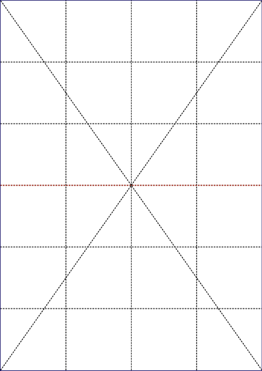
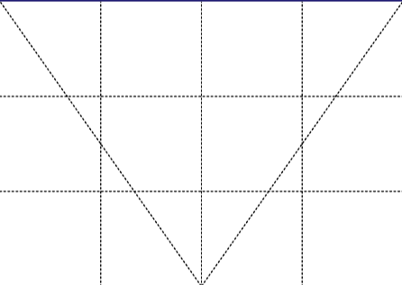
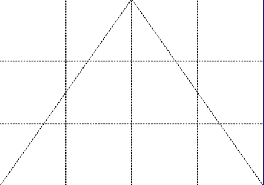
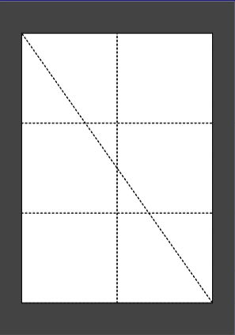
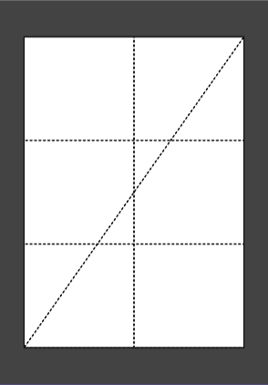
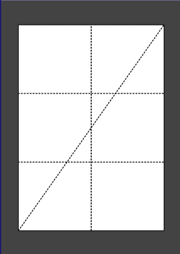
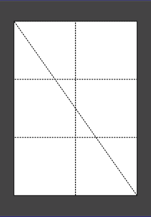

# N-down

* An alternative to [poster](poster.md) and [cut](cut.md)

* Create a poster for the selected page by cutting symmetrically into n tiles.

* The poster for each selected page is packaged into a PDF file in outDir containing an outline view followed by pages representing the poster tiles.

* This command may be viewed as inverse to n-Up.  

* See also the related commands: [poster](poster.md), [cut](cut.md)

* Have a look at some [examples](#examples).

<br>

## Usage

```
pdfcpu ndown [-p(ages) selectedPages] -- [description] n inFile outDir [outFileName]
```

<br>

### Flags

| name                                         | description    | required
|:---------------------------------------------|:---------------|---------
| [p(ages)](../getting_started/page_selection) | selected pages | no

<br>

### Common Flags

| name                                            | description     | values
|:------------------------------------------------|:----------------|:-------
| [v(erbose)](../getting_started/common_flags.md) | turn on logging |
| [vv](../getting_started/common_flags.md)        | verbose logging |
| [q(uiet)](../getting_started/common_flags.md)   | quiet mode      |
| [u(nit)](../getting_started/common_flags.md)    | display unit    | po(ints),in(ches),cm,mm
| [c(onf)](../getting_started/common_flags.md)    | config dir      | $path, disable
| [upw](../getting_started/common_flags.md)       | user password   |
| [opw](../getting_started/common_flags.md)       | owner password  |

<br>

### Arguments

| name         | description          | required
|:-------------|:---------------------|:--------
| description  | configuration string | no
| n            | the N-down value     | yes
| inFile       | PDF input file       | yes
| outDir       | output directory     | yes
| outFileName  | PDF output file name | no

<br>

### N-down Value

The following table lists all supported values for `n` and the resulting poster tile layout with respect to the orientation of the chosen output [paper size](../paper.md).

| value | portrait | landscape | Example
|:------|:---------|:----------|:-------
| 2     | 1x2      | 2x1       | A1 -> 2 x A2
| 3     | 1x3      | 3x1       | 
| 4     | 2x2      | 2x2       | A1 -> 4 x A3
| 8     | 2x4      | 4x2       | A1 -> 8 x A4
| 9     | 3x3      | 3x3       |
| 12    | 3x4      | 4x3       |
| 16    | 4x4      | 4x4       | A1 -> 16 x A5

<br>

### Description

A configuration string to specify the details of the grid layout.

| parameter            | description | values                                      
|:---------------------|:--------------|:------------------------------
| margin               | margin / glue area in display units | >= 0.0
| bgcolor              | margin / glue area color value | [color](../getting_started/color.md)
| border               | draw content region border along set margin | on/off, true/false, t/f   

<br>

## Examples

The page format is A2, the printer supports A3.<br>
Quick cut a page into 2 equally sized pages.<br>
Results in a PDF containing 3 pages for each processed page:
```sh
pdfcpu ndown 2 test.pdf .
cut test.pdf into ./ ...
writing test_page_1.pdf
```

<p align="center">
  <br>
  <br>
  
</p>

<br>

The page format is A2, the printer supports A4.<br>
Quick cut page into 4 equally (A4) sized pages.<br>
Results in a PDF containing 5 pages for each processed page:
```sh
pdfcpu ndown 4 test.pdf .
cut test.pdf into ./ ...
writing test_page_1.pdf
```

<p align="center">
  <br>
  
  <br>
  
  
</p>

<br>

The page format is A2, the printer supports A4.
Quick cut page into 4 equally (A4) sized pages and provide a dark gray glue area of 1 cm.<br>
Results in a PDF containing 5 pages for each processed page:
```sh
pdfcpu ndown -u cm -- "margin:1, bgcol:DarkGray, border:on" 4 test.pdf .
cut test.pdf into ./ ...
writing test_page_1.pdf
````

<p align="center">
  <br>
  
  <br>
  
  
</p>