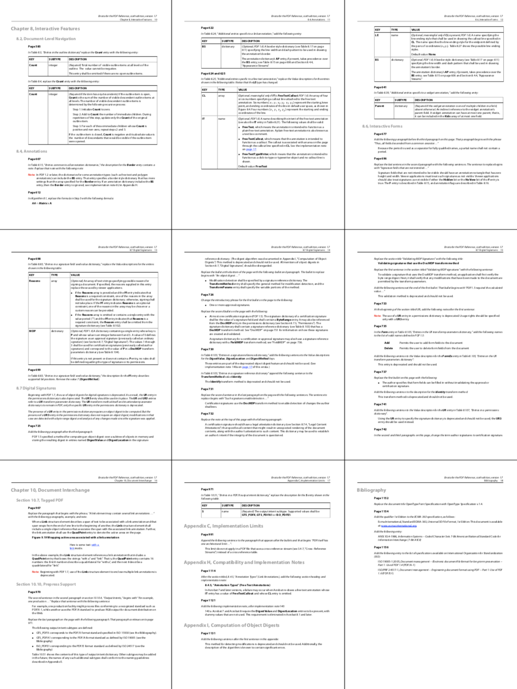
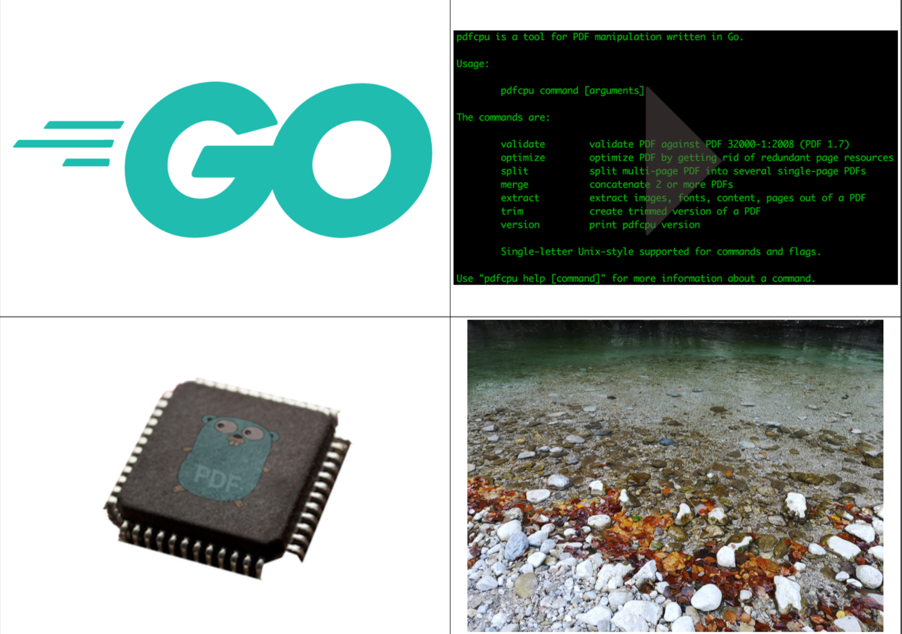

# N-up

* Rearrange all pages of `inFile` file in order to reduce the number of pages and write the result to `outFile`.
Each new page is composed of multiple original pages in a grid like fashion.
The original page size is preserved.

* Create `outFile` for a given [paper size](../paper.md) and arrange `imageFiles` on pages in a grid like fashion.
For a single image file create a single page PDF file and fill the grid with copies of the image.

* The [N-up](https://en.wikipedia.org/wiki/N-up) value `n` controls the grid layout.

* Proper rotation based on involved aspect ratios will be applied during the process.

* Have a look at some [examples](#examples).

<br>


## Usage

```
pdfcpu nup [-p(ages) selectedPages] [description] outFile n inFile|imageFiles...
```

<br>

### Flags

| name                                         | description    | required
|:---------------------------------------------|:---------------|---------
| [p(ages)](../getting_started/page_selection) | selected pages | no

<br>

### Common Flags

| name                                            | description     | values
|:------------------------------------------------|:----------------|:-------
| [v(erbose)](../getting_started/common_flags.md) | turn on logging |
| [vv](../getting_started/common_flags.md)        | verbose logging |
| [q(uiet)](../getting_started/common_flags.md)   | quiet mode      |
| [u(nit)](../getting_started/common_flags.md)    | display unit    | po(ints),in(ches),cm,mm
| [c(onf)](../getting_started/common_flags.md)       | config dir      | $path, disable
| [upw](../getting_started/common_flags.md)          | user password   |
| [opw](../getting_started/common_flags.md)          | owner password  |

<br>

### Arguments

| name         | description          | required | default
|:-------------|:---------------------|:---------|:-
| description  | configuration string | no
| outFile      | PDF output file      | yes
| n            | the N-up value       | yes
| inFile       | PDF input file       | inFile or imageFile(s)
| imageFile... | one or more images   | inFile or imageFile(s)

<br>

### N-up Value

The following table lists all supported values for `n` and the resulting grid layout with respect to the orientation of the chosen output [paper size](../paper.md). See [here](https://en.wikipedia.org/wiki/N-up) for a thorough explanation of N-up.

| value | portrait | landscape
|:------|:---------|----------
| 2     | 1x2      | 2x1
| 3     | 1x3      | 3x1
| 4     | 2x2      | 2x2
| 8     | 2x4      | 4x2
| 9     | 3x3      | 3x3
| 12    | 3x4      | 4x3
| 16    | 4x4      | 4x4

<br>

### Description

A configuration string to specify the details of the grid layout.

| parameter            | values                                      | default
|:---------------------|:--------------------------------------------|:--
| dimensions           | (width, height) in user units eg. '400 200' | d: 595 842
| formsize, paper size | [paper size](../paper.md) to be used. Append L or P to enforce landscape/portrait mode| f: A4
| orientation          | one of `rd, dr, ld, dl` for PDF input files | o: rd
| border               | on/off true/false                           | bo: on
| margin               | integer >= 0                                | m: 0
| backgroundcolor      | (=bgcol) 0.0 <= r,g,b <= 1.0, eg. 1.0, 0.0 0.0 = red | none
|                      | or the hex RGB value: #RRGGBB               |

<br>

#### Orientation

This is usually associated with the writing direction used in the document to be processed. For PDF input files only

| value | description |
|:------|-------------|
| rd    | right down, default |
| dr    | down right  |
| ld    | left down   |
| dl    | down left   |

<br>

#### Default description

```sh
'f:A4, d:595 842, o:rd, b:on, m:3'
```

* You only have to specify any parameter diverging from the default.

* Only one of dimensions or format is allowed.

* You may use parameter prefixes as long as the parameter can be identified.


## Examples

Create `out.pdf` by applying 4-up to `in.pdf`. Each page fits `4` original pages of `in.pdf` into a 2x2 grid:
```sh
pdfcpu nup out.pdf 4 in.pdf
```

<p align="center">
  
</p>

<br>

The output file will use the page size of the input file unless explicitly declared by a description string like so:
```sh
pdfcpu nup 'f:A4' out.pdf 9 in.pdf
```

<p align="center">
  
</p>

<br>

`nup` also accepts a list of image files with the result of rendering all images
in N-up fashion into a PDF file using the specified paper size (default=A4).
Generate `out.pdf` using `A4 L`andscape mode where each page fits 4 images onto a 2x2 grid.
The grid element border lines are rendered by default as well is the default margin of 3 points applied:

```sh
pdfcpu nup 'f:A4L' out.pdf 4 *.jpg *.png *.tif
````


<p align="center">
  
</p>

<br>

A single image input file supplied will produce a single page PDF ouput file.<br>
In the following example `logo.jpg` will be `16`-up'ed onto `out.pdf`.
Both grid borders and margins are suppressed and the output format is `Ledger`:

```sh
pdfcpu nup 'f:Ledger, b:off, m:0' out.pdf 16 logo.jpg
```


<p align="center">
  
</p>