# Poster

* Create a poster for the selected page using given paper size or dimensions which may be scaled.

* Print large PDFs as poster using available paper size.

* The poster for each selected page is packaged into a PDF file in outDir containing an outline view followed by pages representing the poster tiles.

* See also the related commands: [ndown](ndown.md), [cut](cut.md)

* Have a look at some [examples](#examples).

<br>


## Usage

```
pdfcpu poster [-p(ages) selectedPages] -- description inFile outDir [outFileName]
```

<br>

### Flags

| name                                         | description    | required
|:---------------------------------------------|:---------------|---------
| [p(ages)](../getting_started/page_selection) | selected pages | no

<br>

### Common Flags

| name                                            | description     | values
|:------------------------------------------------|:----------------|:-------
| [v(erbose)](../getting_started/common_flags.md) | turn on logging |
| [vv](../getting_started/common_flags.md)        | verbose logging |
| [q(uiet)](../getting_started/common_flags.md)   | quiet mode      |
| [-o(ffline)](../getting_started/common_flags.md)| disable http traffic |                                 | 
| [c(onf)](../getting_started/common_flags.md)    | config dir      | $path, disable
| [opw](../getting_started/common_flags.md)       | owner password  |
| [upw](../getting_started/common_flags.md)       | user password   |
| [u(nit)](../getting_started/common_flags.md)    | display unit    | po(ints),in(ches),cm,mm

<br>

### Arguments

| name         | description          | required
|:-------------|:---------------------|:--------
| description  | configuration string | yes
| inFile       | PDF input file       | yes
| outDir       | output directory     | yes
| outFileName  | PDF output file name | no

<br>

### Description

| parameter            | description | values                                      
|:---------------------|:--------------|:------------------------------
| scalefactor          | enlarge poster  | > 1.0
| formsize             | Paper to be used. Append L or P to enforce landscape/portrait mode | [paper size](../paper.md)
| dimensions           | dimensions in display units | eg. '400 200' 
| margin               | margin / glue area in display units | >= 0.0 
| bgcolor              | margin / glue area color value | [color](../getting_started/color.md)
| border               | draw content region border along set margin | on/off, true/false, t/f                           

<br>

## Examples

Page format is A2, the printer supports A4.<br>
Generate a poster(A2) via a corresponding 2x2 grid of A4 pages:
```sh
$ pdfcpu poster "f:A4" test.pdf .
cut test.pdf into ./ ...
writing test_page_1.pdf
```

<p align="center">
  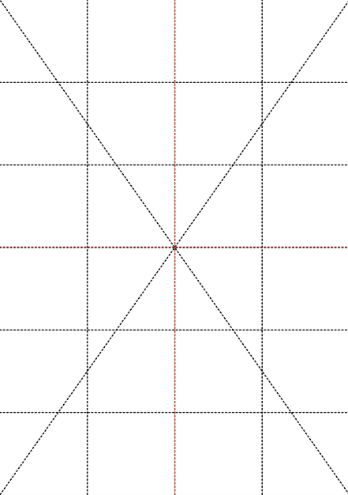<br>
  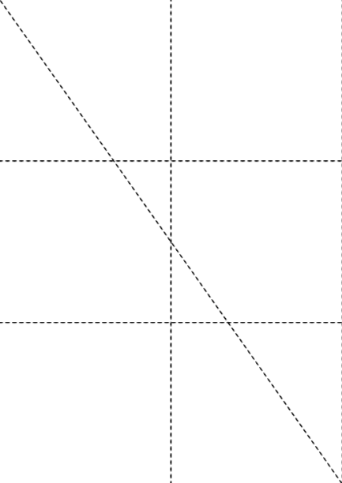
  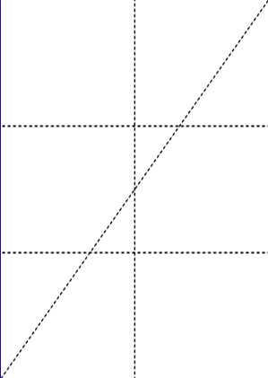<br>
  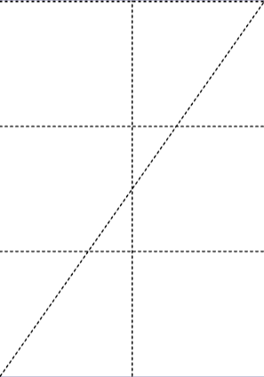
  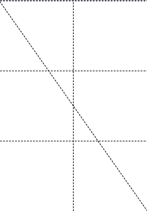
</p>

<br>

Page format is A2, the printer supports A4.<br>
Generate a poster(A0) via a corresponding 4x4 grid of A4 pages:
```sh
$ pdfcpu poster "f:A4, scale:2.0" test.pdf .
cut test.pdf into ./ ...
writing test_page_1.pdf
```

<br>

Generate a poster via a corresponding grid with cell size 15x10 cm and provide a glue area of 1 cm:
```sh
$ pdfcpu poster -u cm -- "dim:15 10, margin:1, border:on" test.pdf .
cut test.pdf into ./ ...
writing test_page_1.pdf
````

<p align="center">
  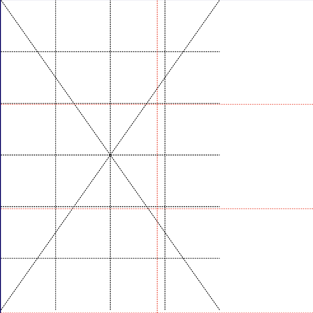<br>
  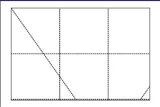
  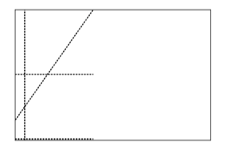<br>
  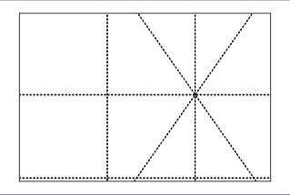
  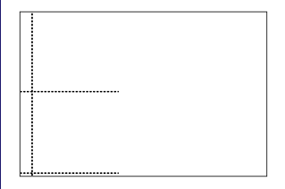<br>
  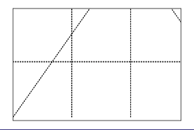
  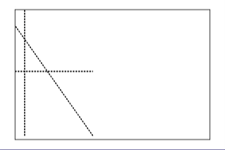
</p>